# Software Architecture Design Document (SADD)
## Online Collaborative AI Code Editor — Backend

> **Document Version**: 1.0  
> **Date**: 2026-07-18  
> **Classification**: Internal Engineering — Confidential  
> **Author**: Principal Software Architect  
> **Status**: Draft — Pending Stakeholder Approval

> [!NOTE]
> This document serves as the single source of architectural truth for the backend of the Online Collaborative AI Code Editor. Every architectural decision is justified with rationale, trade-offs, and future scalability considerations. No implementation code is included — this is a design-phase artifact intended to precede all development work.

---

## Table of Contents

1. [Product Requirement Analysis](#1-product-requirement-analysis)
2. [Technology Stack Selection](#2-technology-stack-selection)
3. [High-Level System Architecture](#3-high-level-system-architecture)
4. [Feature-First Folder Architecture](#4-feature-first-folder-architecture)
5. [Module Architecture](#5-module-architecture)
6. [Database Design](#6-database-design)
7. [Redis Architecture](#7-redis-architecture)
8. [Real-Time Collaboration Architecture](#8-real-time-collaboration-architecture)
9. [REST API Design](#9-rest-api-design)
10. [Background Processing Architecture](#10-background-processing-architecture)
11. [AI Service Architecture](#11-ai-service-architecture)
12. [Security Architecture](#12-security-architecture)
13. [Logging & Monitoring](#13-logging--monitoring)
14. [Error Handling Strategy](#14-error-handling-strategy)
15. [Sequence Diagrams](#15-sequence-diagrams)
16. [Scalability Strategy](#16-scalability-strategy)
17. [Deployment Architecture](#17-deployment-architecture)
18. [Development Roadmap](#18-development-roadmap)

---

# 1. Product Requirement Analysis

## 1.1 Functional Requirements

| ID | Requirement | Description | Why It Exists | Engineering Impact | Future Considerations |
|----|-------------|-------------|---------------|-------------------|----------------------|
| FR-01 | User Authentication | Users must register and log in via email/password or Google OAuth 2.0 | Identity is the foundation of authorization, audit trails, and personalization | Requires JWT infrastructure, refresh token rotation, OAuth callback handling, secure cookie management | Federation with SAML/OIDC for enterprise SSO; MFA support; passkey/WebAuthn |
| FR-02 | User Authorization (RBAC) | Role-based access control within rooms (Viewer, Editor, Admin) | Prevents unauthorized mutations; critical for multi-tenant collaborative environments | Middleware guards on every route and socket event; permission matrices per resource | Attribute-based access control (ABAC); per-file permissions; organization-level roles |
| FR-03 | Collaborative Rooms | Users create isolated workspaces containing files, chat, and execution contexts | Rooms are the primary unit of collaboration — everything is scoped to a room | Room lifecycle management; cascade deletes; invitation system; member management | Room templates; room forking/cloning; room archival and cold storage |
| FR-04 | Real-Time Code Editing | Multiple users edit the same file simultaneously with conflict resolution | Core value proposition — without this, it's just a file host | WebSocket infrastructure; CRDT/OT algorithm; sub-100ms latency target; Redis ephemeral state | Language-aware merging; AST-level conflict resolution; offline editing with sync |
| FR-05 | Presence & Cursor Sync | Show who is online, where their cursor is, and what they're selecting | Social presence drives engagement and prevents editing collisions | High-frequency socket events; Redis presence sets; heartbeat intervals | User activity heatmaps; "follow mode" where you watch another user's cursor |
| FR-06 | Chat System | Real-time text messaging within rooms | Communication channel without leaving the editor; reduces context switching | Message persistence in PostgreSQL; real-time delivery via Socket.IO; pagination for history | Threaded conversations; reactions; @mentions; file/code snippet sharing; rich media |
| FR-07 | File Management | CRUD operations on files and folders within rooms | Users need to organize code into a project-like file tree | Hierarchical file storage; path-based queries; Redis-cached file tree | File locking; concurrent folder operations; binary file support; large file handling |
| FR-08 | Version History | Snapshot files at points in time; diff and restore | Safety net against destructive edits; regulatory audit trail | Snapshot storage strategy; diff computation; restore logic | Git-like branching within rooms; automatic periodic snapshots; storage optimization |
| FR-09 | Multi-Language Code Execution | Execute code in JavaScript, Python, Java, C++, Go, Rust, etc. | Users need to run and test code without leaving the editor | Sandboxed execution environments; resource limits; streaming I/O; BullMQ job processing | Interactive REPL; debug integration; custom runtime environments; GPU support |
| FR-10 | GitHub Integration | Import repos, commit changes, push, create PRs | Bridges the editor with the broader development ecosystem | GitHub OAuth; REST API integration; background job processing for clone/push | GitLab/Bitbucket support; webhook listeners; branch management; merge conflict UI |
| FR-11 | AI Code Review & Assistance | AI analyzes code and provides reviews, suggestions, and explanations | Intelligent assistance differentiates this product from plain editors | LLM API integration; prompt engineering; cost control; streaming responses | Multi-model support; fine-tuned models; context-aware suggestions; code generation |
| FR-12 | Notifications | In-app alerts for invitations, AI review completion, room events | Keeps users informed of asynchronous events without polling | Notification table; real-time delivery; read/unread state management | Push notifications; email digests; notification preferences; webhook outbound |
| FR-13 | System Health | Health check endpoints for load balancers and monitoring | Required for production deployment and automated recovery | Dedicated health routes; dependency health checks (DB, Redis, queues) | Deep health checks; readiness vs. liveness probes; degraded-mode responses |

## 1.2 Non-Functional Requirements

| ID | Category | Requirement | Target | Why | Engineering Impact |
|----|----------|-------------|--------|-----|-------------------|
| NFR-01 | Performance | API response time (p95) | < 200ms | Users perceive anything over 200ms as sluggish; real-time editors demand speed | Connection pooling, query optimization, Redis caching, efficient serialization |
| NFR-02 | Performance | WebSocket event latency (p95) | < 50ms | Collaborative editing must feel instantaneous to avoid user frustration | Redis Pub/Sub, minimal serialization overhead, binary protocols where possible |
| NFR-03 | Performance | Code execution queue time | < 5s to start | Longer waits feel broken; users expect near-instant feedback | Worker auto-scaling, priority queues, warm container pools |
| NFR-04 | Scalability | Concurrent WebSocket connections | 10,000+ per node | Must support growth without re-architecture | Stateless API servers, Redis adapter, horizontal scaling |
| NFR-05 | Scalability | Concurrent active rooms | 5,000+ | Multi-tenant support for educational/enterprise use cases | Efficient memory management, room-scoped resource allocation |
| NFR-06 | Reliability | API uptime | 99.9% (8.7h downtime/year) | Users depend on this for their work; downtime means lost productivity | Health checks, auto-restart, rolling deployments, circuit breakers |
| NFR-07 | Reliability | Data durability | Zero data loss for persisted content | Code is valuable intellectual property; losing it destroys trust | PostgreSQL WAL, point-in-time recovery, periodic snapshots to object storage |
| NFR-08 | Security | Authentication | Industry-standard JWT + refresh tokens | Compromised auth means complete system breach | Short-lived tokens, HTTP-only cookies, token rotation, revocation lists |
| NFR-09 | Security | Data in transit | TLS 1.3 everywhere | Prevents eavesdropping on code, credentials, and chat | Reverse proxy TLS termination, internal TLS for sensitive paths |
| NFR-10 | Security | Input validation | 100% of user inputs validated | Prevents injection attacks and data corruption | Zod schema validation on every endpoint and socket event |
| NFR-11 | Observability | Structured logging | 100% JSON, correlated by request ID | Enables debugging in distributed systems; required for incident response | Pino logger, request correlation middleware, log aggregation pipeline |
| NFR-12 | Maintainability | Code modularity | Feature-based modules with zero circular deps | Enables independent development, testing, and potential microservice extraction | Strict dependency direction, dependency injection, module boundary enforcement |

## 1.3 User Personas

### Persona 1: Individual Developer ("Solo Dev")
- **Profile**: A developer working on personal projects who wants a cloud-based IDE with AI assistance
- **Goals**: Quick setup, code execution, AI code review, version history
- **Pain Points**: Local environment setup, lack of AI integration in existing editors
- **Engineering Impact**: Must support single-user mode efficiently; AI features must be fast and useful

### Persona 2: Student Collaborator ("Learner")
- **Profile**: CS student working on group assignments
- **Goals**: Easy room sharing, real-time collaboration, in-room chat, simple code execution
- **Pain Points**: Coordinating code changes via email/Discord; merge conflicts in Git
- **Engineering Impact**: Invitation system must be frictionless; conflict resolution must be invisible

### Persona 3: Team Lead ("Tech Lead")
- **Profile**: Engineering lead coordinating a small team's code review and prototyping
- **Goals**: RBAC, GitHub integration, AI-powered code review, version history for accountability
- **Pain Points**: Context-switching between editor, GitHub, and review tools
- **Engineering Impact**: RBAC must be granular; GitHub integration must be reliable; audit trails are essential

### Persona 4: Educator ("Instructor")
- **Profile**: Teacher conducting live coding sessions with students
- **Goals**: Read-only viewer mode, real-time presence, ability to execute and demonstrate code
- **Pain Points**: Screen sharing is passive; wants interactive collaboration
- **Engineering Impact**: Viewer role must truly restrict mutations; presence must scale to 30+ concurrent viewers

## 1.4 User Roles

| Role | Scope | Capabilities | Restrictions |
|------|-------|--------------|--------------|
| **Guest** | Pre-auth | View public rooms (future), register, login | No mutations; no room access |
| **Authenticated User** | Platform-wide | Create rooms, join rooms via invitation, manage own profile | Cannot access rooms without membership |
| **Room Viewer** | Per-room | View files, chat, observe presence, view execution output | Cannot edit files, execute code, or manage room settings |
| **Room Editor** | Per-room | All Viewer capabilities + edit files, execute code, trigger AI review | Cannot manage members, delete room, or change room settings |
| **Room Admin** | Per-room | All Editor capabilities + invite/remove members, change roles, manage room settings, delete room | Full control within room scope |
| **Platform Admin** | Platform-wide | All capabilities + system monitoring, user management, feature flags | Reserved for operators; not exposed in initial MVP |

## 1.5 User Journeys

### Journey 1: First-Time Registration → First Collaborative Session


### Journey 2: GitHub-Based Workflow

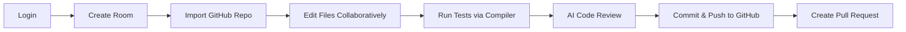

## 1.6 MVP Scope vs. Future Scope

### MVP (Version 1.0)

| Feature | Justification |
|---------|--------------|
| Google OAuth + JWT Auth | Fastest auth path; avoids email verification complexity |
| Room CRUD + Invitations | Core collaboration unit; everything depends on rooms |
| Real-Time Code Editing (single file) | Core value proposition; start with single-file to reduce CRDT complexity |
| Presence & Cursor Sync | Essential for collaborative UX |
| In-Room Chat | Minimum viable communication |
| File Management (flat tree) | Start with flat file list; nested folders in v1.1 |
| Code Execution (JS, Python) | Two most common languages cover 70%+ of use cases |
| Basic AI Code Review | Key differentiator; start with single-file review |
| Version Snapshots (manual) | Safety net; auto-snapshots deferred |
| Basic Notifications (in-app) | Inform users of async events |
| Health Checks + Basic Monitoring | Production deployment requirement |

### Future Scope (v1.1+)

| Feature | Version | Dependency |
|---------|---------|-----------|
| Email/Password Auth + MFA | v1.1 | Auth module extension |
| Nested Folder Trees | v1.1 | File management refactor |
| GitHub Integration | v1.1 | OAuth + background jobs |
| 6+ Language Support | v1.2 | Compiler infrastructure expansion |
| AI Code Generation / Chat | v1.2 | AI module extension |
| Auto-Version Snapshots | v1.2 | Scheduler infrastructure |
| Enterprise SSO (SAML/OIDC) | v2.0 | Auth module major extension |
| Organization/Team Management | v2.0 | New module |
| Plugin System | v2.0 | Architecture extension |
| Self-Hosted Deployment | v2.0 | Docker + Helm charts |

## 1.7 Performance, Scalability, and Reliability Goals

| Dimension | Target | Measurement | Mitigation Strategy |
|-----------|--------|-------------|-------------------|
| API Latency (p50) | < 50ms | APM tracing | Connection pooling, query optimization |
| API Latency (p95) | < 200ms | APM tracing | Redis caching, CDN for static assets |
| API Latency (p99) | < 500ms | APM tracing | Circuit breakers, timeouts on external calls |
| Socket Event Latency (p95) | < 50ms | Custom metrics | Redis Pub/Sub, minimal serialization |
| Compilation Start Time | < 5s | Queue metrics | Priority queues, warm containers |
| Concurrent Users per Room | 50+ | Load testing | Efficient broadcast, throttled cursor events |
| Concurrent Rooms | 5,000+ | Load testing | Room-scoped resource allocation |
| Concurrent WebSocket Connections | 10,000+ per node | Load testing | Horizontal scaling, Redis adapter |
| Database Connections | 100 per pool | Pool metrics | PgBouncer or built-in pool management |
| Uptime | 99.9% | Uptime monitoring | Rolling deploys, health checks, auto-restart |
| Recovery Time Objective (RTO) | < 15 minutes | Incident drills | Automated failover, infrastructure as code |
| Recovery Point Objective (RPO) | < 5 minutes | Backup verification | WAL archiving, continuous replication |

---

# 2. Technology Stack Selection

## 2.1 Runtime

| Decision | Selection | Alternatives Considered | Why Selected | Trade-offs |
|----------|-----------|------------------------|--------------|------------|
| **Runtime** | **Node.js 20 LTS** | Deno, Bun, Go, Java/Spring | Node.js has the richest ecosystem for real-time applications (Socket.IO, BullMQ). LTS guarantees long-term support. The event-loop model is ideal for I/O-bound workloads like WebSockets and database queries. | Single-threaded CPU-bound limitation mitigated by offloading heavy tasks to BullMQ workers. Go would offer better raw performance but at the cost of ecosystem maturity for real-time collaboration tooling. |

**Advantages**:
- Unified JavaScript/TypeScript across frontend and backend reduces context-switching
- Non-blocking I/O handles thousands of concurrent WebSocket connections efficiently
- Massive npm ecosystem with battle-tested libraries for every component
- First-class Socket.IO support (Socket.IO was built for Node.js)

**Limitations**:
- CPU-intensive operations block the event loop → mitigated by BullMQ workers
- Memory management requires attention at scale → mitigated by heap monitoring and process clustering
- Single-threaded model means vertical scaling has diminishing returns → mitigated by horizontal scaling

## 2.2 Language

| Decision | Selection | Alternatives Considered | Why Selected | Trade-offs |
|----------|-----------|------------------------|--------------|------------|
| **Language** | **JavaScript (ES2022+) with JSDoc type annotations** | TypeScript, plain JavaScript | JSDoc provides type safety without a build step, reducing development and CI complexity. TypeScript is the gold standard but adds compilation overhead and build tool complexity. For a project starting fresh, JSDoc offers a pragmatic middle ground. | TypeScript would provide stricter compile-time guarantees. JSDoc types are advisory and not enforced at runtime. However, Zod schemas provide runtime validation where it matters most (API boundaries). |

**Advantages**:
- Zero build step — run directly with Node.js
- IDE support (VS Code IntelliSense) works with JSDoc type annotations
- Faster development iteration cycle (no `tsc` watcher)
- Easier onboarding for contributors who know JavaScript but not TypeScript

**Limitations**:
- No compile-time type enforcement → mitigated by Zod runtime validation at API boundaries
- Refactoring is less safe than TypeScript → mitigated by comprehensive test coverage
- Some libraries have better TypeScript support → JSDoc `@typedef` and `@type` cover most cases

> [!TIP]
> **Migration path**: If the team decides to adopt TypeScript later, JSDoc-annotated JavaScript can be incrementally migrated file-by-file using `allowJs` in `tsconfig.json`.

## 2.3 Framework

| Decision | Selection | Alternatives Considered | Why Selected | Trade-offs |
|----------|-----------|------------------------|--------------|------------|
| **Framework** | **Express.js 4.x** | Fastify, Koa, Hapi, NestJS | Express is the most widely adopted Node.js framework with the richest middleware ecosystem. Socket.IO has first-class Express integration. The learning curve is minimal, and the middleware pattern is well-understood. | Fastify offers ~2x throughput for JSON serialization but has a smaller ecosystem. NestJS provides opinionated architecture but introduces heavy abstraction overhead. Express's simplicity allows us to enforce our own clean architecture without framework lock-in. |

**Advantages**:
- Largest middleware ecosystem in Node.js
- First-class Socket.IO integration via `http.createServer(app)`
- Minimal abstraction — we control the architecture
- Extensive community support and documentation

**Limitations**:
- No built-in schema validation → Zod provides this
- No built-in dependency injection → manual DI via factory functions
- Callback-based middleware can lead to callback hell → mitigated by async/await wrappers

## 2.4 ORM / Database Client

| Decision | Selection | Alternatives Considered | Why Selected | Trade-offs |
|----------|-----------|------------------------|--------------|------------|
| **ORM** | **Prisma 5.x** | Knex.js, TypeORM, Sequelize, Drizzle, raw pg | Prisma offers the best developer experience with its declarative schema language, automatic migration generation, and type-safe client. The Prisma Client generates a fully typed query builder from the schema, catching data access errors before runtime. | Prisma adds a query engine binary (~15MB) and has less flexibility for complex raw SQL. Knex.js offers more control but requires manual type definitions. Drizzle is newer with a smaller ecosystem. |

**Advantages**:
- Declarative schema language (`schema.prisma`) serves as the single source of truth for the database
- Auto-generated client with IntelliSense for all models, relations, and query methods
- Built-in migration system with drift detection
- Connection pooling built-in (configurable pool size)
- Rich relation queries (nested includes, selects)

**Limitations**:
- Complex aggregations sometimes require `$queryRaw` → acceptable for edge cases
- Query engine binary adds container size → negligible in production
- N+1 query patterns require careful eager loading → mitigated by explicit `include` statements

## 2.5 Database

| Decision | Selection | Alternatives Considered | Why Selected | Trade-offs |
|----------|-----------|------------------------|--------------|------------|
| **Primary Database** | **PostgreSQL 16** | MySQL, MongoDB, CockroachDB, Supabase | PostgreSQL is the industry standard for relational data with ACID guarantees. It offers superior JSON support (JSONB), full-text search, and advanced indexing. The data model for this application is inherently relational (Users → Rooms → Files → Versions). | MongoDB would offer schema flexibility but at the cost of referential integrity. CockroachDB adds distributed SQL but introduces operational complexity beyond our current scale needs. |

**Advantages**:
- ACID transactions for data integrity (critical for concurrent room operations)
- JSONB columns for semi-structured data (editor settings, AI review results)
- Advanced indexing (B-tree, GIN, partial indexes) for query optimization
- Row-level security for potential future multi-tenancy
- Excellent Prisma support

**Limitations**:
- Vertical scaling has limits → mitigated by read replicas and connection pooling
- Schema migrations require careful planning → Prisma migration system handles this
- No built-in horizontal sharding → acceptable at our target scale; PgBouncer handles connection pooling

## 2.6 Cache / In-Memory Store

| Decision | Selection | Alternatives Considered | Why Selected | Trade-offs |
|----------|-----------|------------------------|--------------|------------|
| **Cache** | **Redis 7.x (via ioredis)** | Memcached, KeyDB, Dragonfly | Redis serves triple duty: cache, Pub/Sub broker (for Socket.IO adapter), and job queue backing store (BullMQ). No other solution provides all three. ioredis is the most battle-tested Node.js Redis client with Cluster and Sentinel support. | Memcached is faster for pure caching but lacks Pub/Sub and persistence. KeyDB/Dragonfly are Redis-compatible but less battle-tested. |

**Advantages**:
- Pub/Sub for Socket.IO horizontal scaling (Redis Adapter)
- BullMQ backing store (eliminates need for a separate queue broker)
- Rich data structures (Sets for presence, Sorted Sets for leaderboards, Hashes for sessions)
- Lua scripting for atomic operations (rate limiting, distributed locks)
- Cluster mode for horizontal scaling

**Limitations**:
- Memory-bound — cost scales with data volume → mitigated by TTLs and eviction policies
- Single-threaded (for commands) → Redis 7 I/O threading helps; Cluster mode distributes load
- Data loss risk on restart → mitigated by RDB snapshots + AOF; critical data lives in PostgreSQL

## 2.7 Message Queue

| Decision | Selection | Alternatives Considered | Why Selected | Trade-offs |
|----------|-----------|------------------------|--------------|------------|
| **Queue** | **BullMQ 5.x** | RabbitMQ, AWS SQS, Kafka, Agenda | BullMQ runs on Redis (already in our stack), eliminating an additional infrastructure dependency. It provides reliable job processing with retries, dead-letter queues, rate limiting, job priorities, cron scheduling, and a rich event system. | RabbitMQ is more feature-rich for complex routing but adds operational overhead. Kafka is designed for event streaming at massive scale, which is premature for our needs. SQS requires AWS lock-in. |

**Advantages**:
- Runs on existing Redis infrastructure (zero additional services)
- First-class Node.js support with TypeScript definitions
- Built-in retry strategies, exponential backoff, dead-letter queues
- Job priorities, rate limiting, and delayed jobs
- BullBoard integration for queue monitoring dashboard
- Graceful shutdown support for zero job loss

**Limitations**:
- Redis dependency means queue durability depends on Redis persistence config → mitigated by RDB+AOF
- Not suitable for event sourcing patterns → not needed for MVP
- Limited to Node.js workers → acceptable given our stack

## 2.8 Authentication

| Decision | Selection | Alternatives Considered | Why Selected | Trade-offs |
|----------|-----------|------------------------|--------------|------------|
| **Authentication** | **JWT (jsonwebtoken) + Google OAuth 2.0 (passport-google-oauth20)** | Auth0, Firebase Auth, Supabase Auth, Clerk | Self-managed JWT gives full control over token claims, expiration, and rotation logic. Avoids vendor lock-in and per-user pricing of managed auth services. Google OAuth covers the primary login flow with minimal friction. | Managed auth services (Auth0, Clerk) reduce implementation effort but introduce vendor dependency and per-MAU costs that scale unpredictably. Self-managed auth requires careful security engineering. |

**Advantages**:
- Full control over token lifecycle (expiry, claims, rotation)
- No per-user pricing — cost is only infrastructure
- Google OAuth provides fast, trusted registration
- JWT is stateless — no database lookup per request (token self-contains claims)

**Limitations**:
- Must implement refresh token rotation manually → planned in auth module
- Must handle token revocation (logout) → Redis blacklist for compromised tokens
- OAuth requires maintaining Google API credentials and consent screen

## 2.9 Validation

| Decision | Selection | Alternatives Considered | Why Selected | Trade-offs |
|----------|-----------|------------------------|--------------|------------|
| **Validation** | **Zod 3.x** | Joi, Yup, class-validator, Ajv | Zod provides the best TypeScript/JSDoc inference, composable schema building, and runtime validation in a single library. Its `.parse()` method throws structured errors that map cleanly to our error response format. | Joi is mature but verbose and lacks type inference. Yup is designed for forms, not API validation. Ajv is fastest but requires JSON Schema definitions. |

## 2.10 Logging

| Decision | Selection | Alternatives Considered | Why Selected | Trade-offs |
|----------|-----------|------------------------|--------------|------------|
| **Logging** | **Pino 8.x** | Winston, Bunyan, console.log | Pino is the fastest structured JSON logger for Node.js (~5x faster than Winston). JSON output integrates directly with log aggregation platforms (Datadog, ELK, Grafana Loki). Child loggers enable per-request context injection. | Winston is more feature-rich (transports, formatting) but significantly slower. Pino's philosophy of "log fast, process later" aligns with production logging best practices. |

## 2.11 Testing

| Decision | Selection | Alternatives Considered | Why Selected | Trade-offs |
|----------|-----------|------------------------|--------------|------------|
| **Testing** | **Vitest + Supertest** | Jest, Mocha/Chai, Tap | Vitest offers Jest-compatible APIs with native ES modules support and significantly faster execution (Vite-based). Supertest provides elegant HTTP assertion testing for Express routes. | Jest is the most popular but slower for ES modules projects and requires configuration for ESM. Vitest is drop-in compatible with Jest's API surface. |

## 2.12 Monitoring

| Decision | Selection | Alternatives Considered | Why Selected | Trade-offs |
|----------|-----------|------------------------|--------------|------------|
| **Error Monitoring** | **Sentry** | Bugsnag, Rollbar, Datadog APM | Sentry provides real-time error tracking with stack traces, breadcrumbs, and release tracking. The Node.js SDK has Express and WebSocket integration. Free tier covers 5,000 events/month. | Datadog APM is more comprehensive but significantly more expensive. Sentry focuses on errors with excellent DX. |
| **Metrics & APM** | **Prometheus + Grafana** | Datadog, New Relic, AWS CloudWatch | Open-source, self-hosted, no per-host pricing. Prometheus scrapes metrics from Node.js exporters. Grafana visualizes dashboards. | Requires self-hosting; managed alternatives reduce operational burden but increase cost. |

## 2.13 File Storage

| Decision | Selection | Alternatives Considered | Why Selected | Trade-offs |
|----------|-----------|------------------------|--------------|------------|
| **File Storage** | **PostgreSQL TEXT columns (MVP) → S3-compatible object storage (scale)** | File system, GridFS, MinIO from day one | For MVP, code files are text — storing them in PostgreSQL TEXT columns simplifies queries, transactions, and backups. A single `SELECT` retrieves a file with its metadata. | At scale (files > 1MB, binary assets), S3/MinIO becomes necessary. The Repository layer abstracts storage, making migration transparent to services. |

## 2.14 Deployment Platform

| Decision | Selection | Alternatives Considered | Why Selected | Trade-offs |
|----------|-----------|------------------------|--------------|------------|
| **Deployment** | **Docker + Docker Compose (dev/staging) → Kubernetes or AWS ECS (production)** | Heroku, Render, Railway, bare metal | Docker provides consistent environments across development, CI, and production. Compose handles multi-service orchestration locally. Kubernetes/ECS handles production scaling with auto-scaling groups. | Kubernetes adds operational complexity; managed services (ECS, GKE) reduce this. For MVP, Docker Compose on a single VPS is sufficient. |

## 2.15 Complete Stack Summary

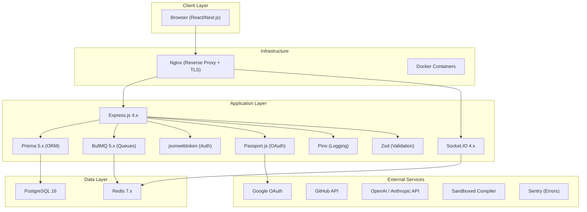

---

# 3. High-Level System Architecture

## 3.1 System Context Diagram

This diagram shows the system boundaries and external actors interacting with the Collaborative Code Editor backend.

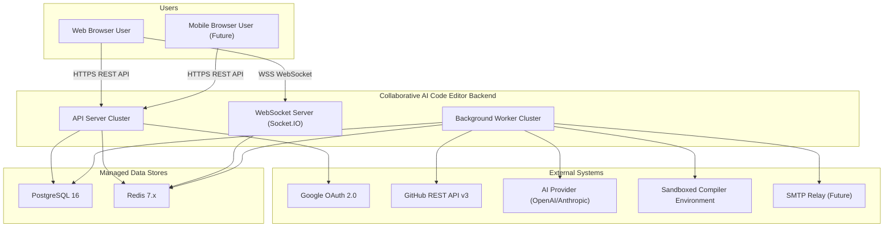

## 3.2 High-Level Component Diagram

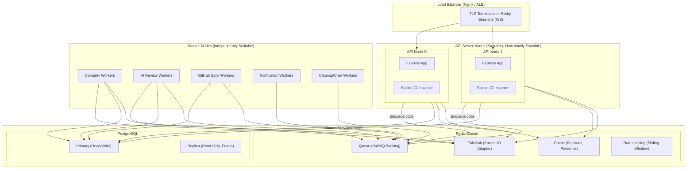

## 3.3 Deployment Diagram

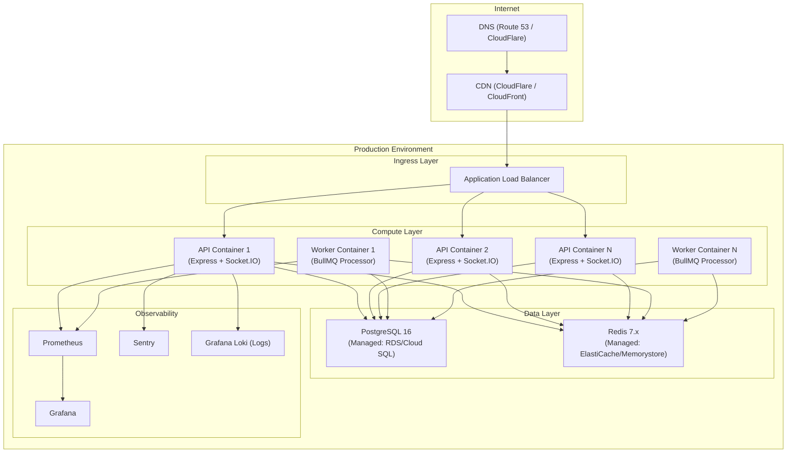

## 3.4 Communication Flow

| Flow | Protocol | Pattern | Latency Target | Description |
|------|----------|---------|----------------|-------------|
| Client → API | HTTPS/REST | Request-Response | < 200ms (p95) | Standard CRUD operations, authentication, file management |
| Client ↔ API | WSS/Socket.IO | Bidirectional Streaming | < 50ms (p95) | Real-time editing, presence, chat, notifications |
| API → PostgreSQL | TCP (pg wire) | Connection Pool | < 20ms (p95) | Persistent data storage and retrieval |
| API → Redis | TCP (RESP) | Connection Pool | < 5ms (p95) | Caching, Pub/Sub, rate limiting |
| API → BullMQ | via Redis | Fire-and-Forget | < 10ms (enqueue) | Async job dispatching |
| Worker → External APIs | HTTPS | Request-Response | < 30s (timeout) | AI, GitHub, Compiler interactions |
| Worker → Redis Pub/Sub | TCP (RESP) | Publish | < 5ms | Notify API nodes of completed jobs |
| API Node ↔ API Node | Redis Pub/Sub | Pub/Sub | < 10ms | Socket.IO event synchronization across nodes |

## 3.5 Request Lifecycle

### HTTP Request Lifecycle

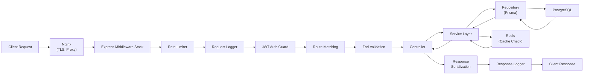

### WebSocket Event Lifecycle

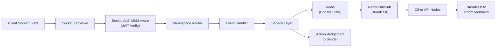

## 3.6 Component Responsibilities

| Component | Responsibility | Stateful? | Horizontally Scalable? | Failure Mode |
|-----------|---------------|-----------|----------------------|--------------|
| **Nginx / ALB** | TLS termination, load balancing, WebSocket upgrade, static file serving | No (config only) | Yes (DNS round-robin) | Redundant instances; health check failover |
| **API Server** | HTTP request handling, WebSocket event handling, business logic orchestration | No (all state in Redis/PG) | Yes (add more containers) | Other nodes absorb traffic; reconnect on failure |
| **Worker** | Async job processing (compilation, AI, GitHub, notifications) | No (jobs in Redis) | Yes (add more processors) | Jobs retry automatically; dead-letter queue for failures |
| **PostgreSQL** | Persistent data storage, ACID transactions, relational integrity | Yes (data on disk) | Read replicas; connection pooling | Automated failover to standby; point-in-time recovery |
| **Redis** | Cache, Pub/Sub, session storage, rate limiting, queue backing | Yes (in-memory + AOF) | Cluster mode for horizontal scaling | Sentinel for failover; RDB+AOF for persistence |

---

# 4. Feature-First Folder Architecture

## 4.1 Complete Project Structure

```text
backend/
├── .env.example                     # Environment variable template
├── .env                             # Local environment (git-ignored)
├── .eslintrc.cjs                    # ESLint configuration
├── .prettierrc                      # Prettier configuration
├── .dockerignore                    # Docker build exclusions
├── Dockerfile                       # Multi-stage production build
├── docker-compose.yml               # Local development services
├── docker-compose.prod.yml          # Production-like compose
├── package.json                     # Dependencies and scripts
├── vitest.config.js                 # Test runner configuration
│
├── prisma/                          # Database schema and migrations
│   ├── schema.prisma                # Prisma schema definition
│   ├── migrations/                  # Auto-generated migration files
│   │   └── YYYYMMDD_init/
│   │       └── migration.sql
│   └── seed.js                      # Database seeding script
│
├── src/
│   ├── app.js                       # Express application bootstrap and composition root
│   ├── server.js                    # HTTP server creation, Socket.IO attachment, startup
│   │
│   ├── config/                      # Application configuration
│   │   ├── index.js                 # Central config export (validates env vars via Zod)
│   │   ├── constants.js             # Application-wide constants
│   │   └── features.js              # Feature flag definitions
│   │
│   ├── core/                        # Cross-cutting concerns (shared infrastructure)
│   │   ├── errors/                  # Error handling infrastructure
│   │   │   ├── AppError.js          # Base application error class
│   │   │   ├── errorTypes.js        # Specific error classes (ValidationError, etc.)
│   │   │   ├── errorCodes.js        # Enum of error codes
│   │   │   ├── errorHandler.js      # Global Express error handler middleware
│   │   │   └── errorHandler.test.js # Error handler tests
│   │   │
│   │   ├── logger/                  # Logging infrastructure
│   │   │   ├── index.js             # Pino logger factory
│   │   │   └── serializers.js       # Custom Pino serializers
│   │   │
│   │   ├── middleware/              # Global Express middlewares
│   │   │   ├── authenticate.js      # JWT verification guard
│   │   │   ├── authorize.js         # RBAC permission checker
│   │   │   ├── rateLimiter.js       # Redis-backed rate limiting
│   │   │   ├── requestId.js         # Unique request ID injection
│   │   │   ├── requestLogger.js     # HTTP request/response logging
│   │   │   ├── cors.js              # CORS configuration
│   │   │   ├── helmet.js            # Security headers
│   │   │   └── validate.js          # Zod schema validation middleware factory
│   │   │
│   │   ├── database/                # Database connection management
│   │   │   ├── prisma.js            # Prisma client singleton
│   │   │   └── healthCheck.js       # DB connectivity check
│   │   │
│   │   ├── redis/                   # Redis connection management
│   │   │   ├── client.js            # ioredis client singleton
│   │   │   ├── subscriber.js        # Dedicated subscriber connection
│   │   │   └── healthCheck.js       # Redis connectivity check
│   │   │
│   │   └── utils/                   # Shared utility functions
│   │       ├── asyncHandler.js      # Express async error wrapper
│   │       ├── pagination.js        # Pagination helper
│   │       ├── crypto.js            # Hashing, token generation
│   │       └── date.js              # Date formatting utilities
│   │
│   ├── modules/                     # Feature-based domain modules
│   │   ├── auth/                    # Authentication module
│   │   │   ├── routes.js            # POST /auth/login, /auth/refresh, etc.
│   │   │   ├── controllers.js       # Request handling, response formatting
│   │   │   ├── services.js          # Auth business logic
│   │   │   ├── repositories.js      # User/RefreshToken DB access
│   │   │   ├── dto.js               # Zod schemas for auth payloads
│   │   │   ├── strategies/          # Passport strategies
│   │   │   │   └── google.js        # Google OAuth strategy
│   │   │   └── tests/
│   │   │       ├── services.test.js
│   │   │       └── controllers.test.js
│   │   │
│   │   ├── user/                    # User management module
│   │   │   ├── routes.js
│   │   │   ├── controllers.js
│   │   │   ├── services.js
│   │   │   ├── repositories.js
│   │   │   ├── dto.js
│   │   │   └── tests/
│   │   │
│   │   ├── room/                    # Room management module
│   │   │   ├── routes.js
│   │   │   ├── controllers.js
│   │   │   ├── services.js
│   │   │   ├── repositories.js
│   │   │   ├── dto.js
│   │   │   └── tests/
│   │   │
│   │   ├── editor/                  # Real-time code editing module
│   │   │   ├── routes.js            # REST endpoints for file CRUD
│   │   │   ├── controllers.js
│   │   │   ├── services.js          # File management + CRDT coordination
│   │   │   ├── repositories.js
│   │   │   ├── dto.js
│   │   │   ├── socket.js            # Socket event handlers for editing
│   │   │   ├── events.js            # Event name constants
│   │   │   ├── crdt.js              # CRDT algorithm implementation
│   │   │   └── tests/
│   │   │
│   │   ├── collaboration/           # Presence and cursor synchronization
│   │   │   ├── services.js          # Presence tracking, cursor state
│   │   │   ├── socket.js            # Socket handlers for presence events
│   │   │   ├── events.js
│   │   │   └── tests/
│   │   │
│   │   ├── chat/                    # In-room chat module
│   │   │   ├── routes.js            # GET /rooms/:id/messages (history)
│   │   │   ├── controllers.js
│   │   │   ├── services.js
│   │   │   ├── repositories.js
│   │   │   ├── dto.js
│   │   │   ├── socket.js            # Real-time message handlers
│   │   │   ├── events.js
│   │   │   └── tests/
│   │   │
│   │   ├── compiler/                # Code execution module
│   │   │   ├── routes.js            # POST /compiler/run (REST fallback)
│   │   │   ├── controllers.js
│   │   │   ├── services.js          # Job creation, language resolution
│   │   │   ├── repositories.js      # CompilerJob audit log
│   │   │   ├── dto.js
│   │   │   ├── socket.js            # Streaming output via sockets
│   │   │   ├── events.js
│   │   │   ├── languages.js         # Supported language registry
│   │   │   └── tests/
│   │   │
│   │   ├── version/                 # Version history module
│   │   │   ├── routes.js
│   │   │   ├── controllers.js
│   │   │   ├── services.js
│   │   │   ├── repositories.js
│   │   │   ├── dto.js
│   │   │   └── tests/
│   │   │
│   │   ├── github/                  # GitHub integration module
│   │   │   ├── routes.js
│   │   │   ├── controllers.js
│   │   │   ├── services.js
│   │   │   ├── repositories.js
│   │   │   ├── dto.js
│   │   │   ├── githubClient.js      # GitHub API client wrapper
│   │   │   └── tests/
│   │   │
│   │   ├── ai/                      # AI code assistance module
│   │   │   ├── routes.js
│   │   │   ├── controllers.js
│   │   │   ├── services.js
│   │   │   ├── dto.js
│   │   │   ├── gateway.js           # AI provider abstraction layer
│   │   │   ├── promptBuilder.js     # Prompt template engine
│   │   │   ├── responseParser.js    # AI response normalization
│   │   │   ├── providers/           # Swappable AI provider implementations
│   │   │   │   ├── openai.js
│   │   │   │   └── anthropic.js
│   │   │   └── tests/
│   │   │
│   │   ├── notification/            # Notification module
│   │   │   ├── routes.js
│   │   │   ├── controllers.js
│   │   │   ├── services.js
│   │   │   ├── repositories.js
│   │   │   ├── dto.js
│   │   │   ├── socket.js
│   │   │   ├── events.js
│   │   │   └── tests/
│   │   │
│   │   └── system/                  # System/health module
│   │       ├── routes.js            # GET /health, GET /ready
│   │       └── controllers.js
│   │
│   ├── socket/                      # Socket.IO infrastructure
│   │   ├── index.js                 # Socket.IO server initialization
│   │   ├── adapter.js               # Redis adapter configuration
│   │   ├── auth.js                  # Socket authentication middleware
│   │   ├── namespaces.js            # Namespace registration
│   │   └── errorHandler.js          # Socket error handling
│   │
│   └── workers/                     # BullMQ worker infrastructure
│       ├── index.js                 # Worker process entry point
│       ├── queues.js                # Queue definitions and exports
│       ├── processors/              # Job processor implementations
│       │   ├── compiler.processor.js
│       │   ├── ai.processor.js
│       │   ├── github.processor.js
│       │   ├── notification.processor.js
│       │   └── cleanup.processor.js
│       └── scheduler.js             # Cron job definitions
│
├── scripts/                         # Operational scripts
│   ├── migrate.sh                   # Database migration runner
│   ├── seed.sh                      # Database seeding
│   └── healthcheck.sh               # Container health check
│
└── docs/                            # Project documentation
    ├── api/                         # API documentation
    │   └── openapi.yaml             # OpenAPI 3.0 specification
    ├── architecture/                # Architecture decision records
    │   └── ADR-001-crdt-vs-ot.md
    └── runbooks/                    # Operational runbooks
        └── incident-response.md
```

## 4.2 Folder Responsibilities

| Folder | Purpose | Responsibility | Naming Conventions | Best Practices |
|--------|---------|---------------|-------------------|----------------|
| `config/` | Application configuration | Validate and export environment variables; define constants and feature flags | `index.js` for primary export; descriptive names for sub-configs | Fail fast on boot if config is invalid; never import `process.env` directly outside this folder |
| `core/errors/` | Error infrastructure | Define error class hierarchy; centralized error-to-HTTP mapping | `PascalCase` for error classes; `camelCase` for handlers | Every error class extends `AppError`; error codes are enums, not magic strings |
| `core/logger/` | Logging infrastructure | Initialize Pino logger with child logger factory | Single export from `index.js` | Always use child loggers with context (requestId, userId, roomId) |
| `core/middleware/` | Global Express middlewares | Cross-cutting HTTP concerns (auth, logging, rate limiting, validation) | `camelCase.js` — one middleware per file | Middlewares are pure functions; no business logic; compose via `app.use()` |
| `core/database/` | Database connectivity | Prisma client singleton and health check | Singleton pattern | Never instantiate Prisma multiple times; use connection pooling |
| `core/redis/` | Redis connectivity | ioredis client singleton, subscriber connection | Separate connections for Pub/Sub subscriber (Redis requirement) | Graceful connection handling; retry strategies |
| `core/utils/` | Shared helpers | Pure utility functions with no side effects | `camelCase.js` — grouped by domain | Zero dependencies on modules; no imports from `modules/` |
| `modules/<feature>/` | Feature domain | All code for a single business feature | `routes.js`, `controllers.js`, `services.js`, `repositories.js`, `dto.js` | Each module is self-contained; dependencies flow inward (routes → controllers → services → repositories) |
| `modules/<feature>/socket.js` | Socket event handlers | Map socket events to service calls for real-time features | `socket.js` per module | Socket handlers call service layer — never access DB directly |
| `modules/<feature>/events.js` | Event constants | Define socket event name constants | `UPPER_SNAKE_CASE` for event names | Prevents typos; single source of truth for event names |
| `modules/<feature>/tests/` | Feature tests | Unit and integration tests for the feature | `*.test.js` suffix | Co-located with feature code for discoverability |
| `socket/` | Socket.IO infrastructure | Server initialization, adapter, auth middleware, namespace registration | Infrastructure-only — no business logic | Delegates all event handling to module-level `socket.js` files |
| `workers/` | BullMQ infrastructure | Worker process entry point, queue definitions, job processors | `*.processor.js` for processors | Workers run as separate processes; share service layer with API |
| `prisma/` | Database schema | Prisma schema, migrations, seed data | Prisma conventions | Schema is the single source of truth for database structure |

## 4.3 Why Feature-First Architecture

### Comparison with Alternatives

| Architecture | Structure | Pros | Cons | When to Use |
|-------------|-----------|------|------|-------------|
| **Feature-First (Selected)** | `modules/auth/`, `modules/room/`, `modules/editor/` | High cohesion within features; easy to locate related code; simple to extract microservices; teams can own features independently | May duplicate utility patterns across features (mitigated by `core/`) | Medium-to-large applications with clear domain boundaries |
| **Layer-Based** | `controllers/`, `services/`, `repositories/` | Clear separation of concerns; easy to understand layering | Low cohesion — related files scattered across folders; modifying one feature touches 5+ directories; difficult to extract microservices | Small applications with few features |
| **MVC** | `models/`, `views/`, `controllers/` | Simple and well-understood; good for server-rendered apps | Backend APIs have no "views"; conflates data models with business logic; becomes unmaintainable past 10+ resources | Simple CRUD applications or server-rendered apps |
| **Monolithic Flat** | `routes.js`, `controllers.js`, `services.js` (single files) | Minimal setup; fast for prototypes | Unmanageable past 500 lines; merge conflicts; no clear ownership | Prototypes and throwaway code |

### Key Decision Rationale

1. **Microservice Readiness**: Each `modules/<feature>/` folder is a self-contained unit. Extracting the `compiler` module into its own service requires moving one folder and wiring up network calls where service imports used to be.

2. **Team Scalability**: Different developers can work on `modules/auth/` and `modules/editor/` simultaneously without merge conflicts on shared files like a monolithic `controllers.js`.

3. **Cognitive Load**: When debugging the chat feature, a developer only needs to look in `modules/chat/` — not hunt across `controllers/chatController.js`, `services/chatService.js`, `models/message.js`, `routes/chatRoutes.js`, etc.

4. **Testing Isolation**: Each module's tests live alongside its code. Running `vitest modules/auth/` executes only auth tests, enabling fast feedback loops.

5. **Dependency Direction**: The architecture enforces a strict dependency direction:
   - `routes.js` → `controllers.js` → `services.js` → `repositories.js`
   - Modules can import from `core/` but never from other modules' internal files
   - Cross-module communication goes through service-to-service calls or domain events

---

# 5. Module Architecture

## 5.1 Authentication Module (`modules/auth/`)

### Responsibilities
- User registration and login (Google OAuth 2.0)
- JWT access token generation and verification
- Refresh token rotation and revocation
- Session management
- Logout (token blacklisting)

### Public Interfaces

| Interface | Type | Description |
|-----------|------|-------------|
| `POST /auth/google` | REST | Initiate Google OAuth flow |
| `GET /auth/google/callback` | REST | Google OAuth callback handler |
| `POST /auth/refresh` | REST | Exchange refresh token for new access token |
| `POST /auth/logout` | REST | Revoke refresh token and blacklist access token |
| `authenticate` middleware | Express Middleware | JWT verification guard (exported for other modules) |

### Internal Components

| Component | File | Responsibility |
|-----------|------|---------------|
| Routes | `routes.js` | Map HTTP paths to controllers; apply rate limiting |
| Controllers | `controllers.js` | Extract request data, invoke services, format responses |
| Services | `services.js` | `loginWithGoogle()`, `refreshAccessToken()`, `logout()`, `verifyToken()` |
| Repositories | `repositories.js` | `findUserByEmail()`, `upsertUser()`, `createRefreshToken()`, `revokeRefreshToken()` |
| DTOs | `dto.js` | Zod schemas: `RefreshTokenSchema`, `LoginResponseSchema` |
| Google Strategy | `strategies/google.js` | Passport.js Google OAuth 2.0 strategy configuration |

### Dependencies
- **Internal**: `core/database/prisma.js`, `core/redis/client.js`, `core/errors/`, `core/logger/`
- **External**: `jsonwebtoken`, `passport`, `passport-google-oauth20`, `bcryptjs`

### Extension Points
- Add `strategies/github.js` for GitHub OAuth
- Add `strategies/local.js` for email/password auth
- Add MFA support via `services.js` extension

---

## 5.2 User Module (`modules/user/`)

### Responsibilities
- User profile retrieval and updates
- User preferences (editor theme, keybindings, font size)
- User search (for room invitations)
- Account deletion

### Public Interfaces

| Interface | Type | Description |
|-----------|------|-------------|
| `GET /users/me` | REST | Get current user profile |
| `PATCH /users/me` | REST | Update profile and preferences |
| `GET /users/search?q=` | REST | Search users by name/email for invitations |
| `DELETE /users/me` | REST | Soft-delete user account |

### Internal Components

| Component | File | Responsibility |
|-----------|------|---------------|
| Routes | `routes.js` | Map HTTP paths; require authentication |
| Controllers | `controllers.js` | Profile CRUD orchestration |
| Services | `services.js` | `getProfile()`, `updateProfile()`, `searchUsers()`, `deleteAccount()` |
| Repositories | `repositories.js` | `findById()`, `update()`, `softDelete()`, `searchByNameOrEmail()` |
| DTOs | `dto.js` | `UpdateProfileSchema`, `UserSearchSchema`, `UserResponseSchema` |

### Dependencies
- **Internal**: `core/database/`, `core/errors/`, `core/middleware/authenticate.js`
- **External**: None

---

## 5.3 Room Module (`modules/room/`)

### Responsibilities
- Room CRUD (create, read, update, delete)
- Member management (add, remove, change roles)
- Invitation system (generate invite links, accept invitations)
- Room settings (language, visibility)
- Room listing and filtering

### Public Interfaces

| Interface | Type | Description |
|-----------|------|-------------|
| `POST /rooms` | REST | Create a new room |
| `GET /rooms` | REST | List user's rooms |
| `GET /rooms/:id` | REST | Get room details |
| `PATCH /rooms/:id` | REST | Update room settings |
| `DELETE /rooms/:id` | REST | Delete room (admin only) |
| `POST /rooms/:id/invite` | REST | Generate invitation link |
| `POST /rooms/join/:token` | REST | Join room via invitation token |
| `GET /rooms/:id/members` | REST | List room members |
| `PATCH /rooms/:id/members/:userId` | REST | Change member role |
| `DELETE /rooms/:id/members/:userId` | REST | Remove member from room |

### Internal Components

| Component | File | Responsibility |
|-----------|------|---------------|
| Routes | `routes.js` | Route definitions with auth and RBAC middleware |
| Controllers | `controllers.js` | Request handling and response formatting |
| Services | `services.js` | `createRoom()`, `joinRoom()`, `generateInvite()`, `updateMemberRole()`, `leaveRoom()` |
| Repositories | `repositories.js` | Room CRUD, member queries, invitation management |
| DTOs | `dto.js` | `CreateRoomSchema`, `UpdateRoomSchema`, `InviteMemberSchema`, `RoomResponseSchema` |

### Dependencies
- **Internal**: `core/database/`, `core/redis/`, `core/middleware/`, `modules/notification/services.js`
- **External**: `nanoid` (for invite token generation)

---

## 5.4 Editor Module (`modules/editor/`)

### Responsibilities
- File CRUD within rooms (create, read, update, delete files/folders)
- File tree management
- Real-time code synchronization (CRDT-based)
- File content caching in Redis for fast reconnect
- Debounced persistence to PostgreSQL

### Public Interfaces

| Interface | Type | Description |
|-----------|------|-------------|
| `GET /rooms/:id/files` | REST | Get file tree for a room |
| `POST /rooms/:id/files` | REST | Create a new file |
| `GET /rooms/:id/files/:fileId` | REST | Get file content |
| `PATCH /rooms/:id/files/:fileId` | REST | Update file metadata (rename, move) |
| `DELETE /rooms/:id/files/:fileId` | REST | Delete a file |
| `editor:change` | Socket Event | Broadcast code change to room |
| `editor:sync` | Socket Event | Full document sync on reconnect |
| `file:create` | Socket Event | Notify room of new file |
| `file:delete` | Socket Event | Notify room of deleted file |

### Internal Components

| Component | File | Responsibility |
|-----------|------|---------------|
| Routes | `routes.js` | REST endpoints for file CRUD |
| Controllers | `controllers.js` | HTTP request handling |
| Services | `services.js` | File CRUD + change coordination + Redis caching |
| Repositories | `repositories.js` | File DB access |
| DTOs | `dto.js` | `CreateFileSchema`, `UpdateFileSchema`, `EditorChangeSchema` |
| Socket Handler | `socket.js` | Socket event handlers for real-time editing |
| Events | `events.js` | Event name constants |
| CRDT | `crdt.js` | Conflict-free replicated data type logic |

### Dependencies
- **Internal**: `core/database/`, `core/redis/`, `modules/collaboration/`, `modules/version/`
- **External**: `yjs` (CRDT library)

---

## 5.5 Collaboration Module (`modules/collaboration/`)

### Responsibilities
- User presence tracking (online/offline/idle)
- Cursor position synchronization
- Selection range synchronization
- Typing indicator state
- Active file tracking (which file each user is viewing)

### Public Interfaces

| Interface | Type | Description |
|-----------|------|-------------|
| `presence:join` | Socket Event | User joins room presence |
| `presence:leave` | Socket Event | User leaves room presence |
| `presence:heartbeat` | Socket Event | Keep-alive for presence |
| `cursor:move` | Socket Event | Broadcast cursor position |
| `selection:change` | Socket Event | Broadcast selection range |
| `typing:start` / `typing:stop` | Socket Event | Typing indicator |
| `file:focus` | Socket Event | User switched active file |

### Internal Components

| Component | File | Responsibility |
|-----------|------|---------------|
| Services | `services.js` | Presence tracking, cursor state management |
| Socket Handler | `socket.js` | High-frequency event handlers |
| Events | `events.js` | Event name constants |

### Dependencies
- **Internal**: `core/redis/` (presence sets, cursor state)
- **External**: None

> [!IMPORTANT]
> **Performance Note**: Cursor events fire on every mouse/keyboard movement. The socket handler must implement client-side throttling (50ms minimum interval) and server-side rate limiting (discard events exceeding 20/second per user per room) to prevent broadcast storms.

---

## 5.6 Socket Module (`socket/`)

### Responsibilities
- Socket.IO server initialization and configuration
- Redis adapter setup for horizontal scaling
- Socket-level authentication middleware
- Namespace registration and routing
- Connection/disconnection lifecycle management
- Global socket error handling

### Internal Components

| Component | File | Responsibility |
|-----------|------|---------------|
| Server Init | `index.js` | Create Socket.IO server, attach to HTTP server, configure CORS |
| Adapter | `adapter.js` | Configure `@socket.io/redis-adapter` for multi-node broadcasting |
| Auth | `auth.js` | Extract and verify JWT from handshake; attach user to socket |
| Namespaces | `namespaces.js` | Register all module socket handlers to namespaces |
| Error Handler | `errorHandler.js` | Catch and log socket errors; emit error events to client |

### Dependencies
- **Internal**: `core/redis/`, `core/logger/`, `modules/*/socket.js`
- **External**: `socket.io`, `@socket.io/redis-adapter`

---

## 5.7 Chat Module (`modules/chat/`)

### Responsibilities
- Send and receive real-time messages within rooms
- Persist message history to PostgreSQL
- Paginated message retrieval (infinite scroll)
- Message formatting and sanitization

### Public Interfaces

| Interface | Type | Description |
|-----------|------|-------------|
| `GET /rooms/:id/messages` | REST | Paginated message history |
| `chat:send` | Socket Event | Send message to room |
| `chat:receive` | Socket Event | Receive message in room |

### Internal Components

| Component | File | Responsibility |
|-----------|------|---------------|
| Routes | `routes.js` | Message history endpoint |
| Controllers | `controllers.js` | Pagination logic |
| Services | `services.js` | `sendMessage()`, `getMessageHistory()` |
| Repositories | `repositories.js` | Message CRUD |
| DTOs | `dto.js` | `SendMessageSchema`, `MessageQuerySchema` |
| Socket Handler | `socket.js` | Real-time message handlers |
| Events | `events.js` | Event name constants |

---

## 5.8 Compiler Module (`modules/compiler/`)

### Responsibilities
- Accept code execution requests
- Validate language support
- Enqueue compilation jobs to BullMQ
- Stream execution output back to client via WebSocket
- Maintain execution audit log

### Public Interfaces

| Interface | Type | Description |
|-----------|------|-------------|
| `POST /compiler/run` | REST | Synchronous execution (with timeout) |
| `compiler:run` | Socket Event | Async execution with streaming output |
| `compiler:output` | Socket Event | Stream stdout/stderr to client |
| `compiler:complete` | Socket Event | Execution finished |
| `compiler:error` | Socket Event | Execution failed |

### Internal Components

| Component | File | Responsibility |
|-----------|------|---------------|
| Routes | `routes.js` | REST fallback for code execution |
| Controllers | `controllers.js` | Request handling |
| Services | `services.js` | `executeCode()`, `getJobStatus()`, `getSupportedLanguages()` |
| Repositories | `repositories.js` | CompilerJob audit log |
| DTOs | `dto.js` | `ExecuteCodeSchema`, `CompilerOutputSchema` |
| Socket Handler | `socket.js` | Streaming output events |
| Events | `events.js` | Event name constants |
| Languages | `languages.js` | Language registry with runtime configs |

### Dependencies
- **Internal**: `core/redis/`, `workers/queues.js`
- **External**: Remote compiler sandbox API (Judge0 or custom Docker sandbox)

---

## 5.9 GitHub Module (`modules/github/`)

### Responsibilities
- GitHub OAuth for repository access
- Import repositories into rooms
- Commit and push changes back to GitHub
- Create pull requests
- Repository listing

### Public Interfaces

| Interface | Type | Description |
|-----------|------|-------------|
| `GET /github/auth` | REST | Initiate GitHub OAuth |
| `GET /github/callback` | REST | GitHub OAuth callback |
| `GET /github/repos` | REST | List user's GitHub repositories |
| `POST /rooms/:id/github/import` | REST | Import repo into room |
| `POST /rooms/:id/github/commit` | REST | Commit changes |
| `POST /rooms/:id/github/push` | REST | Push commits to remote |
| `POST /rooms/:id/github/pr` | REST | Create pull request |

### Internal Components

| Component | File | Responsibility |
|-----------|------|---------------|
| Routes | `routes.js` | GitHub integration endpoints |
| Controllers | `controllers.js` | Request handling |
| Services | `services.js` | `importRepo()`, `commitChanges()`, `pushToRemote()`, `createPR()` |
| Repositories | `repositories.js` | GitHub token storage |
| DTOs | `dto.js` | `ImportRepoSchema`, `CommitSchema`, `PRSchema` |
| GitHub Client | `githubClient.js` | Octokit wrapper with retry logic |

### Dependencies
- **Internal**: `workers/queues.js`, `modules/editor/`, `modules/notification/`
- **External**: `@octokit/rest`, `@octokit/auth-oauth-app`

---

## 5.10 AI Module (`modules/ai/`)

### Responsibilities
- AI-powered code review
- Code explanation and suggestion
- Prompt construction from code context
- AI response parsing and normalization
- Provider abstraction (OpenAI, Anthropic, etc.)
- Cost tracking and rate limiting

### Public Interfaces

| Interface | Type | Description |
|-----------|------|-------------|
| `POST /ai/review` | REST | Request AI code review |
| `POST /ai/explain` | REST | Request code explanation |
| `POST /ai/suggest` | REST | Request code suggestions |
| `GET /ai/reviews/:id` | REST | Get review results |
| `ai:review:complete` | Socket Event | Notify review completion |
| `ai:stream` | Socket Event | Stream AI response (future) |

### Internal Components

| Component | File | Responsibility |
|-----------|------|---------------|
| Routes | `routes.js` | AI endpoints with rate limiting |
| Controllers | `controllers.js` | Request handling |
| Services | `services.js` | `requestReview()`, `explainCode()`, `suggestImprovements()` |
| DTOs | `dto.js` | `ReviewRequestSchema`, `ExplainRequestSchema` |
| Gateway | `gateway.js` | AI provider abstraction interface |
| Prompt Builder | `promptBuilder.js` | Template-based prompt construction |
| Response Parser | `responseParser.js` | Normalize AI responses to consistent format |
| OpenAI Provider | `providers/openai.js` | OpenAI API integration |
| Anthropic Provider | `providers/anthropic.js` | Anthropic API integration |

### Dependencies
- **Internal**: `workers/queues.js`, `modules/editor/`, `modules/notification/`
- **External**: `openai`, `@anthropic-ai/sdk`

---

## 5.11 Notification Module (`modules/notification/`)

### Responsibilities
- Create in-app notifications
- Real-time notification delivery via WebSocket
- Mark as read/unread
- Notification preferences
- Paginated notification history

### Public Interfaces

| Interface | Type | Description |
|-----------|------|-------------|
| `GET /notifications` | REST | Paginated notification list |
| `PATCH /notifications/:id/read` | REST | Mark notification as read |
| `PATCH /notifications/read-all` | REST | Mark all as read |
| `GET /notifications/unread-count` | REST | Unread notification count |
| `notification:new` | Socket Event | Push new notification to client |

---

## 5.12 Version History Module (`modules/version/`)

### Responsibilities
- Create version snapshots (manual and automatic)
- List version history for a room
- Diff between versions
- Restore a previous version

### Public Interfaces

| Interface | Type | Description |
|-----------|------|-------------|
| `POST /rooms/:id/versions` | REST | Create manual snapshot |
| `GET /rooms/:id/versions` | REST | List version history |
| `GET /rooms/:id/versions/:versionId` | REST | Get version details |
| `POST /rooms/:id/versions/:versionId/restore` | REST | Restore to a previous version |
| `GET /rooms/:id/versions/:versionId/diff` | REST | Diff between versions |

---

## 5.13 System Module (`modules/system/`)

### Responsibilities
- Health check endpoints for load balancers
- Readiness and liveness probes
- System metrics exposure

### Public Interfaces

| Interface | Type | Description |
|-----------|------|-------------|
| `GET /health` | REST | Liveness probe |
| `GET /ready` | REST | Readiness probe (checks DB, Redis) |
| `GET /metrics` | REST | Prometheus metrics endpoint |

---

# 6. Database Design

## 6.1 Entity-Relationship Diagram

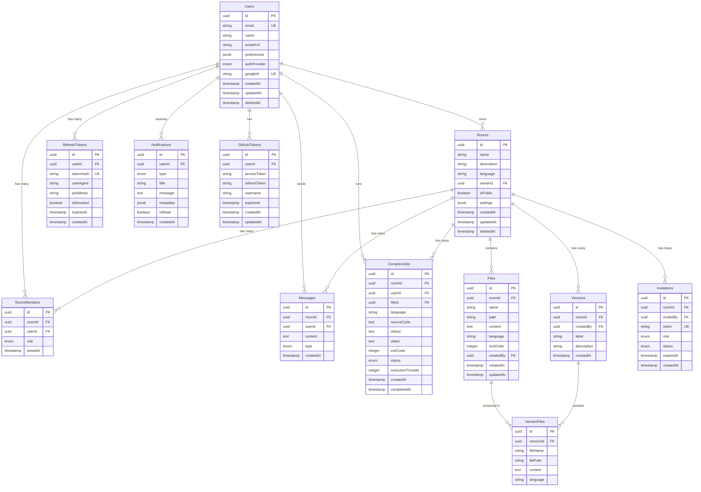

## 6.2 Table Definitions

### Table: `Users`

| Column | Type | Constraints | Description |
|--------|------|-------------|-------------|
| `id` | `UUID` | `PK, DEFAULT gen_random_uuid()` | Primary identifier |
| `email` | `VARCHAR(255)` | `UNIQUE, NOT NULL` | User's email address |
| `name` | `VARCHAR(100)` | `NOT NULL` | Display name |
| `avatar_url` | `TEXT` | `NULLABLE` | Profile picture URL |
| `preferences` | `JSONB` | `DEFAULT '{}'` | Editor preferences (theme, font, keybindings) |
| `auth_provider` | `ENUM('google', 'github', 'local')` | `NOT NULL` | Authentication provider |
| `google_id` | `VARCHAR(255)` | `UNIQUE, NULLABLE` | Google OAuth subject ID |
| `password_hash` | `VARCHAR(255)` | `NULLABLE` | Bcrypt hash (for local auth, future) |
| `created_at` | `TIMESTAMPTZ` | `DEFAULT NOW()` | Registration timestamp |
| `updated_at` | `TIMESTAMPTZ` | `DEFAULT NOW()` | Last update timestamp |
| `deleted_at` | `TIMESTAMPTZ` | `NULLABLE` | Soft delete timestamp |

**Purpose**: Core identity table. Every entity in the system relates back to a user.

**Expected Growth**: Linear with user adoption. ~10K rows at 10K users.

**Indexes**:
- `UNIQUE INDEX idx_users_email ON users(email)` — Login lookups
- `UNIQUE INDEX idx_users_google_id ON users(google_id) WHERE google_id IS NOT NULL` — Partial unique index for OAuth
- `INDEX idx_users_name ON users(name)` — User search
- `INDEX idx_users_deleted_at ON users(deleted_at) WHERE deleted_at IS NULL` — Active user queries

**Query Patterns**: Lookup by email (login), lookup by Google ID (OAuth), search by name (invitations), list with pagination.

**Optimization**: Use partial index on `deleted_at IS NULL` to exclude soft-deleted users from active queries without maintaining a separate `is_active` column.

---

### Table: `Rooms`

| Column | Type | Constraints | Description |
|--------|------|-------------|-------------|
| `id` | `UUID` | `PK, DEFAULT gen_random_uuid()` | Room identifier |
| `name` | `VARCHAR(100)` | `NOT NULL` | Room display name |
| `description` | `TEXT` | `NULLABLE` | Room description |
| `language` | `VARCHAR(50)` | `DEFAULT 'javascript'` | Default language |
| `owner_id` | `UUID` | `FK → users(id), NOT NULL` | Room creator |
| `is_public` | `BOOLEAN` | `DEFAULT false` | Public visibility |
| `settings` | `JSONB` | `DEFAULT '{}'` | Room configuration |
| `created_at` | `TIMESTAMPTZ` | `DEFAULT NOW()` | Creation timestamp |
| `updated_at` | `TIMESTAMPTZ` | `DEFAULT NOW()` | Last update |
| `deleted_at` | `TIMESTAMPTZ` | `NULLABLE` | Soft delete |

**Purpose**: Primary collaboration unit. Everything (files, messages, versions) is scoped to a room.

**Expected Growth**: ~5 rooms per active user. ~50K rows at 10K users.

**Indexes**:
- `INDEX idx_rooms_owner_id ON rooms(owner_id)` — "My rooms" queries
- `INDEX idx_rooms_created_at ON rooms(created_at DESC)` — Recent rooms listing
- `INDEX idx_rooms_deleted_at ON rooms(deleted_at) WHERE deleted_at IS NULL` — Active rooms

**Cascading Rules**: `ON DELETE` of owner → rooms are NOT cascade-deleted (ownership can be transferred). Soft delete is preferred.

---

### Table: `RoomMembers` (Junction Table)

| Column | Type | Constraints | Description |
|--------|------|-------------|-------------|
| `id` | `UUID` | `PK` | Row identifier |
| `room_id` | `UUID` | `FK → rooms(id) ON DELETE CASCADE, NOT NULL` | Room reference |
| `user_id` | `UUID` | `FK → users(id) ON DELETE CASCADE, NOT NULL` | User reference |
| `role` | `ENUM('viewer', 'editor', 'admin')` | `NOT NULL, DEFAULT 'editor'` | Permission level |
| `joined_at` | `TIMESTAMPTZ` | `DEFAULT NOW()` | When user joined |

**Purpose**: Many-to-many relationship between Users and Rooms with role-based permissions.

**Constraints**:
- `UNIQUE(room_id, user_id)` — A user can only be a member once per room

**Indexes**:
- `UNIQUE INDEX idx_room_members_room_user ON room_members(room_id, user_id)` — Prevent duplicates, fast permission checks
- `INDEX idx_room_members_user_id ON room_members(user_id)` — "My rooms" lookups

**Cascading Rules**: `ON DELETE CASCADE` for both foreign keys — if a room or user is hard-deleted, memberships are cleaned up.

**Query Patterns**: Permission check (`SELECT role FROM room_members WHERE room_id = ? AND user_id = ?`), list members, list user's rooms.

---

### Table: `Files`

| Column | Type | Constraints | Description |
|--------|------|-------------|-------------|
| `id` | `UUID` | `PK` | File identifier |
| `room_id` | `UUID` | `FK → rooms(id) ON DELETE CASCADE, NOT NULL` | Parent room |
| `name` | `VARCHAR(255)` | `NOT NULL` | File name with extension |
| `path` | `VARCHAR(1000)` | `NOT NULL, DEFAULT '/'` | File path (for nested folders) |
| `content` | `TEXT` | `DEFAULT ''` | File content |
| `language` | `VARCHAR(50)` | `NULLABLE` | Detected/set language |
| `sort_order` | `INTEGER` | `DEFAULT 0` | Display order in file tree |
| `created_by` | `UUID` | `FK → users(id), NOT NULL` | File creator |
| `created_at` | `TIMESTAMPTZ` | `DEFAULT NOW()` | Creation time |
| `updated_at` | `TIMESTAMPTZ` | `DEFAULT NOW()` | Last content update |

**Purpose**: Stores code files within rooms. Content is stored as TEXT for simplicity; consider S3 migration for files > 1MB.

**Expected Growth**: ~10 files per room average. ~500K rows at 10K active rooms.

**Indexes**:
- `INDEX idx_files_room_id ON files(room_id)` — File tree listing
- `UNIQUE INDEX idx_files_room_path_name ON files(room_id, path, name)` — Prevent duplicate filenames in same directory
- `INDEX idx_files_updated_at ON files(updated_at DESC)` — Recently modified files

**Optimization**: `content` column is a `TEXT` type; use `SELECT` without `content` for file tree listing to avoid loading file bodies. Include `content` only when a specific file is opened.

---

### Table: `Messages`

| Column | Type | Constraints | Description |
|--------|------|-------------|-------------|
| `id` | `UUID` | `PK` | Message identifier |
| `room_id` | `UUID` | `FK → rooms(id) ON DELETE CASCADE, NOT NULL` | Parent room |
| `user_id` | `UUID` | `FK → users(id) ON DELETE SET NULL, NULLABLE` | Message author |
| `content` | `TEXT` | `NOT NULL` | Message text |
| `type` | `ENUM('text', 'system', 'code')` | `DEFAULT 'text'` | Message type |
| `created_at` | `TIMESTAMPTZ` | `DEFAULT NOW()` | Sent timestamp |

**Purpose**: Persistent chat history within rooms.

**Expected Growth**: High-volume. ~1K messages per active room per week. Archival strategy needed at scale.

**Indexes**:
- `INDEX idx_messages_room_created ON messages(room_id, created_at DESC)` — Paginated history (composite index for efficient cursor-based pagination)

**Optimization**: Cursor-based pagination using `created_at` + `id` for consistent ordering. Consider partitioning by `room_id` at scale.

---

### Table: `Versions`

| Column | Type | Constraints | Description |
|--------|------|-------------|-------------|
| `id` | `UUID` | `PK` | Version identifier |
| `room_id` | `UUID` | `FK → rooms(id) ON DELETE CASCADE, NOT NULL` | Parent room |
| `created_by` | `UUID` | `FK → users(id), NOT NULL` | Snapshot creator |
| `label` | `VARCHAR(100)` | `NULLABLE` | User-provided version label |
| `description` | `TEXT` | `NULLABLE` | Version notes |
| `created_at` | `TIMESTAMPTZ` | `DEFAULT NOW()` | Snapshot time |

**Purpose**: Version history metadata. Actual file contents are stored in `VersionFiles`.

**Indexes**:
- `INDEX idx_versions_room_created ON versions(room_id, created_at DESC)` — Version history listing

---

### Table: `VersionFiles`

| Column | Type | Constraints | Description |
|--------|------|-------------|-------------|
| `id` | `UUID` | `PK` | Row identifier |
| `version_id` | `UUID` | `FK → versions(id) ON DELETE CASCADE, NOT NULL` | Parent version |
| `file_name` | `VARCHAR(255)` | `NOT NULL` | File name at time of snapshot |
| `file_path` | `VARCHAR(1000)` | `NOT NULL` | File path at time of snapshot |
| `content` | `TEXT` | `NOT NULL` | Full file content at snapshot time |
| `language` | `VARCHAR(50)` | `NULLABLE` | Language at snapshot time |

**Purpose**: Immutable snapshot of file contents at a specific version point.

**Expected Growth**: `versions × files_per_room`. Consider deduplication (content hashing) at scale.

**Optimization**: Store content hash and use deduplication to avoid storing identical file contents across versions.

---

### Table: `Invitations`

| Column | Type | Constraints | Description |
|--------|------|-------------|-------------|
| `id` | `UUID` | `PK` | Invitation identifier |
| `room_id` | `UUID` | `FK → rooms(id) ON DELETE CASCADE, NOT NULL` | Target room |
| `invited_by` | `UUID` | `FK → users(id), NOT NULL` | Inviter |
| `token` | `VARCHAR(64)` | `UNIQUE, NOT NULL` | Invitation token (URL-safe random string) |
| `role` | `ENUM('viewer', 'editor')` | `DEFAULT 'editor'` | Role granted upon acceptance |
| `status` | `ENUM('pending', 'accepted', 'expired', 'revoked')` | `DEFAULT 'pending'` | Invitation state |
| `expires_at` | `TIMESTAMPTZ` | `NOT NULL` | Expiration timestamp |
| `created_at` | `TIMESTAMPTZ` | `DEFAULT NOW()` | Creation time |

**Indexes**:
- `UNIQUE INDEX idx_invitations_token ON invitations(token)` — Token lookup for join
- `INDEX idx_invitations_room ON invitations(room_id)` — List room invitations
- `INDEX idx_invitations_expires ON invitations(expires_at) WHERE status = 'pending'` — Cleanup expired invitations

---

### Table: `RefreshTokens`

| Column | Type | Constraints | Description |
|--------|------|-------------|-------------|
| `id` | `UUID` | `PK` | Token identifier |
| `user_id` | `UUID` | `FK → users(id) ON DELETE CASCADE, NOT NULL` | Token owner |
| `token_hash` | `VARCHAR(255)` | `UNIQUE, NOT NULL` | SHA-256 hash of token |
| `user_agent` | `TEXT` | `NULLABLE` | Browser/device identifier |
| `ip_address` | `VARCHAR(45)` | `NULLABLE` | Client IP (IPv4/IPv6) |
| `is_revoked` | `BOOLEAN` | `DEFAULT false` | Revocation flag |
| `expires_at` | `TIMESTAMPTZ` | `NOT NULL` | Token expiration |
| `created_at` | `TIMESTAMPTZ` | `DEFAULT NOW()` | Issued timestamp |

**Indexes**:
- `UNIQUE INDEX idx_refresh_tokens_hash ON refresh_tokens(token_hash)` — Token lookup
- `INDEX idx_refresh_tokens_user ON refresh_tokens(user_id)` — User's active sessions
- `INDEX idx_refresh_tokens_expires ON refresh_tokens(expires_at) WHERE is_revoked = false` — Cleanup expired tokens

**Security**: Never store raw refresh tokens. Store only the SHA-256 hash. Compare incoming tokens by hashing and matching.

---

### Table: `Notifications`

| Column | Type | Constraints | Description |
|--------|------|-------------|-------------|
| `id` | `UUID` | `PK` | Notification identifier |
| `user_id` | `UUID` | `FK → users(id) ON DELETE CASCADE, NOT NULL` | Recipient |
| `type` | `ENUM('invite', 'ai_review', 'mention', 'system')` | `NOT NULL` | Notification type |
| `title` | `VARCHAR(255)` | `NOT NULL` | Notification title |
| `message` | `TEXT` | `NULLABLE` | Notification body |
| `metadata` | `JSONB` | `DEFAULT '{}'` | Type-specific data (roomId, reviewId, etc.) |
| `is_read` | `BOOLEAN` | `DEFAULT false` | Read status |
| `created_at` | `TIMESTAMPTZ` | `DEFAULT NOW()` | Creation time |

**Indexes**:
- `INDEX idx_notifications_user_read ON notifications(user_id, is_read, created_at DESC)` — Unread notifications listing
- `INDEX idx_notifications_user_created ON notifications(user_id, created_at DESC)` — All notifications with pagination

---

### Table: `GitHubTokens`

| Column | Type | Constraints | Description |
|--------|------|-------------|-------------|
| `id` | `UUID` | `PK` | Row identifier |
| `user_id` | `UUID` | `FK → users(id) ON DELETE CASCADE, UNIQUE, NOT NULL` | Token owner (one per user) |
| `access_token` | `TEXT` | `NOT NULL` | Encrypted GitHub access token |
| `refresh_token` | `TEXT` | `NULLABLE` | Encrypted GitHub refresh token |
| `username` | `VARCHAR(100)` | `NOT NULL` | GitHub username |
| `expires_at` | `TIMESTAMPTZ` | `NULLABLE` | Token expiration |
| `created_at` | `TIMESTAMPTZ` | `DEFAULT NOW()` | When connected |
| `updated_at` | `TIMESTAMPTZ` | `DEFAULT NOW()` | Last token refresh |

**Security**: Access tokens are encrypted at rest using AES-256-GCM with a key from environment variables.

---

### Table: `CompilerJobs`

| Column | Type | Constraints | Description |
|--------|------|-------------|-------------|
| `id` | `UUID` | `PK` | Job identifier |
| `room_id` | `UUID` | `FK → rooms(id) ON DELETE CASCADE, NOT NULL` | Execution room |
| `user_id` | `UUID` | `FK → users(id), NOT NULL` | Who ran it |
| `file_id` | `UUID` | `FK → files(id) ON DELETE SET NULL, NULLABLE` | Source file |
| `language` | `VARCHAR(50)` | `NOT NULL` | Execution language |
| `source_code` | `TEXT` | `NOT NULL` | Submitted source code |
| `stdout` | `TEXT` | `NULLABLE` | Standard output |
| `stderr` | `TEXT` | `NULLABLE` | Standard error |
| `exit_code` | `INTEGER` | `NULLABLE` | Process exit code |
| `status` | `ENUM('queued', 'running', 'completed', 'failed', 'timeout')` | `DEFAULT 'queued'` | Job status |
| `execution_time_ms` | `INTEGER` | `NULLABLE` | Execution duration in milliseconds |
| `created_at` | `TIMESTAMPTZ` | `DEFAULT NOW()` | Submission time |
| `completed_at` | `TIMESTAMPTZ` | `NULLABLE` | Completion time |

**Purpose**: Audit log for all code executions. Enables usage analytics, abuse detection, and debugging.

**Indexes**:
- `INDEX idx_compiler_jobs_room ON compiler_jobs(room_id, created_at DESC)` — Room execution history
- `INDEX idx_compiler_jobs_user ON compiler_jobs(user_id, created_at DESC)` — User execution history
- `INDEX idx_compiler_jobs_status ON compiler_jobs(status) WHERE status IN ('queued', 'running')` — Active job monitoring

## 6.3 Normalization Analysis

The schema follows **Third Normal Form (3NF)** with pragmatic denormalization:

| Normalization Decision | Rationale |
|----------------------|-----------|
| `Files.content` in same table as metadata | Avoids a JOIN for the most common query (open file). `SELECT` without `content` column for tree listings. |
| `VersionFiles` separate from `Files` | Versions are immutable snapshots; keeping them in `Files` would complicate the schema with versioning flags. |
| `Users.preferences` as JSONB | Preferences are schemaless and user-specific; a separate key-value table would require N queries or complex JOINs. JSONB allows atomic updates. |
| `Rooms.settings` as JSONB | Room settings evolve frequently; JSONB avoids schema migrations for every new setting. |
| `Notifications.metadata` as JSONB | Each notification type has different metadata; JSONB is more flexible than a separate table per type. |

---

# 7. Redis Architecture

## 7.1 Redis Use Cases Overview

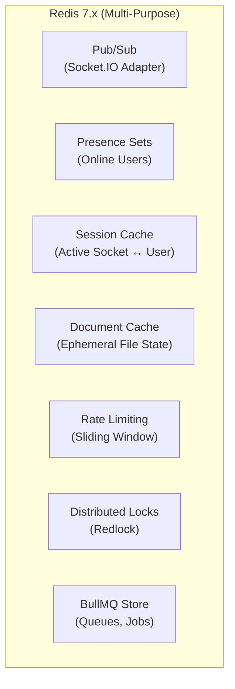

## 7.2 Detailed Key Structures

### 7.2.1 Socket.IO Adapter (Pub/Sub)

| Purpose | Synchronize Socket.IO events across multiple API server nodes |
|---------|--------------------------------------------------------------|
| **Mechanism** | `@socket.io/redis-adapter` uses Redis Pub/Sub channels internally |
| **Key Pattern** | Managed by adapter library — `socket.io#/{namespace}#` |
| **TTL** | N/A (Pub/Sub messages are ephemeral — no persistence) |
| **Memory** | Negligible — messages are not stored |
| **Why Redis** | Only reliable Pub/Sub broker already in our stack; eliminates need for RabbitMQ/Kafka for this use case |

### 7.2.2 User Presence

| Aspect | Detail |
|--------|--------|
| **Purpose** | Track which users are currently online in which rooms |
| **Key Pattern** | `presence:room:{roomId}` → Redis SET of user IDs |
| **Operations** | `SADD` on join, `SREM` on leave, `SMEMBERS` to list online users |
| **TTL Strategy** | No TTL on the set itself; individual presence entries use a separate heartbeat key |
| **Heartbeat Key** | `presence:heartbeat:{roomId}:{userId}` → `1` with `EX 60` (60-second TTL) |
| **Heartbeat Logic** | Client sends heartbeat every 30 seconds. If heartbeat key expires, a cleanup job removes the user from the presence set. |
| **Memory** | ~100 bytes per user per room. 50 users × 1000 rooms = ~5MB |
| **Eviction** | Not evictable — uses `noeviction` or separate keyspace |

```text
# Example keys
presence:room:550e8400-e29b-41d4-a716-446655440000            → SET { "user-1", "user-2", "user-3" }
presence:heartbeat:550e8400-e29b-41d4-a716-446655440000:user-1 → "1" (TTL: 60s)
```

### 7.2.3 Socket Session Mapping

| Aspect | Detail |
|--------|--------|
| **Purpose** | Map socket IDs to user IDs and vice versa for targeted messaging |
| **Key Patterns** | `socket:user:{userId}` → SET of socket IDs (user may have multiple tabs) |
| | `socket:meta:{socketId}` → HASH `{ userId, roomId, connectedAt }` |
| **TTL** | `EX 3600` (1 hour); refreshed on heartbeat |
| **Cleanup** | On disconnect event, remove socket ID from user's set; delete meta hash |
| **Memory** | ~200 bytes per connection. 10K connections = ~2MB |

```text
socket:user:user-1          → SET { "socket-abc", "socket-def" }
socket:meta:socket-abc      → HASH { userId: "user-1", roomId: "room-1", connectedAt: "..." }
```

### 7.2.4 Ephemeral Document State

| Aspect | Detail |
|--------|--------|
| **Purpose** | Cache the current in-memory state of actively edited files to avoid PostgreSQL writes on every keystroke |
| **Key Pattern** | `doc:room:{roomId}:file:{fileId}` → STRING (serialized document state, e.g., Yjs encoded state) |
| **TTL** | `EX 3600` (1 hour); refreshed on every edit |
| **Persistence Strategy** | A debounced flush (every 30 seconds of inactivity or every 5 minutes of continuous editing) writes the cached state back to PostgreSQL |
| **Memory** | ~50KB per active file (assuming average file size). 10K active files = ~500MB |
| **Eviction** | `volatile-lru` — Redis evicts TTL-bearing keys under memory pressure; loss is acceptable because PostgreSQL has the last persisted state |

```text
doc:room:room-1:file:file-1  → "<encoded CRDT state>" (TTL: 3600s)
```

### 7.2.5 Cursor & Selection State

| Aspect | Detail |
|--------|--------|
| **Purpose** | Store each user's current cursor position and selection range for fast broadcast to late-joiners |
| **Key Pattern** | `cursor:room:{roomId}:file:{fileId}` → HASH field per user |
| **Hash Fields** | `{userId}` → JSON `{ line, column, selectionStart, selectionEnd, color }` |
| **TTL** | `EX 300` (5 minutes); refreshed on cursor movement |
| **Memory** | ~100 bytes per user per file. Negligible |

```text
cursor:room:room-1:file:file-1 → HASH {
  "user-1": '{"line":10,"col":5,"color":"#FF6B6B"}',
  "user-2": '{"line":25,"col":12,"color":"#4ECDC4"}'
}
```

### 7.2.6 Rate Limiting

| Aspect | Detail |
|--------|--------|
| **Purpose** | Prevent abuse of expensive endpoints (auth, AI, compiler) |
| **Algorithm** | Sliding Window Counter (implemented via Lua script for atomicity) |
| **Key Pattern** | `ratelimit:{identifier}:{endpoint}:{window}` → STRING (counter) |
| **Identifier** | User ID for authenticated routes; IP address for public routes |
| **TTL** | Matches the window size (e.g., `EX 60` for per-minute limits) |
| **Memory** | ~50 bytes per key. Negligible |

```text
ratelimit:user-1:/ai/review:60     → "3" (TTL: 45s remaining)
ratelimit:192.168.1.1:/auth/login:60 → "5" (TTL: 30s remaining)
```

**Rate Limit Configuration**:

| Endpoint Category | Window | Max Requests | Rationale |
|------------------|--------|-------------|-----------|
| `/auth/*` | 60s | 10 | Prevent brute force login |
| `/ai/*` | 60s | 5 | LLM API cost control |
| `/compiler/run` | 60s | 10 | Compute resource protection |
| General API | 60s | 100 | Prevent scraping/DoS |
| Socket events (general) | 1s | 50 | Prevent event flooding |
| Socket events (cursor) | 1s | 20 | Cursor event throttling |

### 7.2.7 Distributed Locks

| Aspect | Detail |
|--------|--------|
| **Purpose** | Prevent concurrent conflicting operations (e.g., two simultaneous version restores, GitHub push race conditions) |
| **Algorithm** | Redlock (single-instance variant for MVP; full Redlock for multi-node Redis) |
| **Key Pattern** | `lock:{resource}:{resourceId}` → STRING (lock owner UUID) |
| **TTL** | `PX 10000` (10 seconds; auto-release) |
| **Usage** | Version restore, GitHub commit/push, room deletion |
| **Memory** | ~100 bytes per lock. Only a handful active at any time |

```text
lock:version-restore:room-1  → "lock-owner-uuid" (TTL: 10s)
lock:github-push:room-1      → "lock-owner-uuid" (TTL: 30s)
```

### 7.2.8 BullMQ Backing Store

| Aspect | Detail |
|--------|--------|
| **Purpose** | BullMQ uses Redis to store all queue state, job data, and processing metadata |
| **Key Pattern** | `bull:{queueName}:*` (managed by BullMQ library) |
| **TTL** | Configurable `removeOnComplete` and `removeOnFail` settings per queue |
| **Memory** | Depends on job volume. ~1KB per job. 10K completed jobs retained = ~10MB |
| **Eviction** | Never evict BullMQ keys — use `noeviction` for BullMQ prefix or separate Redis instance |

## 7.3 Redis Memory Budget (Estimated for 5K concurrent users)

| Use Case | Estimated Memory | Notes |
|----------|-----------------|-------|
| Presence Sets | ~5 MB | 50 users × 1000 rooms |
| Socket Sessions | ~2 MB | 10K connections |
| Document Cache | ~500 MB | 10K active files × 50KB avg |
| Cursor State | ~1 MB | Negligible |
| Rate Limiting | ~1 MB | Negligible |
| Distributed Locks | < 1 MB | Handful of locks |
| BullMQ Store | ~50 MB | Job history retention |
| Socket.IO Adapter | ~10 MB | Internal channel state |
| **Total Estimated** | **~570 MB** | **Well within a 1GB Redis instance** |

## 7.4 Redis Configuration Recommendations

| Setting | Value | Rationale |
|---------|-------|-----------|
| `maxmemory` | 1GB (MVP), 4GB (production) | Budget includes 50% headroom |
| `maxmemory-policy` | `volatile-lru` | Evicts keys with TTL first (protects persistent BullMQ keys) |
| `save` (RDB) | `save 900 1`, `save 300 10` | Periodic snapshots for crash recovery |
| `appendonly` | `yes` | AOF for BullMQ durability (prevents job loss on crash) |
| `appendfsync` | `everysec` | Balance between durability and performance |
| `tcp-keepalive` | `60` | Detect dead connections in cloud environments |

---

# 8. Real-Time Collaboration Architecture

## 8.1 Socket.IO Server Architecture

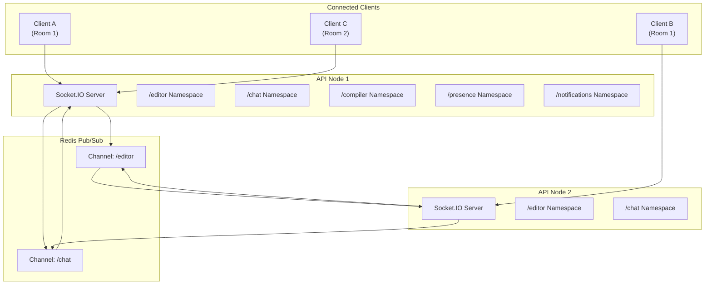

## 8.2 Namespace Architecture

| Namespace | Purpose | Events | Auth Required | Rate Limit |
|-----------|---------|--------|--------------|------------|
| `/editor` | Real-time code editing, file operations | `editor:change`, `editor:sync`, `editor:ack`, `file:create`, `file:delete`, `file:rename` | Yes (JWT + Room Membership) | 50 events/s per user |
| `/collaboration` | Presence, cursors, selections, typing | `presence:join`, `presence:leave`, `cursor:move`, `selection:change`, `typing:start`, `typing:stop`, `file:focus` | Yes (JWT + Room Membership) | 20 events/s per user |
| `/chat` | In-room messaging | `chat:send`, `chat:receive`, `chat:typing` | Yes (JWT + Room Membership) | 10 events/s per user |
| `/compiler` | Code execution streaming | `compiler:run`, `compiler:output`, `compiler:complete`, `compiler:error` | Yes (JWT + Editor/Admin Role) | 2 events/s per user |
| `/notifications` | System alerts, async results | `notification:new`, `notification:read` | Yes (JWT) | N/A (server-initiated) |

## 8.3 Event Naming Conventions

**Pattern**: `{domain}:{action}` (lowercase, colon-separated)

| Category | Event Name | Direction | Payload | Description |
|----------|-----------|-----------|---------|-------------|
| **Editor** | `editor:change` | Client → Server | `{ fileId, changes: [...], version }` | Code change operation |
| | `editor:update` | Server → Client | `{ fileId, changes: [...], userId, version }` | Broadcast change to room |
| | `editor:ack` | Server → Client | `{ fileId, version }` | Confirm change applied |
| | `editor:sync` | Server → Client | `{ fileId, content, version }` | Full document sync on reconnect |
| | `file:create` | Bidirectional | `{ roomId, file: { id, name, path, language } }` | New file created |
| | `file:delete` | Bidirectional | `{ roomId, fileId }` | File deleted |
| | `file:rename` | Bidirectional | `{ roomId, fileId, newName }` | File renamed |
| **Presence** | `presence:join` | Client → Server | `{ roomId }` | User joins room |
| | `presence:leave` | Client → Server | `{ roomId }` | User leaves room |
| | `presence:update` | Server → Client | `{ roomId, users: [...] }` | Updated presence list |
| | `presence:heartbeat` | Client → Server | `{ roomId }` | Keep-alive ping |
| **Cursor** | `cursor:move` | Client → Server | `{ roomId, fileId, position: { line, col } }` | Cursor position update |
| | `cursor:update` | Server → Client | `{ userId, fileId, position, color }` | Broadcast cursor to others |
| | `selection:change` | Client → Server | `{ roomId, fileId, range: { start, end } }` | Selection range update |
| | `selection:update` | Server → Client | `{ userId, fileId, range, color }` | Broadcast selection |
| **Chat** | `chat:send` | Client → Server | `{ roomId, content, type }` | Send message |
| | `chat:receive` | Server → Client | `{ id, userId, userName, content, type, createdAt }` | New message received |
| | `chat:typing` | Bidirectional | `{ roomId, userId, isTyping }` | Typing indicator |
| **Compiler** | `compiler:run` | Client → Server | `{ roomId, fileId, code, language, stdin }` | Execute code |
| | `compiler:queued` | Server → Client | `{ jobId }` | Job queued confirmation |
| | `compiler:output` | Server → Client | `{ jobId, stream: 'stdout'|'stderr', data }` | Streaming output |
| | `compiler:complete` | Server → Client | `{ jobId, exitCode, executionTimeMs }` | Execution finished |
| | `compiler:error` | Server → Client | `{ jobId, error }` | Execution failed |
| **Notification** | `notification:new` | Server → Client | `{ id, type, title, message, metadata }` | New notification |
| | `notification:read` | Client → Server | `{ notificationId }` | Mark as read |
| **System** | `error:system` | Server → Client | `{ code, message }` | System error |
| | `reconnect:state` | Server → Client | `{ rooms: [...], cursors: [...] }` | State restoration on reconnect |

## 8.4 Event Flow Example: Real-Time Code Edit

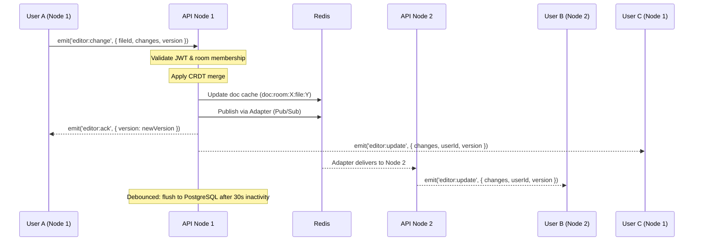

## 8.5 Reconnection Strategy

| Phase | Action | Data Source |
|-------|--------|------------|
| 1. Socket Reconnect | Client reconnects with JWT in handshake auth | Client local storage |
| 2. Auth Verify | Server verifies JWT, re-establishes socket session | JWT verification |
| 3. Room Rejoin | Client sends `presence:join` for previously active rooms | Client local state |
| 4. State Sync | Server sends full document state from Redis cache | `doc:room:X:file:Y` Redis key |
| 5. Cursor Restore | Server sends current cursor positions of all room members | `cursor:room:X:file:Y` Redis HASH |
| 6. Missed Messages | Client provides last known message ID; server sends newer messages | PostgreSQL `messages` table |
| 7. Presence Update | Server broadcasts updated presence list to room | `presence:room:X` Redis SET |

**Conflict Resolution on Reconnect**: If the client has unsent local changes (offline edits), the CRDT algorithm ensures automatic conflict-free merge when the changes are applied after reconnection.

## 8.6 Scaling Strategy

| Challenge | Solution |
|-----------|----------|
| Socket events don't reach users on other nodes | Redis Adapter (`@socket.io/redis-adapter`) syncs all events across nodes via Pub/Sub |
| Sticky sessions required for Socket.IO | Load balancer configured with sticky sessions (cookie-based or IP hash) for the WebSocket upgrade |
| Presence state must be consistent across nodes | Redis Sets for presence; any node can read/write presence state |
| Document state must be accessible from any node | Redis-cached document state; any node can serve a reconnecting client |

---

# 9. REST API Design

## 9.1 API Conventions

| Convention | Standard | Example |
|------------|----------|---------|
| Base URL | `/api/v1` | `https://api.collab-editor.com/api/v1` |
| Resource Naming | Plural nouns, kebab-case | `/rooms`, `/compiler-jobs` |
| ID Parameters | UUID in path | `/rooms/550e8400-...` |
| Pagination | Cursor-based | `?cursor=abc&limit=20` |
| Filtering | Query parameters | `?status=active&language=javascript` |
| Sorting | Query parameter | `?sort=-createdAt` (prefix `-` for descending) |
| Versioning | URL path prefix | `/api/v1/...` |
| Content Type | `application/json` | All requests and responses |

## 9.2 Standard Response Format

### Success Response
```json
{
  "success": true,
  "data": { ... },
  "meta": {
    "pagination": {
      "cursor": "next-cursor-value",
      "hasMore": true,
      "limit": 20
    }
  }
}
```

### Error Response
```json
{
  "success": false,
  "error": {
    "code": "VALIDATION_FAILED",
    "message": "Invalid input provided.",
    "details": [
      { "field": "email", "message": "Must be a valid email address" }
    ]
  }
}
```

## 9.3 API Endpoints by Module

### Authentication APIs

| Method | Endpoint | Auth | Description | Request Body | Response (Success) | Status |
|--------|----------|------|-------------|-------------|-------------------|--------|
| `GET` | `/auth/google` | No | Redirect to Google OAuth consent | — | Redirect (302) | `302` |
| `GET` | `/auth/google/callback` | No | Google OAuth callback | — | `{ accessToken, user }` + Set-Cookie (refresh) | `200` |
| `POST` | `/auth/refresh` | Cookie | Exchange refresh token | — (token in HTTP-only cookie) | `{ accessToken }` | `200` |
| `POST` | `/auth/logout` | Yes | Revoke refresh token | — | `{ message }` | `200` |

**Rate Limiting**: 10 requests/minute per IP on all `/auth/*` endpoints.

**Validation Rules**:
- Refresh token cookie must be present and valid for `/auth/refresh`
- Access token must be present in `Authorization: Bearer <token>` for `/auth/logout`

---

### User APIs

| Method | Endpoint | Auth | Role | Description | Request Body | Response | Status |
|--------|----------|------|------|-------------|-------------|----------|--------|
| `GET` | `/users/me` | Yes | Any | Get current user profile | — | `{ user }` | `200` |
| `PATCH` | `/users/me` | Yes | Any | Update profile | `{ name?, avatarUrl?, preferences? }` | `{ user }` | `200` |
| `GET` | `/users/search` | Yes | Any | Search users | Query: `?q=john&limit=10` | `{ users: [...] }` | `200` |
| `DELETE` | `/users/me` | Yes | Any | Delete account (soft) | — | `{ message }` | `200` |

**Validation Rules**:
- `name`: 2-100 characters
- `preferences`: Valid JSONB matching preferences schema
- `q` (search): 2-100 characters, sanitized

---

### Room APIs

| Method | Endpoint | Auth | Role | Description | Request Body | Response | Status |
|--------|----------|------|------|-------------|-------------|----------|--------|
| `POST` | `/rooms` | Yes | Any | Create room | `{ name, description?, language? }` | `{ room }` | `201` |
| `GET` | `/rooms` | Yes | Any | List user's rooms | Query: `?cursor&limit` | `{ rooms: [...], meta }` | `200` |
| `GET` | `/rooms/:id` | Yes | Member | Get room details | — | `{ room, members, files }` | `200` |
| `PATCH` | `/rooms/:id` | Yes | Admin | Update room | `{ name?, description?, language?, settings? }` | `{ room }` | `200` |
| `DELETE` | `/rooms/:id` | Yes | Admin | Delete room (soft) | — | `{ message }` | `200` |
| `POST` | `/rooms/:id/invite` | Yes | Admin | Generate invite | `{ role? }` | `{ inviteLink, token, expiresAt }` | `201` |
| `POST` | `/rooms/join/:token` | Yes | Any | Join via invite | — | `{ room, role }` | `200` |
| `GET` | `/rooms/:id/members` | Yes | Member | List members | — | `{ members: [...] }` | `200` |
| `PATCH` | `/rooms/:id/members/:userId` | Yes | Admin | Change role | `{ role }` | `{ member }` | `200` |
| `DELETE` | `/rooms/:id/members/:userId` | Yes | Admin | Remove member | — | `{ message }` | `200` |
| `POST` | `/rooms/:id/leave` | Yes | Member | Leave room | — | `{ message }` | `200` |

**Validation Rules**:
- `name`: 1-100 characters, required
- `role`: Must be one of `viewer`, `editor`, `admin`
- Invite tokens expire in 7 days by default
- Room owner cannot be removed; ownership must be transferred first

---

### File APIs

| Method | Endpoint | Auth | Role | Description | Request Body | Response | Status |
|--------|----------|------|------|-------------|-------------|----------|--------|
| `GET` | `/rooms/:id/files` | Yes | Member | Get file tree | — | `{ files: [...] }` | `200` |
| `POST` | `/rooms/:id/files` | Yes | Editor+ | Create file | `{ name, path?, language?, content? }` | `{ file }` | `201` |
| `GET` | `/rooms/:id/files/:fileId` | Yes | Member | Get file content | — | `{ file }` | `200` |
| `PATCH` | `/rooms/:id/files/:fileId` | Yes | Editor+ | Update file metadata | `{ name?, path? }` | `{ file }` | `200` |
| `DELETE` | `/rooms/:id/files/:fileId` | Yes | Editor+ | Delete file | — | `{ message }` | `200` |

---

### Chat APIs

| Method | Endpoint | Auth | Role | Description | Request Body | Response | Status |
|--------|----------|------|------|-------------|-------------|----------|--------|
| `GET` | `/rooms/:id/messages` | Yes | Member | Message history | Query: `?cursor&limit=50` | `{ messages: [...], meta }` | `200` |

**Notes**: Message sending is handled exclusively via WebSocket (`chat:send`) for real-time delivery. The REST endpoint is for historical retrieval only.

---

### Compiler APIs

| Method | Endpoint | Auth | Role | Description | Request Body | Response | Status |
|--------|----------|------|------|-------------|-------------|----------|--------|
| `POST` | `/compiler/run` | Yes | Editor+ | Execute code (sync) | `{ code, language, stdin?, timeout? }` | `{ jobId, output, exitCode }` | `200` |
| `GET` | `/compiler/languages` | No | — | List supported languages | — | `{ languages: [...] }` | `200` |
| `GET` | `/compiler/jobs/:id` | Yes | Editor+ | Get job result | — | `{ job }` | `200` |

**Rate Limiting**: 10 requests/minute per user.

**Validation Rules**:
- `code`: Max 100KB
- `language`: Must be in supported languages list
- `timeout`: Max 30 seconds (default: 10 seconds)
- `stdin`: Max 10KB

---

### Version History APIs

| Method | Endpoint | Auth | Role | Description | Request Body | Response | Status |
|--------|----------|------|------|-------------|-------------|----------|--------|
| `POST` | `/rooms/:id/versions` | Yes | Editor+ | Create snapshot | `{ label?, description? }` | `{ version }` | `201` |
| `GET` | `/rooms/:id/versions` | Yes | Member | List versions | Query: `?cursor&limit` | `{ versions: [...], meta }` | `200` |
| `GET` | `/rooms/:id/versions/:versionId` | Yes | Member | Get version detail | — | `{ version, files: [...] }` | `200` |
| `POST` | `/rooms/:id/versions/:versionId/restore` | Yes | Admin | Restore version | — | `{ message, restoredFiles }` | `200` |
| `GET` | `/rooms/:id/versions/:v1/diff/:v2` | Yes | Member | Diff two versions | — | `{ diffs: [...] }` | `200` |

---

### GitHub APIs

| Method | Endpoint | Auth | Role | Description | Request Body | Response | Status |
|--------|----------|------|------|-------------|-------------|----------|--------|
| `GET` | `/github/auth` | Yes | Any | Initiate GitHub OAuth | — | Redirect (302) | `302` |
| `GET` | `/github/callback` | Yes | Any | GitHub OAuth callback | — | `{ connected: true }` | `200` |
| `GET` | `/github/repos` | Yes | Any | List user's repos | Query: `?page&per_page` | `{ repos: [...] }` | `200` |
| `POST` | `/rooms/:id/github/import` | Yes | Admin | Import repo | `{ repoUrl, branch? }` | `{ jobId, status: 'queued' }` | `202` |
| `POST` | `/rooms/:id/github/commit` | Yes | Editor+ | Commit changes | `{ message, files? }` | `{ commitSha }` | `200` |
| `POST` | `/rooms/:id/github/push` | Yes | Admin | Push to remote | `{ branch? }` | `{ jobId, status: 'queued' }` | `202` |

---

### AI APIs

| Method | Endpoint | Auth | Role | Description | Request Body | Response | Status |
|--------|----------|------|------|-------------|-------------|----------|--------|
| `POST` | `/ai/review` | Yes | Editor+ | Request code review | `{ fileId, context? }` | `{ jobId, status: 'queued' }` | `202` |
| `POST` | `/ai/explain` | Yes | Member | Explain code | `{ code, language }` | `{ explanation }` | `200` |
| `POST` | `/ai/suggest` | Yes | Editor+ | Code suggestions | `{ fileId, instruction }` | `{ suggestions: [...] }` | `200` |
| `GET` | `/ai/reviews/:id` | Yes | Member | Get review results | — | `{ review }` | `200` |

**Rate Limiting**: 5 requests/minute per user on all `/ai/*` endpoints.

---

### Notification APIs

| Method | Endpoint | Auth | Role | Description | Request Body | Response | Status |
|--------|----------|------|------|-------------|-------------|----------|--------|
| `GET` | `/notifications` | Yes | Any | List notifications | Query: `?cursor&limit&unreadOnly` | `{ notifications: [...], meta }` | `200` |
| `PATCH` | `/notifications/:id/read` | Yes | Any | Mark as read | — | `{ notification }` | `200` |
| `PATCH` | `/notifications/read-all` | Yes | Any | Mark all as read | — | `{ updatedCount }` | `200` |
| `GET` | `/notifications/unread-count` | Yes | Any | Unread count | — | `{ count }` | `200` |

---

### System APIs

| Method | Endpoint | Auth | Description | Response | Status |
|--------|----------|------|-------------|----------|--------|
| `GET` | `/health` | No | Liveness probe | `{ status: 'ok', uptime }` | `200` |
| `GET` | `/ready` | No | Readiness probe | `{ status: 'ok', db: 'connected', redis: 'connected' }` | `200` |
| `GET` | `/metrics` | No* | Prometheus metrics | Prometheus text format | `200` |

*`/metrics` should be restricted to internal networks in production.

## 9.4 HTTP Status Code Usage

| Status | Usage |
|--------|-------|
| `200 OK` | Successful GET, PATCH, DELETE, POST (synchronous) |
| `201 Created` | Successful resource creation (POST) |
| `202 Accepted` | Async job queued (AI review, GitHub import) |
| `204 No Content` | Successful deletion with no response body |
| `400 Bad Request` | Validation errors, malformed request |
| `401 Unauthorized` | Missing or invalid JWT |
| `403 Forbidden` | Insufficient permissions (wrong role) |
| `404 Not Found` | Resource doesn't exist |
| `409 Conflict` | Duplicate resource (e.g., user already a member) |
| `429 Too Many Requests` | Rate limit exceeded |
| `500 Internal Server Error` | Unexpected server error |
| `503 Service Unavailable` | Dependency unavailable (DB, Redis down) |

---

# 10. Background Processing Architecture

## 10.1 Queue Architecture

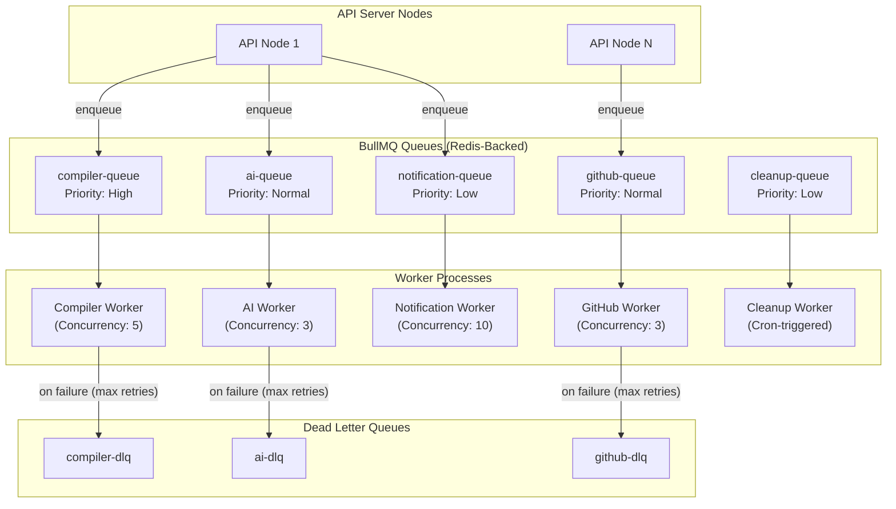

## 10.2 Queue Definitions

| Queue Name | Purpose | Concurrency | Max Retries | Retry Delay | DLQ | Priority |
|------------|---------|-------------|-------------|-------------|-----|----------|
| `compiler-queue` | Code execution | 5 per worker | 2 | Exponential (1s, 5s) | `compiler-dlq` | High |
| `ai-queue` | AI code review, explain, suggest | 3 per worker | 3 | Exponential (5s, 15s, 45s) | `ai-dlq` | Normal |
| `github-queue` | Repo import, push, PR creation | 3 per worker | 3 | Exponential (10s, 30s, 90s) | `github-dlq` | Normal |
| `notification-queue` | In-app and email notifications | 10 per worker | 5 | Fixed (5s) | None (drop after retries) | Low |
| `cleanup-queue` | Expired token cleanup, orphaned data | 1 per worker | 1 | N/A | None | Lowest |

## 10.3 Job Lifecycle

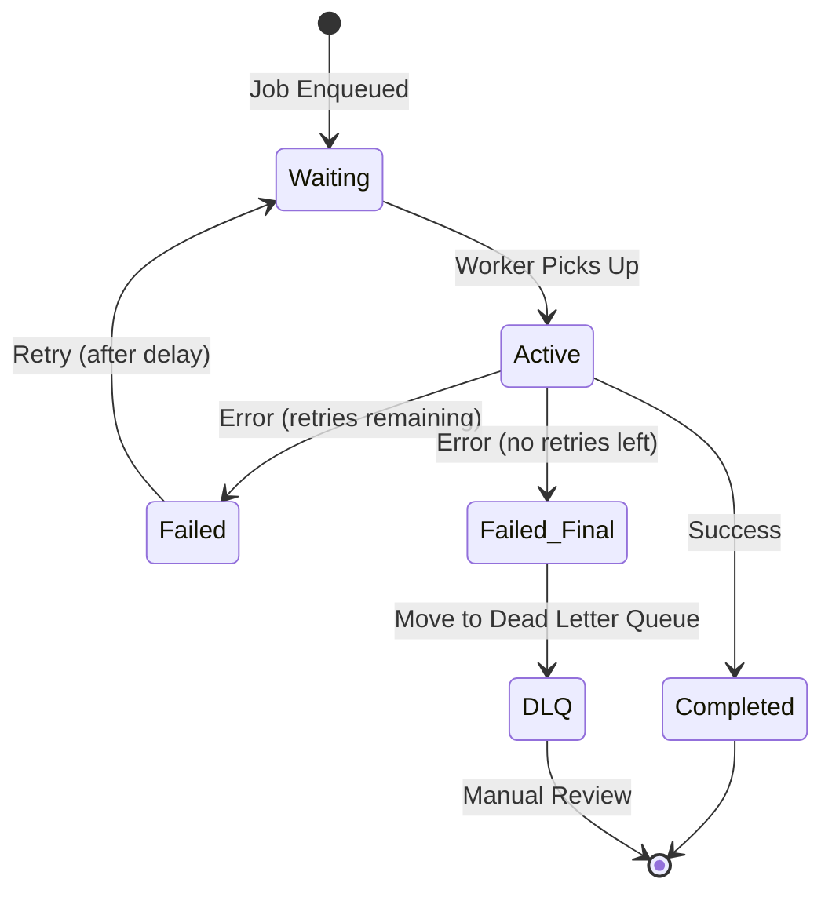

## 10.4 Retry Strategy

| Strategy | Implementation | Use Case |
|----------|---------------|----------|
| **Exponential Backoff** | `backoff: { type: 'exponential', delay: 1000 }` | Network failures, API rate limits |
| **Fixed Delay** | `backoff: { type: 'fixed', delay: 5000 }` | Notification delivery |
| **No Retry** | `attempts: 1` | Cleanup jobs (idempotent; next cron run will retry) |

## 10.5 Scheduled Jobs (Cron)

| Job | Schedule | Purpose | Queue |
|-----|----------|---------|-------|
| Clean expired refresh tokens | Every hour | Remove expired tokens from `RefreshTokens` table | `cleanup-queue` |
| Clean expired invitations | Every 6 hours | Mark expired invitations as `expired` | `cleanup-queue` |
| Flush document cache | Every 5 minutes | Persist Redis document cache to PostgreSQL | `cleanup-queue` |
| Clean orphaned compiler jobs | Daily at 3 AM | Update stuck `running` jobs to `failed` | `cleanup-queue` |
| Redis memory check | Every 15 minutes | Alert if Redis memory exceeds 80% threshold | `cleanup-queue` |

## 10.6 Worker Monitoring

| Metric | Source | Alert Threshold |
|--------|--------|----------------|
| Queue depth (waiting jobs) | BullMQ events | > 100 waiting jobs |
| Job processing time (p95) | Job `completed` event | > 30s for compiler, > 60s for AI |
| Failed job rate | Job `failed` event | > 5% failure rate in 15 minutes |
| DLQ depth | DLQ size check | > 0 (any DLQ entry triggers review) |
| Worker memory usage | Process metrics | > 500MB per worker |
| Active connections to Redis | ioredis metrics | > 80% of pool size |

## 10.7 Why These Features Use Background Jobs

| Feature | Why Background? | Risk if Synchronous |
|---------|----------------|-------------------|
| **Code Execution** | External sandbox API call takes 2-30 seconds; blocks event loop | API timeout; event loop blocked; cascading failures |
| **AI Code Review** | LLM inference takes 5-60 seconds with streaming | HTTP connection timeout; poor UX |
| **GitHub Import** | Cloning repos can take 10-120 seconds depending on size | Client timeout; server memory pressure |
| **GitHub Push** | Network calls with potential conflicts take variable time | Blocking operation with unpredictable duration |
| **Email Notifications** | SMTP delivery can be slow and flaky | User perceives latency on the triggering action |
| **Cleanup Tasks** | Batch operations on thousands of records | Interferes with latency-sensitive API traffic |

---

# 11. AI Service Architecture

## 11.1 Architecture Overview

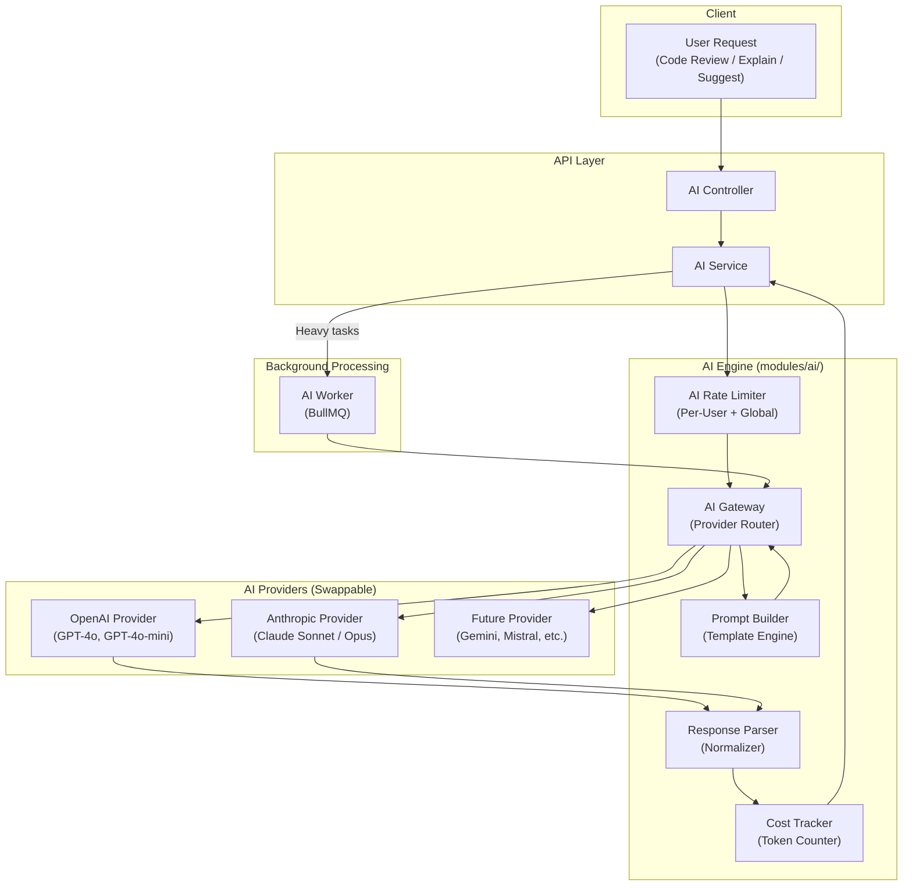

## 11.2 AI Gateway (Provider Abstraction)

The AI Gateway is the critical abstraction layer enabling provider swappability:

```text
AI Gateway Interface:
  ├── review(code, language, context) → ReviewResult
  ├── explain(code, language) → ExplanationResult
  ├── suggest(code, language, instruction) → SuggestionResult
  ├── stream(prompt, onChunk) → void
  └── getAvailableModels() → Model[]

Provider Interface (each provider implements):
  ├── complete(prompt, options) → CompletionResult
  ├── streamComplete(prompt, options, onChunk) → void
  ├── countTokens(text) → number
  └── getModelInfo() → ModelInfo
```

**Why This Abstraction Matters**:
1. **Provider Lock-In Prevention**: If OpenAI raises prices or degrades quality, switch to Anthropic by changing one config value
2. **A/B Testing**: Route 10% of requests to a new provider to compare quality
3. **Fallback Chain**: If OpenAI returns 503, automatically retry with Anthropic
4. **Cost Optimization**: Route simple tasks to cheaper models (GPT-4o-mini), complex tasks to powerful models (Claude Opus)

## 11.3 Prompt Builder

| Feature | Prompt Strategy | Context Included |
|---------|----------------|-----------------|
| **Code Review** | System prompt with reviewer persona + user code | File content, language, file name, project structure hints |
| **Code Explain** | System prompt with teacher persona + code snippet | Selected code, language, surrounding context |
| **Code Suggest** | System prompt with pair programmer persona + instruction | File content, user instruction, language, cursor position |

**Prompt Template Structure**:
```text
[System Message]
  → Persona definition
  → Output format specification (JSON/Markdown)
  → Constraints (language, length, tone)

[Context Message]
  → File name and path
  → Programming language
  → Code content (full or selected)
  → Optional: Adjacent files for context

[User Message]
  → User's specific request or instruction
```

## 11.4 Response Parser

The response parser normalizes diverse AI provider outputs into a consistent format:

```json
{
  "type": "review",
  "model": "gpt-4o",
  "provider": "openai",
  "result": {
    "summary": "Overall assessment...",
    "issues": [
      {
        "severity": "warning",
        "line": 15,
        "message": "Potential null reference",
        "suggestion": "Add null check before accessing..."
      }
    ],
    "score": 7.5
  },
  "usage": {
    "promptTokens": 1500,
    "completionTokens": 800,
    "totalTokens": 2300,
    "estimatedCostUsd": 0.023
  }
}
```

## 11.5 Cost Control

| Strategy | Implementation | Purpose |
|----------|---------------|---------|
| **Per-User Daily Limit** | Redis counter `ai:usage:{userId}:{date}` with daily TTL | Prevent individual users from consuming excessive API credits |
| **Global Monthly Budget** | Redis counter `ai:budget:{month}` | Platform-level cost cap |
| **Token Counting** | Pre-request token estimation using `tiktoken` (OpenAI) or provider SDKs | Reject requests that would exceed limits before calling the API |
| **Model Tiering** | Route simple requests (explain) to cheaper models; complex requests (review) to powerful models | Optimize cost-quality ratio |
| **Response Caching** | Cache identical prompt+code hash in Redis for 1 hour | Avoid paying for duplicate requests |
| **Max Context Length** | Truncate files exceeding 8K tokens with summary | Prevent unbounded API costs for large files |

## 11.6 Streaming Architecture

For real-time AI responses (future feature):

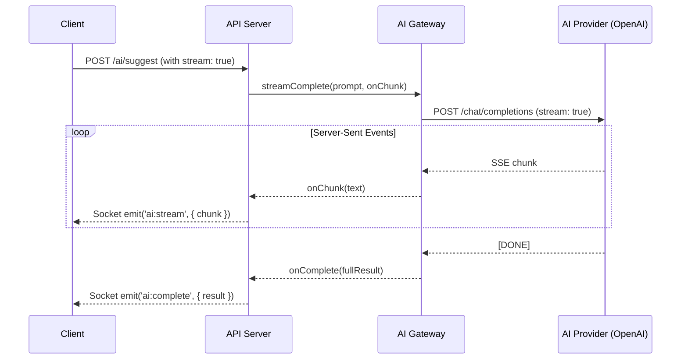

---

# 12. Security Architecture

## 12.1 Security Architecture Overview

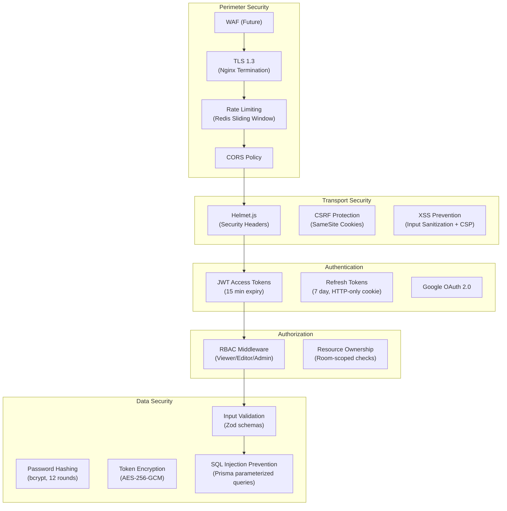

## 12.2 Authentication Design

### JWT Access Token

| Aspect | Design Decision | Rationale |
|--------|----------------|-----------|
| **Algorithm** | HS256 (HMAC-SHA256) | Symmetric encryption is simpler for single-service architecture. Migrate to RS256 for multi-service auth. |
| **Expiry** | 15 minutes | Short-lived tokens minimize damage window if leaked. Refresh flow maintains UX. |
| **Claims** | `{ sub, email, name, iat, exp }` | Minimal claims reduce token size. Role is NOT in JWT — fetched per-request for immediate RBAC changes. |
| **Storage** | Client memory (not localStorage) | Prevents XSS token theft. Token lives only in JavaScript memory. |
| **Transmission** | `Authorization: Bearer <token>` header | Standard OAuth 2.0 bearer token pattern. |

> [!WARNING]
> **Why role is NOT in the JWT**: If an admin demotes a user to viewer, the JWT would still contain `role: admin` until it expires. By fetching the role from the database (with Redis caching), role changes take effect immediately.

### Refresh Token

| Aspect | Design Decision | Rationale |
|--------|----------------|-----------|
| **Format** | Cryptographically random 256-bit token | Unpredictable and unforgeable |
| **Expiry** | 7 days | Balances security (shorter = safer) with UX (longer = fewer re-logins) |
| **Storage (Server)** | SHA-256 hash in PostgreSQL `RefreshTokens` table | Never store raw tokens; hash comparison prevents database breach from yielding usable tokens |
| **Storage (Client)** | HTTP-only, Secure, SameSite=Strict cookie | Inaccessible to JavaScript (prevents XSS theft); SameSite prevents CSRF |
| **Rotation** | Single-use: issue new refresh token on every `/auth/refresh` call | If an old refresh token is reused, it indicates token theft — revoke all user tokens |
| **Revocation** | Mark `is_revoked = true` in database | Logout invalidates the refresh token immediately |

### Token Refresh Flow

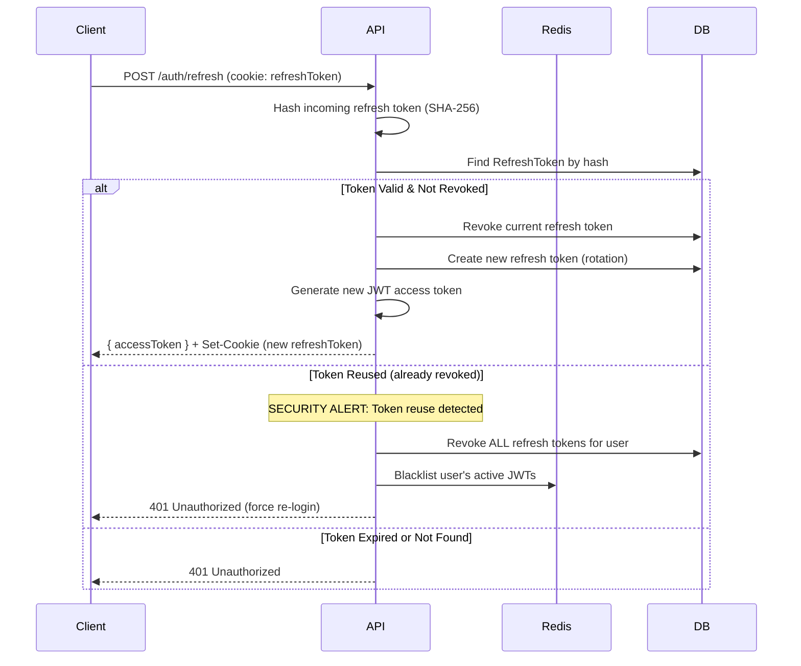

## 12.3 RBAC (Role-Based Access Control)

### Permission Matrix

| Resource Action | Viewer | Editor | Admin | Owner |
|----------------|--------|--------|-------|-------|
| View files | ✅ | ✅ | ✅ | ✅ |
| View chat history | ✅ | ✅ | ✅ | ✅ |
| Send chat messages | ✅ | ✅ | ✅ | ✅ |
| View presence | ✅ | ✅ | ✅ | ✅ |
| Edit files | ❌ | ✅ | ✅ | ✅ |
| Create/delete files | ❌ | ✅ | ✅ | ✅ |
| Execute code | ❌ | ✅ | ✅ | ✅ |
| Request AI review | ❌ | ✅ | ✅ | ✅ |
| Create version snapshots | ❌ | ✅ | ✅ | ✅ |
| Invite members | ❌ | ❌ | ✅ | ✅ |
| Remove members | ❌ | ❌ | ✅ | ✅ |
| Change member roles | ❌ | ❌ | ✅ | ✅ |
| Update room settings | ❌ | ❌ | ✅ | ✅ |
| Restore versions | ❌ | ❌ | ✅ | ✅ |
| GitHub push | ❌ | ❌ | ✅ | ✅ |
| Delete room | ❌ | ❌ | ❌ | ✅ |
| Transfer ownership | ❌ | ❌ | ❌ | ✅ |

### Authorization Middleware Flow

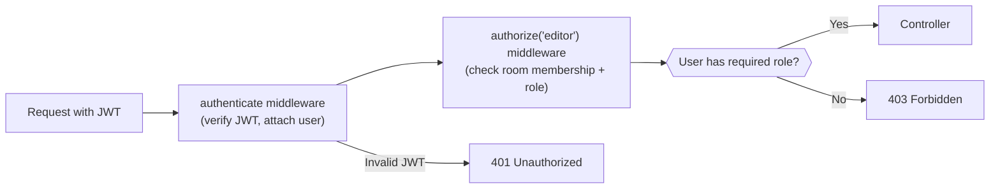

## 12.4 Security Headers (Helmet.js)

| Header | Value | Purpose |
|--------|-------|---------|
| `X-Content-Type-Options` | `nosniff` | Prevent MIME type sniffing |
| `X-Frame-Options` | `DENY` | Prevent clickjacking |
| `X-XSS-Protection` | `0` | Disable browser's buggy XSS filter (CSP is better) |
| `Strict-Transport-Security` | `max-age=31536000; includeSubDomains` | Force HTTPS for 1 year |
| `Content-Security-Policy` | `default-src 'self'` | Prevent unauthorized resource loading |
| `Referrer-Policy` | `strict-origin-when-cross-origin` | Limit referrer information leakage |
| `Permissions-Policy` | `camera=(), microphone=(), geolocation=()` | Disable unused browser APIs |

## 12.5 Input Validation & Injection Prevention

| Attack Vector | Prevention Strategy |
|--------------|-------------------|
| **SQL Injection** | Prisma ORM uses parameterized queries exclusively. `$queryRaw` uses tagged template literals that auto-parameterize. Raw string concatenation into queries is banned. |
| **XSS (Cross-Site Scripting)** | All user input validated by Zod schemas before processing. Chat messages and file names are sanitized. CSP headers prevent inline script execution. |
| **CSRF (Cross-Site Request Forgery)** | Refresh token uses `SameSite=Strict` cookies. State-changing operations require JWT bearer token (not vulnerable to CSRF). |
| **NoSQL Injection** | N/A — PostgreSQL only (no MongoDB). |
| **Path Traversal** | File paths validated against whitelist patterns. `../` sequences rejected. |
| **Prototype Pollution** | `Object.create(null)` for user-provided objects; Zod `.strict()` mode rejects unexpected fields. |
| **ReDoS** | Avoid user-provided regex. All regex patterns are pre-compiled and reviewed. |

## 12.6 Secrets Management

| Secret | Storage | Rotation Strategy |
|--------|---------|------------------|
| JWT signing key | Environment variable (`JWT_SECRET`) | Rotate quarterly; support key array for graceful rotation |
| Database URL | Environment variable (`DATABASE_URL`) | Rotate on suspicion of compromise |
| Redis URL | Environment variable (`REDIS_URL`) | Rotate on compromise |
| Google OAuth credentials | Environment variable (`GOOGLE_CLIENT_ID`, `GOOGLE_CLIENT_SECRET`) | Rotate annually via Google Cloud Console |
| OpenAI API key | Environment variable (`OPENAI_API_KEY`) | Rotate monthly or on suspicion |
| GitHub OAuth credentials | Environment variable | Rotate annually |
| Encryption key (for GitHub tokens) | Environment variable (`ENCRYPTION_KEY`) | Rotate with re-encryption migration |

**Best Practices**:
- Never commit secrets to version control
- Use `.env.example` with placeholder values
- In production, use AWS Secrets Manager, HashiCorp Vault, or Kubernetes Secrets
- Log redaction: Pino serializers strip sensitive fields from logs

---

# 13. Logging & Monitoring

## 13.1 Structured Logging Architecture

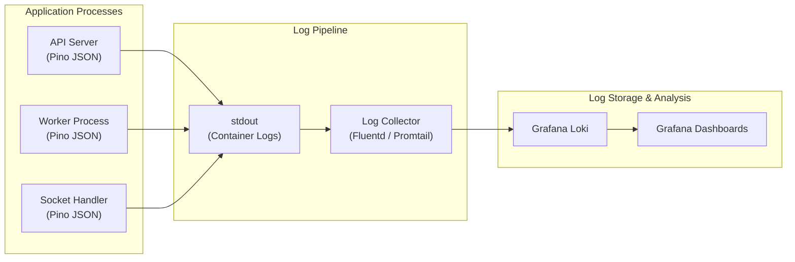

## 13.2 Log Levels and Usage

| Level | Usage | Example |
|-------|-------|---------|
| `fatal` | Process is about to crash | Database connection permanently lost |
| `error` | Operation failed; needs attention | Unhandled exception, external API failure |
| `warn` | Unexpected but recoverable | Rate limit exceeded, deprecated feature used |
| `info` | Normal operational events | Request completed, user logged in, job processed |
| `debug` | Detailed diagnostic information | Query parameters, cache hit/miss, token claims |
| `trace` | Ultra-detailed tracing | Full request/response bodies (development only) |

**Production Level**: `info` (default), `debug` (enabled per-request via header for debugging)

## 13.3 Log Categories

### Request Logs
```json
{
  "level": "info",
  "time": "2026-07-18T12:00:00.000Z",
  "requestId": "req-abc123",
  "method": "POST",
  "url": "/api/v1/rooms",
  "statusCode": 201,
  "responseTimeMs": 45,
  "userId": "user-123",
  "ip": "192.168.1.1",
  "userAgent": "Mozilla/5.0..."
}
```

### Socket Logs
```json
{
  "level": "info",
  "time": "2026-07-18T12:00:00.000Z",
  "event": "socket:connect",
  "socketId": "socket-abc",
  "userId": "user-123",
  "namespace": "/editor",
  "roomId": "room-456",
  "transport": "websocket"
}
```

### Worker Logs
```json
{
  "level": "info",
  "time": "2026-07-18T12:00:00.000Z",
  "queue": "compiler-queue",
  "jobId": "job-789",
  "event": "completed",
  "processingTimeMs": 3200,
  "language": "python",
  "exitCode": 0
}
```

### Audit Logs (Security Events)
```json
{
  "level": "warn",
  "time": "2026-07-18T12:00:00.000Z",
  "audit": true,
  "event": "auth:login_failed",
  "email": "user@example.com",
  "ip": "192.168.1.1",
  "reason": "invalid_credentials",
  "attemptCount": 3
}
```

## 13.4 Metrics Collection

| Metric | Type | Labels | Source |
|--------|------|--------|--------|
| `http_requests_total` | Counter | `method`, `route`, `status` | Express middleware |
| `http_request_duration_ms` | Histogram | `method`, `route` | Express middleware |
| `websocket_connections_active` | Gauge | `namespace` | Socket.IO events |
| `websocket_events_total` | Counter | `namespace`, `event` | Socket handlers |
| `bullmq_jobs_total` | Counter | `queue`, `status` | BullMQ events |
| `bullmq_job_duration_ms` | Histogram | `queue` | BullMQ events |
| `bullmq_queue_depth` | Gauge | `queue` | BullMQ polling |
| `db_query_duration_ms` | Histogram | `model`, `operation` | Prisma middleware |
| `redis_operations_total` | Counter | `command` | ioredis events |
| `ai_api_requests_total` | Counter | `provider`, `model`, `status` | AI Gateway |
| `ai_api_tokens_used` | Counter | `provider`, `model` | AI Gateway |
| `ai_api_cost_usd` | Counter | `provider` | AI Gateway |

## 13.5 Health Checks

| Endpoint | Type | Checks | Failure Action |
|----------|------|--------|---------------|
| `GET /health` | Liveness | Process is alive, event loop not blocked | Restart container |
| `GET /ready` | Readiness | PostgreSQL connected, Redis connected, queues healthy | Remove from load balancer |

### Readiness Check Implementation

| Dependency | Check Method | Timeout | Failure Tolerance |
|-----------|-------------|---------|-------------------|
| PostgreSQL | `SELECT 1` | 5 seconds | Immediate failure |
| Redis | `PING` | 3 seconds | Immediate failure |
| BullMQ | Queue `isReady()` | 3 seconds | Degraded (non-fatal) |

## 13.6 Alerting Rules

| Alert | Condition | Severity | Action |
|-------|-----------|----------|--------|
| High error rate | > 5% of requests return 5xx in 5 minutes | Critical | Page on-call engineer |
| Slow API responses | p95 latency > 500ms for 5 minutes | Warning | Investigate; check DB/Redis |
| Queue backlog | Any queue depth > 200 for 10 minutes | Warning | Scale workers |
| DLQ entries | Any DLQ has > 0 entries | Warning | Manual review required |
| Redis memory | > 80% of `maxmemory` | Warning | Review TTL policies |
| DB connection pool | > 90% utilization | Warning | Increase pool size |
| Sentry error spike | > 50 new errors in 5 minutes | Critical | Investigate immediately |
| Worker crash | Worker process exits unexpectedly | Critical | Auto-restart; investigate |

---

# 14. Error Handling Strategy

## 14.1 Error Class Hierarchy

```mermaid
classDiagram
    class AppError {
        +string code
        +string message
        +number statusCode
        +boolean isOperational
        +object details
    }
    
    class ValidationError {
        +statusCode: 400
        +code: VALIDATION_FAILED
        +array details
    }
    
    class AuthenticationError {
        +statusCode: 401
        +code: AUTHENTICATION_FAILED
    }
    
    class ForbiddenError {
        +statusCode: 403
        +code: FORBIDDEN
    }
    
    class NotFoundError {
        +statusCode: 404
        +code: NOT_FOUND
    }
    
    class ConflictError {
        +statusCode: 409
        +code: CONFLICT
    }
    
    class RateLimitError {
        +statusCode: 429
        +code: RATE_LIMIT_EXCEEDED
    }
    
    class ExternalServiceError {
        +statusCode: 502
        +code: EXTERNAL_SERVICE_FAILED
        +string service
    }
    
    AppError <|-- ValidationError
    AppError <|-- AuthenticationError
    AppError <|-- ForbiddenError
    AppError <|-- NotFoundError
    AppError <|-- ConflictError
    AppError <|-- RateLimitError
    AppError <|-- ExternalServiceError
```

## 14.2 Error Codes Registry

| Code | HTTP Status | Description | Category |
|------|------------|-------------|----------|
| `VALIDATION_FAILED` | 400 | Input validation failed | Validation |
| `INVALID_CREDENTIALS` | 401 | Wrong email/password | Auth |
| `TOKEN_EXPIRED` | 401 | JWT has expired | Auth |
| `TOKEN_INVALID` | 401 | JWT is malformed or signature invalid | Auth |
| `FORBIDDEN` | 403 | User lacks required permission | Auth |
| `NOT_FOUND` | 404 | Requested resource doesn't exist | Resource |
| `CONFLICT` | 409 | Resource already exists (duplicate) | Resource |
| `RATE_LIMIT_EXCEEDED` | 429 | Too many requests | Rate Limit |
| `AI_SERVICE_FAILED` | 502 | AI provider returned error | External |
| `GITHUB_SERVICE_FAILED` | 502 | GitHub API returned error | External |
| `COMPILER_TIMEOUT` | 504 | Code execution timed out | External |
| `INTERNAL_ERROR` | 500 | Unexpected server error | Internal |

## 14.3 Consistent Error Response Format

### Validation Error
```json
{
  "success": false,
  "error": {
    "code": "VALIDATION_FAILED",
    "message": "Invalid input provided.",
    "details": [
      { "field": "name", "message": "Name must be between 2 and 100 characters" },
      { "field": "email", "message": "Must be a valid email address" }
    ]
  }
}
```

### Authentication Error
```json
{
  "success": false,
  "error": {
    "code": "TOKEN_EXPIRED",
    "message": "Your session has expired. Please refresh your token."
  }
}
```

### Rate Limit Error
```json
{
  "success": false,
  "error": {
    "code": "RATE_LIMIT_EXCEEDED",
    "message": "Too many requests. Please try again in 45 seconds.",
    "details": {
      "retryAfter": 45,
      "limit": 10,
      "window": "60s"
    }
  }
}
```

### Internal Server Error (Production)
```json
{
  "success": false,
  "error": {
    "code": "INTERNAL_ERROR",
    "message": "An unexpected error occurred. Please try again later."
  }
}
```

> [!IMPORTANT]
> Internal errors never expose stack traces, SQL queries, or internal details in production. Stack traces are logged server-side with a correlation `requestId` for debugging.

## 14.4 Error Handling by Layer

| Layer | Error Source | Handling Strategy |
|-------|------------|------------------|
| **Express Middleware** | Malformed JSON, invalid content type | Return 400 with descriptive message |
| **Validation (Zod)** | Schema validation failure | Transform Zod errors to `ValidationError` with field-level details |
| **Authentication** | Missing/invalid/expired JWT | Return 401 with appropriate error code |
| **Authorization** | Insufficient role | Return 403 with `FORBIDDEN` |
| **Service Layer** | Business rule violations | Throw specific `AppError` subclass |
| **Repository Layer** | Prisma errors (unique constraint, not found) | Catch and transform to `ConflictError` or `NotFoundError` |
| **Database** | Connection errors, timeouts | Catch and throw `InternalError`; log with full context |
| **Redis** | Connection errors | Degrade gracefully (skip cache); log warning |
| **Socket.IO** | Event handler errors | Emit `error:system` event to client; log server-side |
| **BullMQ Workers** | Job processing failures | Retry with backoff; DLQ after max retries; log with job context |
| **External APIs** | AI/GitHub/Compiler failures | Throw `ExternalServiceError`; include service name for debugging |

## 14.5 Socket Error Handling

Socket errors follow a parallel pattern to REST errors:

```json
// Emitted to the client on error
{
  "event": "error:system",
  "data": {
    "code": "FORBIDDEN",
    "message": "You do not have permission to edit files in this room.",
    "originalEvent": "editor:change"
  }
}
```

---

# 15. Sequence Diagrams

## 15.1 User Registration (Google OAuth)

```mermaid
sequenceDiagram
    participant Client
    participant Nginx as Nginx (Reverse Proxy)
    participant API as API Server
    participant Google as Google OAuth 2.0
    participant DB as PostgreSQL
    participant Redis
    
    Client->>Nginx: GET /api/v1/auth/google
    Nginx->>API: Forward request
    API->>API: Generate OAuth state token
    API->>Redis: Store state token (TTL: 10min)
    API-->>Client: 302 Redirect to Google Consent URL
    
    Client->>Google: User grants consent
    Google-->>Client: 302 Redirect to callback with auth code
    
    Client->>Nginx: GET /api/v1/auth/google/callback?code=X&state=Y
    Nginx->>API: Forward request
    API->>Redis: Validate state token (CSRF protection)
    API->>Google: Exchange auth code for tokens
    Google-->>API: { access_token, id_token, profile }
    
    API->>DB: SELECT user WHERE google_id = ?
    
    alt User Exists
        DB-->>API: Existing user record
    else New User
        API->>DB: INSERT INTO users (email, name, avatar, google_id)
        DB-->>API: New user record
    end
    
    API->>API: Generate JWT access token (15min)
    API->>API: Generate refresh token (random 256-bit)
    API->>DB: INSERT INTO refresh_tokens (user_id, token_hash, expires_at)
    
    API-->>Client: { accessToken, user } + Set-Cookie: refreshToken (HTTP-only, Secure)
```

## 15.2 User Login (Returning User)

```mermaid
sequenceDiagram
    participant Client
    participant API
    participant Redis
    participant DB
    
    Client->>API: POST /auth/refresh (Cookie: refreshToken)
    API->>API: Hash refresh token (SHA-256)
    API->>DB: SELECT FROM refresh_tokens WHERE token_hash = ?
    
    alt Token Valid
        API->>DB: UPDATE refresh_tokens SET is_revoked = true
        API->>API: Generate new refresh token
        API->>DB: INSERT new refresh token
        API->>API: Generate new JWT (15min)
        API-->>Client: { accessToken } + Set-Cookie: newRefreshToken
    else Token Expired/Invalid
        API-->>Client: 401 { code: 'TOKEN_EXPIRED' }
    end
```

## 15.3 Room Creation

```mermaid
sequenceDiagram
    participant Client
    participant API
    participant Auth as Auth Middleware
    participant RoomService
    participant DB
    
    Client->>API: POST /api/v1/rooms { name: "My Project", language: "javascript" }
    API->>Auth: Verify JWT
    Auth-->>API: User authenticated (userId)
    
    API->>API: Validate input (Zod schema)
    API->>RoomService: createRoom(userId, { name, language })
    
    RoomService->>DB: BEGIN TRANSACTION
    RoomService->>DB: INSERT INTO rooms (name, language, owner_id)
    DB-->>RoomService: Room created (roomId)
    RoomService->>DB: INSERT INTO room_members (room_id, user_id, role: 'admin')
    RoomService->>DB: INSERT INTO files (room_id, name: 'main.js', content: '')
    RoomService->>DB: COMMIT
    
    RoomService-->>API: { room, defaultFile }
    API-->>Client: 201 { success: true, data: { room } }
```

## 15.4 Join Room (via Invitation)

```mermaid
sequenceDiagram
    participant Client
    participant API
    participant Auth as Auth Middleware
    participant RoomService
    participant DB
    participant Redis
    participant SocketServer
    
    Client->>API: POST /api/v1/rooms/join/abc123token
    API->>Auth: Verify JWT
    Auth-->>API: User authenticated (userId)
    
    API->>RoomService: joinRoom(userId, 'abc123token')
    RoomService->>DB: SELECT FROM invitations WHERE token = ? AND status = 'pending'
    
    alt Invitation Valid & Not Expired
        RoomService->>DB: SELECT FROM room_members WHERE room_id = ? AND user_id = ?
        
        alt User Not Already Member
            RoomService->>DB: INSERT INTO room_members (room_id, user_id, role: invitation.role)
            RoomService->>DB: UPDATE invitations SET status = 'accepted'
            RoomService->>Redis: Publish 'room:member-joined' event
            Redis->>SocketServer: Deliver via Pub/Sub
            SocketServer-->>SocketServer: Broadcast to room members
            RoomService-->>API: { room, role }
            API-->>Client: 200 { success: true, data: { room, role } }
        else Already a Member
            API-->>Client: 409 { code: 'CONFLICT', message: 'Already a member' }
        end
    else Invalid or Expired
        API-->>Client: 404 { code: 'NOT_FOUND', message: 'Invalid or expired invitation' }
    end
```

## 15.5 Live Code Editing

```mermaid
sequenceDiagram
    participant UserA as User A
    participant Node1 as API Node 1
    participant Redis
    participant Node2 as API Node 2
    participant UserB as User B
    participant DB as PostgreSQL
    
    UserA->>Node1: emit('editor:change', { fileId, changes, version: 5 })
    
    Note over Node1: Verify JWT & room membership
    Note over Node1: Verify user has 'editor' role
    Note over Node1: Apply CRDT merge to in-memory state
    
    Node1->>Redis: SET doc:room:R1:file:F1 <merged state> EX 3600
    Node1->>Redis: Publish editor:update via Adapter
    
    Node1-->>UserA: ACK callback({ success: true, version: 6 })
    
    Redis-->>Node2: Adapter delivers editor:update
    Node2-->>UserB: emit('editor:update', { fileId, changes, userId: A, version: 6 })
    
    Note over Node1: Debounce timer: 30s of inactivity
    
    opt After 30s inactivity
        Node1->>Redis: GET doc:room:R1:file:F1
        Redis-->>Node1: <current document state>
        Node1->>DB: UPDATE files SET content = ?, updated_at = NOW() WHERE id = ?
    end
```

## 15.6 Cursor Synchronization

```mermaid
sequenceDiagram
    participant UserA as User A
    participant Node1 as API Node 1
    participant Redis
    participant Node2 as API Node 2
    participant UserB as User B
    participant UserC as User C (Same Node as A)
    
    Note over UserA: Cursor moves (throttled to 50ms)
    
    UserA->>Node1: emit('cursor:move', { roomId, fileId, position: { line: 10, col: 5 } })
    
    Note over Node1: Rate limit check (max 20/s per user)
    
    Node1->>Redis: HSET cursor:room:R1:file:F1 userA '{"line":10,"col":5,"color":"#FF6B6B"}'
    Node1->>Redis: Publish cursor:update via Adapter
    
    Node1-->>UserC: emit('cursor:update', { userId: A, fileId, position, color })
    
    Redis-->>Node2: Adapter delivers
    Node2-->>UserB: emit('cursor:update', { userId: A, fileId, position, color })
```

## 15.7 Chat Message

```mermaid
sequenceDiagram
    participant UserA as User A (Sender)
    participant Node1 as API Node 1
    participant DB as PostgreSQL
    participant Redis
    participant Node2 as API Node 2
    participant UserB as User B (Receiver)
    
    UserA->>Node1: emit('chat:send', { roomId, content: 'Hello!' }, ackCallback)
    
    Note over Node1: Verify membership & role
    Note over Node1: Sanitize message content
    Note over Node1: Validate via Zod schema
    
    Node1->>DB: INSERT INTO messages (room_id, user_id, content, type: 'text')
    DB-->>Node1: { id, createdAt }
    
    Node1->>Redis: Publish chat:receive via Adapter
    
    Node1-->>UserA: ackCallback({ success: true, messageId })
    Node1-->>UserA: emit('chat:receive', { id, userId, name, content, createdAt })
    
    Redis-->>Node2: Adapter delivers
    Node2-->>UserB: emit('chat:receive', { id, userId, name, content, createdAt })
```

## 15.8 Compile Code

```mermaid
sequenceDiagram
    participant Client
    participant Node1 as API Node 1
    participant Redis
    participant BullMQ
    participant Worker
    participant Sandbox as Compiler Sandbox
    participant DB as PostgreSQL
    
    Client->>Node1: emit('compiler:run', { roomId, fileId, code, language: 'python' })
    
    Note over Node1: Verify role >= 'editor'
    Note over Node1: Rate limit check (10/min)
    Note over Node1: Validate language supported
    
    Node1->>DB: INSERT INTO compiler_jobs (room_id, user_id, source_code, language, status: 'queued')
    DB-->>Node1: { jobId }
    
    Node1->>BullMQ: Add to compiler-queue { jobId, code, language, stdin }
    Node1-->>Client: emit('compiler:queued', { jobId })
    
    BullMQ->>Worker: Dequeue job
    Worker->>DB: UPDATE compiler_jobs SET status = 'running'
    Worker->>Sandbox: POST /execute { code, language, timeout: 10s }
    
    loop Streaming Output
        Sandbox-->>Worker: stdout chunk
        Worker->>Redis: PUBLISH compiler:output:jobId { stream: 'stdout', data }
        Redis-->>Node1: Pub/Sub delivery
        Node1-->>Client: emit('compiler:output', { jobId, stream: 'stdout', data })
    end
    
    Sandbox-->>Worker: Execution complete { exitCode: 0 }
    Worker->>DB: UPDATE compiler_jobs SET status = 'completed', stdout, stderr, exit_code, execution_time_ms
    Worker->>Redis: PUBLISH compiler:complete:jobId { exitCode, executionTimeMs }
    Redis-->>Node1: Pub/Sub delivery
    Node1-->>Client: emit('compiler:complete', { jobId, exitCode, executionTimeMs })
```

## 15.9 AI Review Request

```mermaid
sequenceDiagram
    participant Client
    participant API as API Server
    participant DB as PostgreSQL
    participant BullMQ
    participant Worker as AI Worker
    participant OpenAI as OpenAI API
    participant Redis
    participant SocketServer
    
    Client->>API: POST /api/v1/ai/review { fileId }
    
    Note over API: Auth + RBAC check
    Note over API: Rate limit (5/min per user)
    Note over API: Cost check (daily limit)
    
    API->>DB: SELECT content, name, language FROM files WHERE id = ?
    DB-->>API: File data
    
    API->>BullMQ: Add to ai-queue { fileId, code, language, userId }
    API-->>Client: 202 { jobId, status: 'queued' }
    
    BullMQ->>Worker: Dequeue job
    Worker->>Worker: Build prompt (system + context + code)
    Worker->>Worker: Estimate tokens (tiktoken)
    Worker->>OpenAI: POST /chat/completions { model: 'gpt-4o', messages }
    
    OpenAI-->>Worker: { choices, usage }
    
    Worker->>Worker: Parse response → structured ReviewResult
    Worker->>Redis: INCR ai:usage:{userId}:{date}
    Worker->>Redis: INCRBY ai:budget:{month} cost_in_cents
    Worker->>DB: INSERT INTO notifications (user_id, type: 'ai_review', metadata: { reviewResult })
    
    Worker->>Redis: PUBLISH ai:review:complete { userId, fileId, reviewResult }
    Redis-->>SocketServer: Pub/Sub delivery
    SocketServer-->>Client: emit('notification:new', { type: 'ai_review', review })
    SocketServer-->>Client: emit('ai:review:complete', { fileId, review })
```

## 15.10 GitHub Push

```mermaid
sequenceDiagram
    participant Client
    participant API
    participant Auth as Auth Middleware
    participant DB as PostgreSQL
    participant BullMQ
    participant Worker as GitHub Worker
    participant GitHub as GitHub API
    participant Redis
    participant SocketServer
    
    Client->>API: POST /api/v1/rooms/:id/github/push { branch: 'main' }
    API->>Auth: Verify JWT + Admin role
    
    API->>DB: SELECT github_token FROM github_tokens WHERE user_id = ?
    Note over API: Decrypt access token (AES-256-GCM)
    
    API->>Redis: SET lock:github-push:room-1 <uuid> PX 30000
    Note over API: Acquire distributed lock (prevent concurrent pushes)
    
    API->>BullMQ: Add to github-queue { roomId, userId, branch, token }
    API-->>Client: 202 { jobId, status: 'queued' }
    
    BullMQ->>Worker: Dequeue job
    Worker->>DB: SELECT * FROM files WHERE room_id = ?
    Worker->>GitHub: Create/update file contents via API
    Worker->>GitHub: Create commit
    GitHub-->>Worker: { commitSha }
    
    Worker->>Redis: DEL lock:github-push:room-1
    Worker->>DB: INSERT INTO notifications (user_id, type: 'system', title: 'Push complete')
    Worker->>Redis: PUBLISH github:push:complete { roomId, commitSha }
    
    Redis-->>SocketServer: Pub/Sub delivery
    SocketServer-->>Client: emit('notification:new', { title: 'Pushed to GitHub', commitSha })
```

## 15.11 Save Version

```mermaid
sequenceDiagram
    participant Client
    participant API
    participant VersionService
    participant DB as PostgreSQL
    participant Redis
    
    Client->>API: POST /api/v1/rooms/:id/versions { label: 'Before refactor' }
    
    Note over API: Auth + Editor role check
    
    API->>VersionService: createSnapshot(roomId, userId, label)
    
    VersionService->>Redis: Check doc cache for unsaved changes
    
    opt Unsaved changes in Redis
        VersionService->>Redis: GET doc:room:R1:file:*
        VersionService->>DB: UPDATE files SET content = ? (flush cache first)
    end
    
    VersionService->>DB: BEGIN TRANSACTION
    VersionService->>DB: INSERT INTO versions (room_id, created_by, label)
    DB-->>VersionService: { versionId }
    VersionService->>DB: SELECT id, name, path, content, language FROM files WHERE room_id = ?
    VersionService->>DB: INSERT INTO version_files (version_id, file_name, file_path, content, language) -- bulk insert
    VersionService->>DB: COMMIT
    
    VersionService-->>API: { version: { id, label, createdAt, fileCount } }
    API-->>Client: 201 { success: true, data: { version } }
```

## 15.12 Notification Delivery

```mermaid
sequenceDiagram
    participant Trigger as Triggering Service (AI/GitHub/Room)
    participant NotifService as Notification Service
    participant DB as PostgreSQL
    participant Redis
    participant SocketServer
    participant Client as Recipient's Client
    
    Trigger->>NotifService: createNotification(userId, type, title, message, metadata)
    
    NotifService->>DB: INSERT INTO notifications (user_id, type, title, message, metadata)
    DB-->>NotifService: { notificationId }
    
    NotifService->>Redis: PUBLISH notification:new:userId { notification }
    
    Redis-->>SocketServer: Pub/Sub delivery
    
    SocketServer->>Redis: SMEMBERS socket:user:{userId}
    Redis-->>SocketServer: [ socketId1, socketId2 ]
    
    alt User is Online
        SocketServer-->>Client: emit('notification:new', { id, type, title, message, metadata })
    else User is Offline
        Note over SocketServer: Notification persisted in DB; delivered on next login
    end
```

---

# 16. Scalability Strategy

## 16.1 Scalability Architecture

```mermaid
graph TB
    subgraph Tier1["Tier 1: Stateless Compute (Scale Horizontally)"]
        API1["API Node 1"]
        API2["API Node 2"]
        API3["API Node N"]
        W1["Worker 1"]
        W2["Worker N"]
    end
    
    subgraph Tier2["Tier 2: Shared State (Scale Vertically → Cluster)"]
        Redis["Redis 7.x<br/>(→ Redis Cluster at scale)"]
        PG["PostgreSQL 16<br/>(→ Read Replicas at scale)"]
    end
    
    subgraph Tier3["Tier 3: External Services (Provider-Managed Scale)"]
        AI["AI API (Rate-Managed)"]
        GitHub["GitHub API (Rate-Managed)"]
        Compiler["Compiler Sandbox (Auto-Scale)"]
    end
```

## 16.2 Scaling Dimensions

### Stateless API Servers

| Aspect | Strategy |
|--------|----------|
| **Why stateless** | All state lives in PostgreSQL and Redis. API nodes share nothing. Any node can serve any request. |
| **Scaling trigger** | CPU > 70% or active connections > 8K per node |
| **Scaling method** | Add more Docker containers behind load balancer |
| **Session affinity** | Required for WebSocket connections (load balancer sticky sessions via cookie) |
| **Capacity model** | Each node handles ~5K WebSocket connections and ~1K REST requests/second |

### Redis Scaling

| Scale Phase | Users | Strategy | Redis Config |
|-------------|-------|----------|-------------|
| MVP (1-1K users) | ~1K | Single Redis instance (1GB) | Standalone mode |
| Growth (1K-10K users) | ~10K | Redis with Sentinel (HA) | Primary + 2 replicas + 3 sentinels |
| Scale (10K-100K users) | ~100K | Redis Cluster (sharding) | 6 nodes (3 primary + 3 replicas) |

### PostgreSQL Scaling

| Scale Phase | Strategy | Description |
|-------------|----------|-------------|
| MVP | Single primary (managed) | AWS RDS or Cloud SQL with automated backups |
| Growth | Primary + 1 read replica | Route `SELECT` queries for listings, search, and history to replica |
| Scale | Primary + N read replicas + PgBouncer | PgBouncer for connection pooling; route reads to replicas via middleware |
| Future | Logical partitioning | Partition `messages` by `room_id`; partition `compiler_jobs` by `created_at` |

### Worker Scaling

| Queue | Scaling Strategy | Auto-Scale Metric |
|-------|-----------------|-------------------|
| `compiler-queue` | Scale based on queue depth | Queue depth > 20 → add worker |
| `ai-queue` | Scale based on queue depth + AI API rate limits | Queue depth > 10 → add worker (max bounded by API limits) |
| `github-queue` | Scale based on queue depth | Queue depth > 10 → add worker |
| `notification-queue` | Rarely a bottleneck | Static allocation (1-2 workers) |

## 16.3 Bottleneck Analysis & Mitigation

| Bottleneck | When It Occurs | Detection | Mitigation |
|-----------|---------------|-----------|------------|
| **Database connections** | > 100 concurrent API nodes | Connection pool exhaustion errors | PgBouncer; reduce pool per node; connection timeouts |
| **Redis memory** | > 10K active documents cached | `maxmemory` threshold alerts | Increase memory; reduce TTLs; eviction policies |
| **Socket broadcast storms** | > 50 users editing same file | High CPU on API nodes; socket latency spikes | Client-side throttling (50ms); server-side rate limiting; batch updates |
| **AI API rate limits** | > 50 concurrent AI requests | 429 responses from AI provider | Queue buffering; multi-provider failover; request coalescing |
| **Large file syncs** | Files > 100KB with frequent edits | High Redis bandwidth | Delta-only syncs (CRDT operations, not full file); compression |
| **Message table growth** | > 10M messages | Slow pagination queries | Table partitioning by `room_id` or `created_at`; archival |

## 16.4 Caching Strategy

| Data | Cache Location | TTL | Invalidation | Cache Hit Rate Target |
|------|---------------|-----|--------------|----------------------|
| Active document state | Redis (`doc:room:X:file:Y`) | 1 hour (refreshed on edit) | Explicit on file delete; TTL expiry | ~99% (hot path) |
| Room membership/permissions | Redis (`auth:room:X:user:Y`) | 5 minutes | Explicit on role change | ~95% |
| User profile | Redis (`user:profile:X`) | 10 minutes | Explicit on profile update | ~90% |
| File tree (metadata only) | Redis (`files:room:X`) | 5 minutes | Explicit on file create/delete/rename | ~90% |
| Supported languages list | In-memory (Node.js) | Until restart | Static data | 100% |
| AI response cache | Redis (`ai:cache:sha256(prompt+code)`) | 1 hour | TTL-only | ~20% (unique prompts) |

---

# 17. Deployment Architecture

## 17.1 Environment Strategy

| Environment | Purpose | Infrastructure | Data | Access |
|------------|---------|---------------|------|--------|
| **Development** | Local developer workstation | Docker Compose (API, Worker, PG, Redis) | Seeded test data | localhost |
| **CI** | Automated testing | GitHub Actions with Docker services | Ephemeral test database | GitHub-internal |
| **Staging** | Pre-production validation | Mirror of production (smaller scale) | Anonymized production subset | Team-internal |
| **Production** | Live user traffic | Managed services (RDS, ElastiCache, ECS/K8s) | Real user data | Public |

## 17.2 Docker Strategy

### Multi-Stage Dockerfile

```text
Stage 1: "deps" — Install production dependencies only (npm ci --omit=dev)
Stage 2: "build" — Copy source code, generate Prisma client
Stage 3: "production" — Minimal base image (node:20-alpine), copy from deps + build
  - Non-root user (node)
  - Health check (curl http://localhost:PORT/health)
  - Exposed port
  - CMD ["node", "src/server.js"]
```

### Docker Compose (Development)

| Service | Image | Ports | Volumes |
|---------|-------|-------|---------|
| `api` | Built from Dockerfile | `3000:3000` | `./src:/app/src` (hot reload) |
| `worker` | Same image, different CMD | — | `./src:/app/src` |
| `postgres` | `postgres:16-alpine` | `5432:5432` | Named volume for persistence |
| `redis` | `redis:7-alpine` | `6379:6379` | Named volume for persistence |
| `bullboard` | `deadly0/bull-board` | `3001:3001` | — |

## 17.3 CI/CD Pipeline

```mermaid
graph LR
    A["Push to GitHub"] --> B["GitHub Actions Trigger"]
    B --> C["Lint (ESLint)"]
    C --> D["Unit Tests (Vitest)"]
    D --> E["Integration Tests<br/>(Supertest + Docker PG/Redis)"]
    E --> F["Build Docker Image"]
    F --> G["Push to Container Registry<br/>(ECR / GCR / GHCR)"]
    G --> H{"Branch?"}
    H -->|main| I["Deploy to Staging"]
    I --> J["Smoke Tests on Staging"]
    J --> K["Manual Approval"]
    K --> L["Deploy to Production<br/>(Rolling Update)"]
    H -->|feature/*| M["Deploy to Preview Env (Optional)"]
```

### CI/CD Configuration

| Step | Tool | Duration Target | Failure Action |
|------|------|----------------|---------------|
| Lint | ESLint + Prettier | < 30 seconds | Block merge |
| Unit Tests | Vitest | < 2 minutes | Block merge |
| Integration Tests | Vitest + Supertest + Docker | < 5 minutes | Block merge |
| Docker Build | Multi-stage build | < 3 minutes | Block deploy |
| Security Scan | `npm audit` + Snyk | < 2 minutes | Warning (non-blocking for low severity) |
| Deploy to Staging | Container deploy | < 5 minutes | Alert team |
| Smoke Tests | Automated HTTP/WS checks | < 1 minute | Block production deploy |
| Production Deploy | Rolling update (zero downtime) | < 5 minutes | Auto-rollback on health check failure |

## 17.4 Reverse Proxy (Nginx) Configuration

| Setting | Value | Rationale |
|---------|-------|-----------|
| Upstream backend | Round-robin across API containers | Distribute load evenly |
| WebSocket upgrade | `proxy_set_header Upgrade $http_upgrade` | Required for Socket.IO |
| Sticky sessions | `ip_hash` or cookie-based | Required for WebSocket connections |
| SSL termination | Let's Encrypt certificates (auto-renewed) | TLS 1.3 only; HTTPS everywhere |
| Request body size | `client_max_body_size 10m` | Prevent oversized payloads |
| Proxy timeouts | `proxy_read_timeout 86400` (for WebSocket) | Keep long-lived connections alive |
| Rate limiting | `limit_req_zone` | Additional layer of rate limiting |
| Gzip compression | `gzip on` for JSON responses | Reduce bandwidth |

## 17.5 Backup & Disaster Recovery

| Component | Backup Strategy | Frequency | Retention | RTO | RPO |
|-----------|----------------|-----------|-----------|-----|-----|
| PostgreSQL | Automated snapshots (RDS) + WAL archiving | Continuous (WAL) + Daily (snapshot) | 30 days | 15 minutes | 5 minutes |
| Redis | RDB snapshots + AOF | RDB every 5 minutes; AOF continuous | 7 days | 5 minutes | < 1 minute |
| Docker images | Container registry | Every build | 90 days | Instant (re-deploy) | N/A |
| Secrets | Vault/Secrets Manager | On change | Versioned | Instant | N/A |
| Application logs | Log aggregation platform | Continuous | 30 days | N/A | N/A |

### Disaster Recovery Plan

| Scenario | Detection | Response | Recovery Time |
|----------|-----------|----------|--------------|
| API node failure | Health check failure | Load balancer routes traffic to healthy nodes | Immediate (~5s) |
| Database failure | Connection errors | Automated failover to standby (RDS Multi-AZ) | < 5 minutes |
| Redis failure | Sentinel detects | Sentinel promotes replica to primary | < 30 seconds |
| Full region outage | External monitoring | DNS failover to secondary region (future) | < 30 minutes |
| Data corruption | Application-level detection | Point-in-time recovery from WAL archive | < 15 minutes |

## 17.6 Environment Variables

| Variable | Required | Default | Description |
|----------|----------|---------|-------------|
| `NODE_ENV` | Yes | — | `development`, `staging`, `production` |
| `PORT` | No | `3000` | API server port |
| `DATABASE_URL` | Yes | — | PostgreSQL connection string |
| `REDIS_URL` | Yes | — | Redis connection string |
| `JWT_SECRET` | Yes | — | JWT signing key (min 32 chars) |
| `JWT_EXPIRES_IN` | No | `15m` | JWT expiration |
| `REFRESH_TOKEN_EXPIRES_IN` | No | `7d` | Refresh token expiration |
| `GOOGLE_CLIENT_ID` | Yes | — | Google OAuth client ID |
| `GOOGLE_CLIENT_SECRET` | Yes | — | Google OAuth secret |
| `GOOGLE_CALLBACK_URL` | Yes | — | OAuth callback URL |
| `OPENAI_API_KEY` | Yes* | — | OpenAI API key (*required if AI enabled) |
| `GITHUB_CLIENT_ID` | No | — | GitHub OAuth client ID |
| `GITHUB_CLIENT_SECRET` | No | — | GitHub OAuth secret |
| `ENCRYPTION_KEY` | Yes | — | AES-256 encryption key for sensitive tokens |
| `CORS_ORIGIN` | Yes | — | Allowed frontend origin |
| `LOG_LEVEL` | No | `info` | Pino log level |
| `SENTRY_DSN` | No | — | Sentry error tracking DSN |
| `COMPILER_API_URL` | Yes* | — | Compiler sandbox API URL |
| `AI_DAILY_LIMIT_PER_USER` | No | `50` | Max AI requests per user per day |
| `AI_MONTHLY_BUDGET_USD` | No | `500` | Monthly AI API cost cap |

---

# 18. Development Roadmap

## Milestone 1: Project Foundation & Infrastructure

| Aspect | Detail |
|--------|--------|
| **Objective** | Establish the project skeleton, development environment, core infrastructure (Express, Prisma, Redis, Pino), and shared utilities |
| **Duration** | 1 week |
| **Dependencies** | None (first milestone) |

**Deliverables**:
- [ ] Express application bootstrap (`app.js`, `server.js`)
- [ ] Configuration module with Zod validation (`config/`)
- [ ] Pino structured logger (`core/logger/`)
- [ ] Custom error classes and global error handler (`core/errors/`)
- [ ] Prisma initialization and initial schema (Users table only)
- [ ] Redis client setup (`core/redis/`)
- [ ] Global middlewares: requestId, requestLogger, CORS, Helmet
- [ ] Health check endpoint (`GET /health`, `GET /ready`)
- [ ] Docker Compose for local development (API, PG, Redis)
- [ ] ESLint + Prettier configuration
- [ ] Vitest configuration
- [ ] `.env.example` with all variables

**Definition of Done**:
- `docker compose up` starts API, PostgreSQL, and Redis
- `GET /health` returns `200 OK`
- `GET /ready` confirms DB and Redis connectivity
- Global error handler catches and formats errors correctly
- Pino logs in JSON format to stdout
- All utilities have unit tests passing

**Testing Strategy**: Unit tests for error classes, config validation, logger setup, async handler wrapper.

---

## Milestone 2: Authentication & User Management

| Aspect | Detail |
|--------|--------|
| **Objective** | Implement Google OAuth login, JWT issuance, refresh token rotation, and user profile management |
| **Duration** | 1-2 weeks |
| **Dependencies** | Milestone 1 (Express, Prisma, Redis) |

**Deliverables**:
- [ ] Prisma schema: `Users`, `RefreshTokens` tables + migration
- [ ] Google OAuth flow (`passport-google-oauth20`)
- [ ] JWT access token generation and verification
- [ ] Refresh token rotation with reuse detection
- [ ] `authenticate` middleware (JWT guard)
- [ ] User profile endpoints (`GET /users/me`, `PATCH /users/me`)
- [ ] User search endpoint (`GET /users/search`)
- [ ] Rate limiting on auth endpoints

**Definition of Done**:
- User can login via Google OAuth and receive JWT + refresh token cookie
- `/auth/refresh` issues new token pair and revokes old refresh token
- `/auth/logout` revokes refresh token
- Reuse of revoked refresh token triggers all-token revocation
- Protected routes reject unauthenticated requests with 401
- Unit and integration tests pass

**Testing Strategy**: Unit tests for JWT generation/verification, refresh token rotation. Integration tests for OAuth callback, token refresh, protected route access.

---

## Milestone 3: Room Management & RBAC

| Aspect | Detail |
|--------|--------|
| **Objective** | Implement room CRUD, member management, invitation system, and role-based authorization |
| **Duration** | 1-2 weeks |
| **Dependencies** | Milestone 2 (Auth, Users) |

**Deliverables**:
- [ ] Prisma schema: `Rooms`, `RoomMembers`, `Invitations` tables + migration
- [ ] Room CRUD endpoints
- [ ] Member management (add, remove, change role)
- [ ] Invitation system (generate token, accept, expire)
- [ ] `authorize(role)` middleware
- [ ] Pagination helper for room listing

**Definition of Done**:
- User can create rooms and is automatically assigned Admin role
- Invite links can be generated and shared
- Users can join rooms via invite links
- RBAC prevents unauthorized actions (viewers can't edit, editors can't invite)
- Room deletion cascades to members and invitations
- Integration tests cover all RBAC scenarios

**Testing Strategy**: Unit tests for authorization logic. Integration tests for room lifecycle (create, invite, join, role change, leave, delete).

---

## Milestone 4: Socket.IO Infrastructure & Presence

| Aspect | Detail |
|--------|--------|
| **Objective** | Set up Socket.IO with Redis Adapter, socket authentication, namespace routing, and user presence |
| **Duration** | 1-2 weeks |
| **Dependencies** | Milestone 2 (Auth), Milestone 3 (Rooms) |

**Deliverables**:
- [ ] Socket.IO server initialization with Redis Adapter
- [ ] Socket authentication middleware (JWT from handshake)
- [ ] Namespace registration (`/editor`, `/chat`, `/collaboration`, `/compiler`, `/notifications`)
- [ ] Presence tracking (join, leave, heartbeat)
- [ ] Presence broadcasting (user joined/left events)
- [ ] Socket error handling
- [ ] Reconnection support (state restoration)

**Definition of Done**:
- Clients connect with JWT in handshake auth
- Users joining a room see all currently online users
- Presence is broadcast to all room members on join/leave
- Heartbeat keeps presence alive; expired heartbeats trigger cleanup
- Socket.IO events sync across two API nodes (Redis Adapter)
- Connection and disconnection are logged

**Testing Strategy**: Integration tests for socket connection, auth rejection, room join/leave. Manual testing with two browser tabs.

---

## Milestone 5: Real-Time Code Editor & File Management

| Aspect | Detail |
|--------|--------|
| **Objective** | Implement file CRUD, real-time collaborative editing (CRDT), cursor sync, and Redis-cached document state |
| **Duration** | 2-3 weeks |
| **Dependencies** | Milestone 3 (Rooms), Milestone 4 (Sockets) |

**Deliverables**:
- [ ] Prisma schema: `Files` table + migration
- [ ] File CRUD REST endpoints
- [ ] CRDT implementation (Yjs integration)
- [ ] Real-time editing socket events (`editor:change`, `editor:update`, `editor:ack`)
- [ ] Cursor synchronization socket events
- [ ] Selection synchronization
- [ ] Typing indicators
- [ ] Redis document cache with debounced persistence
- [ ] File tree management

**Definition of Done**:
- Two users can edit the same file simultaneously without conflicts
- CRDT merges concurrent changes correctly
- Cursor positions of other users are visible in real-time
- Document state is cached in Redis and flushed to PostgreSQL on inactivity
- Reconnecting users receive current document state from Redis
- File CRUD operations are broadcast to room members

**Testing Strategy**: Unit tests for CRDT operations. Integration tests for concurrent editing scenarios. Manual testing with multiple browsers.

---

## Milestone 6: Chat System

| Aspect | Detail |
|--------|--------|
| **Objective** | Implement real-time in-room chat with message persistence and history |
| **Duration** | 1 week |
| **Dependencies** | Milestone 4 (Sockets), Milestone 3 (Rooms) |

**Deliverables**:
- [ ] Prisma schema: `Messages` table + migration
- [ ] Chat socket events (`chat:send`, `chat:receive`, `chat:typing`)
- [ ] Message history REST endpoint with cursor-based pagination
- [ ] Message content sanitization
- [ ] System messages for join/leave events

**Definition of Done**:
- Users can send and receive messages in real-time
- Message history is paginated and loads on scroll
- Messages persist across reconnections
- Typing indicators show when other users are typing
- Messages are sanitized against XSS

**Testing Strategy**: Integration tests for message send/receive, pagination, sanitization.

---

## Milestone 7: Code Execution (Compiler)

| Aspect | Detail |
|--------|--------|
| **Objective** | Implement background code execution via BullMQ workers with streaming output |
| **Duration** | 2 weeks |
| **Dependencies** | Milestone 4 (Sockets), BullMQ infrastructure |

**Deliverables**:
- [ ] Prisma schema: `CompilerJobs` table + migration
- [ ] BullMQ queue setup and worker process entry point
- [ ] Compiler worker processor
- [ ] Streaming output via socket events
- [ ] Language registry (JavaScript, Python)
- [ ] Execution timeout handling
- [ ] Compiler job audit logging
- [ ] Rate limiting on execution

**Definition of Done**:
- Users can execute JavaScript and Python code
- Output streams to client in real-time
- Execution times out after configurable limit
- Failed executions return error details
- Job history is persisted in `CompilerJobs`
- Rate limiting prevents abuse (10 executions/minute)
- Worker runs as a separate process from API

**Testing Strategy**: Unit tests for language registry, job creation. Integration tests for execution lifecycle. Manual testing for streaming output.

---

## Milestone 8: Version History

| Aspect | Detail |
|--------|--------|
| **Objective** | Implement version snapshots, version listing, diff, and restore |
| **Duration** | 1 week |
| **Dependencies** | Milestone 5 (Files) |

**Deliverables**:
- [ ] Prisma schema: `Versions`, `VersionFiles` tables + migration
- [ ] Create snapshot endpoint
- [ ] List versions endpoint
- [ ] Version detail (with files) endpoint
- [ ] Restore version endpoint (with distributed lock)
- [ ] Diff between versions endpoint

**Definition of Done**:
- Users can create named snapshots of all room files
- Version history lists all snapshots with metadata
- Restoring a version overwrites current files with snapshot content
- Diff shows changes between two versions
- Concurrent restore operations are prevented by distributed lock

**Testing Strategy**: Integration tests for snapshot creation, restoration, diffing. Edge cases: restore with concurrent edits, empty room snapshot.

---

## Milestone 9: GitHub Integration

| Aspect | Detail |
|--------|--------|
| **Objective** | Implement GitHub OAuth, repo import, commit, and push via background workers |
| **Duration** | 2 weeks |
| **Dependencies** | Milestone 5 (Files), Milestone 7 (Workers) |

**Deliverables**:
- [ ] Prisma schema: `GitHubTokens` table + migration
- [ ] GitHub OAuth flow
- [ ] GitHub token encryption (AES-256-GCM)
- [ ] Repository listing endpoint
- [ ] Repo import via background worker
- [ ] Commit and push via background worker
- [ ] Distributed lock for push operations

**Definition of Done**:
- Users can connect their GitHub account
- Connected users can list and import repositories
- Import creates files in the room from repo content
- Users can commit room files and push to GitHub
- GitHub tokens are encrypted at rest
- Long-running operations (import, push) are async with notifications

**Testing Strategy**: Integration tests for OAuth flow, token encryption. Mock GitHub API for import/push tests.

---

## Milestone 10: AI Code Review & Assistance

| Aspect | Detail |
|--------|--------|
| **Objective** | Implement AI code review, code explanation, and suggestion features with provider abstraction |
| **Duration** | 2 weeks |
| **Dependencies** | Milestone 5 (Files), Milestone 7 (Workers) |

**Deliverables**:
- [ ] AI Gateway (provider abstraction interface)
- [ ] OpenAI provider implementation
- [ ] Prompt Builder (template engine)
- [ ] Response Parser (normalizer)
- [ ] AI review endpoint (async via BullMQ)
- [ ] AI explain endpoint (synchronous)
- [ ] AI suggest endpoint (synchronous)
- [ ] Cost tracking (per-user daily limits, monthly budget)
- [ ] Rate limiting on AI endpoints

**Definition of Done**:
- Users can request AI code reviews (processed asynchronously)
- Code explanation returns in real-time
- AI provider is swappable via configuration
- Per-user daily limits prevent cost overruns
- Monthly budget cap stops all AI requests when exceeded
- Structured review results with severity, line numbers, and suggestions

**Testing Strategy**: Unit tests for prompt builder, response parser, cost tracking. Integration tests with mocked AI provider.

---

## Milestone 11: Notifications

| Aspect | Detail |
|--------|--------|
| **Objective** | Implement in-app notification system with real-time delivery |
| **Duration** | 1 week |
| **Dependencies** | Milestone 4 (Sockets) |

**Deliverables**:
- [ ] Prisma schema: `Notifications` table + migration
- [ ] Notification service (create, list, mark read)
- [ ] Real-time notification delivery via socket
- [ ] Unread count endpoint
- [ ] Mark all as read endpoint
- [ ] Integration with AI, GitHub, and Room modules

**Definition of Done**:
- Notifications appear in real-time for online users
- Offline users see notifications upon next login
- Unread count badge updates in real-time
- Mark as read / mark all as read work correctly
- AI review completion, room invitation, and GitHub push create notifications

**Testing Strategy**: Integration tests for notification creation, delivery, and read state management.

---

## Milestone 12: Production Readiness

| Aspect | Detail |
|--------|--------|
| **Objective** | Dockerize for production, set up CI/CD, integrate monitoring (Sentry, Prometheus), and document APIs |
| **Duration** | 2 weeks |
| **Dependencies** | All previous milestones |

**Deliverables**:
- [ ] Production Dockerfile (multi-stage, non-root, health check)
- [ ] Docker Compose production configuration
- [ ] GitHub Actions CI/CD pipeline (lint, test, build, deploy)
- [ ] Sentry integration for error tracking
- [ ] Prometheus metrics endpoint
- [ ] OpenAPI (Swagger) documentation
- [ ] Seed script for development data
- [ ] Security audit (`npm audit`, dependency review)
- [ ] Load testing with k6 or Artillery
- [ ] Operational runbook documentation
- [ ] BullBoard monitoring dashboard

**Definition of Done**:
- CI/CD pipeline runs on every push: lint → test → build → deploy
- Production Docker image is < 200MB and runs as non-root
- Sentry captures and groups errors with stack traces
- Prometheus scrapes application metrics
- OpenAPI spec documents all endpoints
- Load test confirms 1K concurrent users without degradation
- Runbook covers common incident scenarios

**Testing Strategy**: End-to-end smoke tests in staging. Load testing for concurrency targets. Security audit review.

---

## Milestone Summary Timeline

```mermaid
gantt
    title Development Roadmap
    dateFormat YYYY-MM-DD
    
    section Foundation
    M1: Project Foundation           :m1, 2026-07-21, 7d
    
    section Core
    M2: Authentication               :m2, after m1, 14d
    M3: Room Management              :m3, after m2, 14d
    
    section Real-Time
    M4: Socket Infrastructure        :m4, after m2, 14d
    M5: Editor & Collaboration       :m5, after m4, 21d
    M6: Chat System                  :m6, after m4, 7d
    
    section Features
    M7: Code Execution               :m7, after m5, 14d
    M8: Version History              :m8, after m5, 7d
    M9: GitHub Integration           :m9, after m7, 14d
    M10: AI Assistance               :m10, after m7, 14d
    M11: Notifications               :m11, after m4, 7d
    
    section Production
    M12: Production Readiness        :m12, after m10, 14d
```

> [!IMPORTANT]
> Milestones 4 (Sockets), 5 (Editor), and 7 (Workers) are on the critical path. Delays in these milestones cascade to GitHub, AI, and Production Readiness milestones. Prioritize these accordingly.

---

## Appendix A: Architecture Decision Records (ADR) Index

| ADR | Title | Status | Decision |
|-----|-------|--------|----------|
| ADR-001 | CRDT vs Operational Transform | Proposed | CRDT (Yjs) — no central server ordering required; better for P2P (future) |
| ADR-002 | Feature-First vs Layer-Based Architecture | Accepted | Feature-First — microservice readiness, team scalability |
| ADR-003 | Prisma vs Knex.js | Accepted | Prisma — better DX, type safety, migration management |
| ADR-004 | BullMQ vs RabbitMQ | Accepted | BullMQ — Redis-backed, no additional infrastructure |
| ADR-005 | JWT Roles vs Database Roles | Accepted | Database Roles with Redis cache — immediate role changes |
| ADR-006 | Socket.IO vs raw WebSockets | Proposed | Socket.IO — auto-reconnect, rooms, namespaces, ACKs, Redis adapter |
| ADR-007 | PostgreSQL TEXT vs S3 for file storage | Proposed | PostgreSQL TEXT (MVP); S3 migration at scale |
| ADR-008 | Self-Managed Auth vs Auth0 | Accepted | Self-Managed — no vendor lock-in, no per-user costs |

---

## Appendix B: Glossary

| Term | Definition |
|------|-----------|
| **CRDT** | Conflict-free Replicated Data Type — data structure that allows concurrent updates without coordination |
| **OT** | Operational Transformation — algorithm for resolving concurrent edits via a central server |
| **RBAC** | Role-Based Access Control — permission model based on user roles |
| **DLQ** | Dead Letter Queue — queue for jobs that failed all retry attempts |
| **WAL** | Write-Ahead Log — PostgreSQL's mechanism for crash recovery and replication |
| **APM** | Application Performance Monitoring — tools for tracking application health and performance |
| **p95/p99** | 95th/99th percentile — response time that 95%/99% of requests are faster than |
| **TTL** | Time to Live — expiration time for cache entries or tokens |
| **RTO** | Recovery Time Objective — maximum acceptable downtime after failure |
| **RPO** | Recovery Point Objective — maximum acceptable data loss measured in time |

---

> **Document End**
> 
> This Software Architecture Design Document is a living document. It should be updated as architectural decisions evolve during implementation. All major deviations from this document should be recorded as Architecture Decision Records (ADRs) in `docs/architecture/`.
