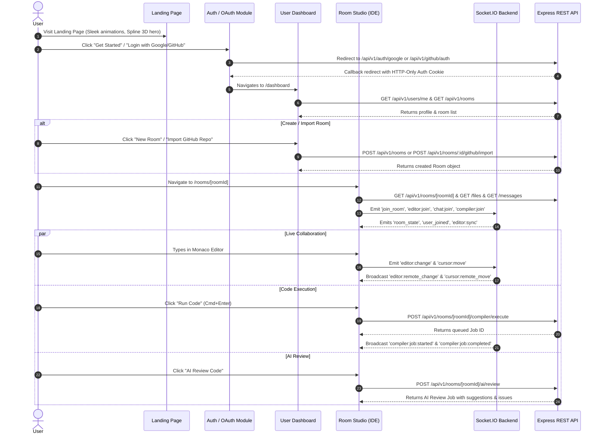
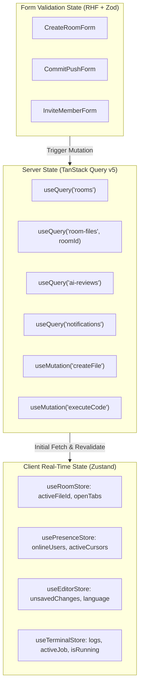

# Collaborative Code Editor — Comprehensive Frontend Architecture & Design Specification

> **System Status**: Backend is 100% complete with Node.js/Express, Prisma (PostgreSQL), Redis, Socket.IO, OAuth (Google & GitHub), Judge0 Code Execution, and AI Code Review services.
> **Frontend Stack**: Next.js 14 (App Router), TypeScript, TailwindCSS, shadcn/ui, TanStack Query v5, React Hook Form, Zod, Socket.IO Client, Monaco Editor, Framer Motion (Motion.dev), Tremor/Recharts, cmdk, react-resizable-panels, Sonner.
> **Design Language**: Linear + Vercel + GitHub + Cursor + Stripe Dashboard aesthetic.

---

## 1. Overall Frontend Architecture

### 1.1 System Architecture Diagram

```mermaid
flowchart TB
    subgraph Client ["Frontend Architecture (Next.js 14 App Router)"]
        direction TB
        UI ["UI Component Layer (shadcn/ui + TailwindCSS + Framer Motion)"]
        Pages ["App Router Pages & Layouts (RSC & Client Components)"]
        
        subgraph StateManagement ["State Management Layer"]
            RQ ["TanStack Query v5 (Server State, Caching, Optimistic UI)"]
            Zustand ["Zustand / Context (Active Room, Editor State, Presence, Layout)"]
            RHF ["React Hook Form + Zod (Form Validation & Mutation Specs)"]
        end
        
        subgraph RealtimeLayer ["Real-Time & Service Layer"]
            APIClient ["Axios API Client (JWT Interceptor, Token Rotation)"]
            SocketClient ["Socket.IO Client Service (Multi-namespace Event Handlers)"]
            MonacoManager ["Monaco Editor Bridge (Operational Transform / Cursor Tracking)"]
        end
    end

    subgraph Backend ["Existing Backend Architecture (100% Complete)"]
        Express ["Express REST API (/api/v1/*)"]
        SocketServer ["Socket.IO Server (Namespaces: /chat, /collaboration, /editor, /compiler)"]
    end

    Pages --> UI
    UI --> StateManagement
    RQ --> APIClient
    Zustand --> SocketClient
    Zustand --> MonacoManager
    APIClient --> Express
    SocketClient <--> SocketServer
```

### 1.2 Architectural Layers
1. **Presentation Layer**: Built with Next.js 14 App Router. Server Components (RSC) are utilized for initial page loads, SEO landing pages, and static metadata. Client Components (`'use client'`) encapsulate interactive workspaces, Monaco editor sessions, and real-time state listeners.
2. **State Orchestration Layer**:
   - **Server State**: Managed via TanStack Query (`@tanstack/react-query`). Handles caching, background revalidation, optimistic updates, and garbage collection for REST endpoints.
   - **Real-Time Workspace State**: Managed via lightweight Zustand stores. Tracks connected users, cursor positions, active file buffers, terminal execution logs, and typing indicators.
   - **Form & Input Validation State**: Powered by React Hook Form (`react-hook-form`) combined with Zod schemas mirror-matching backend DTOs.
3. **API & Real-time Client Layer**:
   - **REST Client**: Axios instance configured with automatic cookie transmission (`withCredentials: true`), request tracing headers, and automatic token refresh retry logic via `/api/v1/auth/refresh`.
   - **Socket.IO Client Manager**: A singleton socket client manager handling connection pooling, reconnection logic with exponential backoff, and event dispatching for collaboration, editor, chat, and compiler channels.

---

## 2. Comprehensive User Flows



---

## 3. Navigation & Routing Architecture

### 3.1 Route Matrix

| Path | Access Level | Description | Core Components |
|---|---|---|---|
| `/` | Public | Marketing Landing Page | `Hero`, `FeatureGrid`, `InteractiveDemo`, `SplineHero`, `Footer` |
| `/login` | Public (Unauth) | Login & OAuth Gateway | `GlassAuthCard`, `GoogleOAuthBtn`, `DevLoginForm` |
| `/dev-login` | Public (Dev Only) | Fast Dev Authentication | `DevLoginCard` |
| `/dashboard` | Authenticated | Main User Control Center | `RoomMetrics`, `RecentRoomsGrid`, `QuickActions`, `ActivityFeed` |
| `/rooms` | Authenticated | Full Room Repository List | `RoomTable`, `CreateRoomModal`, `ImportGitHubModal` |
| `/rooms/[roomId]` | Viewer+ | Full Collaborative IDE | `ResizableWorkspace`, `MonacoContainer`, `FileTree`, `Terminal`, `ChatDrawer` |
| `/rooms/[roomId]/settings` | Admin | Room Configuration & RBAC | `MemberRoleTable`, `InviteGenerator`, `DeleteRoomDangerZone` |
| `/invites/[token]` | Public / Auth | Invitation Accept Page | `InviteDetailsCard`, `AcceptInviteBtn` |
| `/ai-reviews` | Authenticated | User AI Audit History | `ReviewHistoryTable`, `FilterBar`, `CostMetricsCard` |
| `/ai-reviews/[reviewId]` | Authenticated | Detailed AI Review Report | `DiffViewer`, `IssuesList`, `SuggestionCard` |
| `/analytics` | Authenticated | Execution & Usage Stats | `ExecutionTimeChart`, `LanguageBreakdown`, `TokenUsageArea` |
| `/settings` | Authenticated | General User Settings | `ProfileForm`, `PreferencesForm`, `ThemeToggle` |
| `/settings/github` | Authenticated | GitHub Integration Portal | `GitHubStatusBadge`, `RepoListTable`, `ConnectGitHubBtn` |
| `/notifications` | Authenticated | In-App Notification Center | `NotificationList`, `NotificationItem`, `MarkAllReadBtn` |

---

## 4. Design System Specification

### 4.1 Design Philosophy: Linear + Vercel + Cursor + Stripe

- **Color Palette**: Dark-first palette using HSL CSS variables with refined neutral slate tones (`#090d16`, `#111827`, `#1f2937`) paired with electric accent colors (`#6366f1` Indigo, `#10b981` Emerald, `#f59e0b` Amber, `#ef4444` Rose, `#38bdf8` Sky).
- **Glassmorphism**: Subtle backdrop blur (`backdrop-blur-md bg-neutral-950/70 border border-neutral-800/60`).
- **Borders & Shadows**: Ultra-thin 1px borders (`border-white/10` or `border-neutral-800`), layered soft ambient drop-shadows (`shadow-[0_8px_30px_rgb(0,0,0,0.4)]`).
- **Typography**: Primary body text in **Inter**, code & editor text in **JetBrains Mono** with crisp sub-pixel antialiasing (`font-mono tracking-tight`).

```css
/* Core Color Tokens */
:root {
  --background: 224 71% 4%;        /* #090d16 Deep space background */
  --foreground: 210 40% 98%;       /* Crisp white heading text */
  --card: 222 47% 7%;              /* #0e1422 Surface card */
  --card-foreground: 210 40% 98%;
  --popover: 222 47% 8%;
  --popover-foreground: 210 40% 98%;
  --primary: 239 84% 67%;          /* #6366f1 Electric Indigo */
  --primary-foreground: 0 0% 100%;
  --secondary: 217 19% 15%;        /* Soft slate secondary button */
  --secondary-foreground: 210 40% 98%;
  --muted: 217 19% 12%;
  --muted-foreground: 215 20.2% 65.1%;
  --accent: 217 19% 18%;
  --accent-foreground: 210 40% 98%;
  --destructive: 0 84% 60%;
  --border: 217 19% 16%;           /* Subtle border line */
  --input: 217 19% 16%;
  --ring: 239 84% 67%;
  --radius: 0.5rem;                /* Rounded-md styling */
}
```

### 4.2 Component Primitives Palette
- **Buttons**:
  - `Primary`: Indigo gradient glow with active scale `active:scale-[0.98]` and shine effect.
  - `Secondary`: Glass slate background with border highlight on hover.
  - `Ghost`: Seamless flat style with background color shift on hover.
  - `Danger`: Rose tinted border & background for destructive room operations.
- **Cards (`AnimatedCard`)**: Framer Motion elevated card with custom mouse cursor spotlight effect (`radial-gradient` tracking mouse coordinates).
- **Badges (`StatusBadge`)**: Pill-shaped indicator with pulse animation for execution status (`queued` yellow pulse, `running` blue spinner, `completed` emerald glow, `failed` rose indicator).

---

## 5. Component Hierarchy & Architecture

```
app/
├── (auth)/
│   ├── login/page.tsx
│   ├── dev-login/page.tsx
│   └── callback/page.tsx
├── (dashboard)/
│   ├── layout.tsx (Sidebar + Topbar + Command Palette + Toast Container)
│   ├── dashboard/page.tsx
│   ├── rooms/
│   │   ├── page.tsx
│   │   └── [roomId]/
│   │       ├── page.tsx (IDE Studio main entry)
│   │       └── settings/page.tsx
│   ├── ai-reviews/
│   │   ├── page.tsx
│   │   └── [reviewId]/page.tsx
│   ├── analytics/page.tsx
│   ├── settings/
│   │   ├── page.tsx
│   │   └── github/page.tsx
│   └── notifications/page.tsx
├── invites/
│   └── [token]/page.tsx
└── page.tsx (Landing Page)

components/
├── ui/ (shadcn/ui primitives: button, dialog, dropdown, tabs, toast, select, etc.)
├── animation/
│   ├── MotionContainer.tsx
│   ├── FadeIn.tsx
│   ├── MagneticButton.tsx
│   └── GlowingBorder.tsx
├── 3d/
│   ├── SplineHeroCanvas.tsx
│   └── Rive404Animation.tsx
├── layout/
│   ├── AppSidebar.tsx
│   ├── AppTopbar.tsx
│   ├── BreadcrumbHeader.tsx
│   └── UserDropdown.tsx
├── editor/
│   ├── WorkspaceLayout.tsx (react-resizable-panels wrapper)
│   ├── FileTreeSidebar.tsx
│   ├── MonacoEditorContainer.tsx
│   ├── RemoteCursorOverlay.tsx
│   ├── PresenceBar.tsx
│   └── LanguageSelector.tsx
├── terminal/
│   ├── CompilerConsole.tsx
│   ├── ExecutionOutput.tsx
│   └── ExecutionHistoryTab.tsx
├── chat/
│   ├── ChatDrawer.tsx
│   ├── MessageList.tsx
│   ├── MessageInput.tsx
│   └── TypingIndicator.tsx
├── ai/
│   ├── AiReviewDrawer.tsx
│   ├── DiffViewer.tsx
│   ├── IssueItemCard.tsx
│   └── CodeExplainModal.tsx
├── github/
│   ├── ImportRepoDialog.tsx
│   ├── CommitPushDialog.tsx
│   └── CreatePRDialog.tsx
└── command/
    └── CommandPalette.tsx (cmdk modal triggered by Cmd+K)
```

---

## 6. Animation Strategy & UI Library Allocation

| UI Library | Targeted Feature / Component | Value Addition & Aesthetic Goal |
|---|---|---|
| **Motion.dev (Framer Motion)** | Page transitions, Sidebar toggle, Modal reveals, Hover elevation, Animated Cards | Smooth 60fps layout shifts (`layoutId`), staggered list entry, fluid interactive micro-feedback |
| **Lenis** | Landing Page (`/`) Smooth Scroll | Ultra-smooth inertia scrolling giving a polished Linear/Vercel feel |
| **Spline** | Landing Page Hero (`/`) 3D Interactive Code Core | Immersive interactive 3D code matrix sphere responding to mouse position |
| **Rive** | 404 / 500 Error States & Empty States | Lightweight vector interactive character reacting to user clicks |
| **Magic UI & Aceternity UI** | Hero background grid beam, Shimmer Buttons, Bento Box Cards | Next-gen visual flare without compromising DOM performance |
| **Tremor & Recharts** | Analytics (`/analytics`) & AI Review metrics | Clean, animated area charts, bar graphs, and token burn metrics |
| **Monaco Editor** | Room Studio IDE (`/rooms/[roomId]`) | Production-grade code editor matching VS Code functionality with custom dark themes |
| **cmdk** | Global Command Palette (`Cmd+K`) | Fast keyboard navigation for jumping between rooms, triggering code execution, and opening AI tools |
| **react-resizable-panels** | Studio IDE Multi-pane Layout | Smooth drag-to-resize split panes for File Explorer, Code Editor, and Execution Terminal |
| **Sonner** | System Notifications & Real-Time Alerts | Sleek stacked toast alerts for compiler completions, join events, and GitHub sync status |

---

## 7. State Management Architecture



---

## 8. Complete API Integration Strategy

### 8.1 REST API Mapping Table

| Endpoint | Method | Triggering Component / Hook | React Query Spec / Handler |
|---|---|---|---|
| `/api/v1/auth/google` | GET | `GoogleOAuthBtn` | Direct window location redirect |
| `/api/v1/auth/refresh` | POST | Axios Response Interceptor | Token rotation handler on 401 error |
| `/api/v1/auth/logout` | POST | `UserDropdown` | `useMutation` -> invalidate user query & clear state |
| `/api/v1/users/me` | GET | `AppTopbar`, `AuthGuard` | `useQuery(['user', 'me'])` |
| `/api/v1/users/me` | PATCH | `ProfileForm` | `useMutation` -> update cache optimistically |
| `/api/v1/rooms` | GET | `RoomsPage`, `DashboardPage` | `useQuery(['rooms', params])` |
| `/api/v1/rooms` | POST | `CreateRoomModal` | `useMutation` -> push new room to cache |
| `/api/v1/rooms/:id` | GET | `RoomStudioPage` | `useQuery(['room', roomId])` |
| `/api/v1/rooms/:id/files` | GET | `FileTreeSidebar` | `useQuery(['files', roomId])` |
| `/api/v1/rooms/:id/files` | POST | `FileTreeSidebar` (New File) | `useMutation` -> optimistic file tree insert |
| `/api/v1/rooms/:id/compiler/execute` | POST | `RunCodeBtn` (`Cmd+Enter`) | `useMutation` -> set terminal status to queued |
| `/api/v1/rooms/:id/ai/review` | POST | `AiReviewDrawer` | `useMutation` -> trigger AI review loading state |
| `/api/v1/github/repos` | GET | `ImportRepoModal` | `useQuery(['github', 'repos'])` |
| `/api/v1/notifications` | GET | `NotificationPopover` | `useQuery(['notifications'])` with refetchInterval |

### 8.2 Socket.IO Event Mapping Table

| Socket Event | Direction | Triggering Action | Handler Action |
|---|---|---|---|
| `join_room` | Client -> Server | Studio page load | Joins collaboration room channel |
| `room_state` | Server -> Client | On room join | Populates initial online user presence |
| `user_joined` | Server -> Client | Remote user enters | Adds user avatar to `PresenceBar` & shows Sonner toast |
| `editor:join` | Client -> Server | File tab selected | Joins room editor file room |
| `editor:change` | Client -> Server | User types in Monaco | Sends operation delta to backend |
| `editor:remote_change` | Server -> Client | Remote user edits | Applies delta into Monaco model without losing cursor |
| `cursor:move` | Client -> Server | Mouse/caret position changes | Broadcasts `{ line, column, fileId }` |
| `cursor:remote_move` | Server -> Client | Remote caret moves | Updates `RemoteCursorOverlay` in Monaco |
| `chat:send` | Client -> Server | User submits chat message | Emits message payload |
| `chat:message` | Server -> Client | New chat message | Appends message to `ChatDrawer` list |
| `compiler:job:started` | Server -> Client | Code execution begins | Sets terminal status indicator to `running` |
| `compiler:job:completed` | Server -> Client | Execution finishes | Appends stdout/stderr logs & execution time |

---

## 9. Responsive & Breakpoint Strategy

- **Desktop & Ultrawide (`>= 1280px`)**: Full multi-pane IDE experience with 3 resizable columns (File Tree, Monaco Editor, Terminal/Chat Panel). Topbar with live presence avatars.
- **Tablet (`768px - 1024px`)**: File tree collapses into a slide-over sheet drawer. Monaco editor consumes primary screen width. Terminal and Chat render as bottom tabbed panels.
- **Mobile (`< 768px`)**: Single column workspace. Top navigation bar with tab triggers to switch between "Code Editor", "File Explorer", "Output Terminal", and "Chat". Touch-friendly toolbar buttons for running code and triggering AI reviews.

---

## 10. Performance, Accessibility & Scalability

### 10.1 Performance Optimizations
- **Dynamic Module Loading**: Monaco Editor (`@monaco-editor/react`), Recharts, and Spline components dynamically imported with `next/dynamic` to minimize initial bundle size.
- **Debounced Sockets**: Caret movement (`cursor:move`) and typing status indicators debounced at 50ms and 300ms respectively.
- **Virtualization**: Large message logs and execution output streams virtualized using `@tanstack/react-virtual`.

### 10.2 Accessibility (a11y)
- Full keyboard access for Monaco shortcuts (`Cmd+S`, `Cmd+Enter`, `Cmd+K`).
- ARIA live region (`aria-live="polite"`) configured for terminal output updates so screen readers announce code execution completion.
- Color contrast ratio compliance (WCAG AAA) across all dark mode background/foreground pairs.

---

## 11. Implementation Roadmap (Phase 1 to Production)

### Phase 1: Core System Setup & Design Tokens (Days 1–2)
- Configure Next.js 14 App Router workspace structure with TypeScript & TailwindCSS.
- Establish HSL theme tokens, dark mode palette, and typography scale.
- Install shadcn/ui components, Lucide icons, Motion.dev, and Sonner.
- Setup Axios client with authentication interceptors and TanStack Query provider.

### Phase 2: Auth Gateway & User Dashboard (Days 3–4)
- Build public Landing Page (`/`) with Lenis smooth scroll and hero animation.
- Build Auth Page (`/login`) supporting Google OAuth redirect and Dev Login.
- Build Dashboard Layout (`AppSidebar`, `AppTopbar`, `CommandPalette`).
- Build User Dashboard (`/dashboard`) & Room Management (`/rooms`).

### Phase 3: Collaborative Studio IDE & Monaco Integration (Days 5–7)
- Integrate `react-resizable-panels` for 3-column studio layout (`/rooms/[roomId]`).
- Configure Monaco Editor with custom VS Code dark theme and language syntax modules.
- Connect Socket.IO client service to backend `/editor` and `/collaboration` namespaces.
- Implement remote cursor overlays, selection highlights, and real-time presence indicators.

### Phase 4: Code Compiler Terminal, Chat & Version Snapshots (Days 8–9)
- Build Compiler Console component connected to Judge0 execution API & WebSocket events.
- Build Chat Drawer with real-time message stream and typing indicators.
- Build Version History snapshot manager (`/rooms/[roomId]/settings` & version diff viewer).

### Phase 5: AI Code Review, GitHub Sync & Analytics (Days 10–11)
- Build AI Code Review Drawer & Report page (`/ai-reviews/[reviewId]`) featuring side-by-side diffs.
- Implement GitHub repository import modal, commit/push dialog, and pull request creation.
- Build Analytics dashboard (`/analytics`) with Recharts execution timelines and token usage.

### Phase 6: Responsive Polish, Accessibility & Production Launch (Day 12+)
- Audit mobile/tablet responsive layout behavior.
- Perform ARIA keyboard navigation check and focus trap verification.
- Configure dynamic code-splitting, static page caching, and production build validation.
