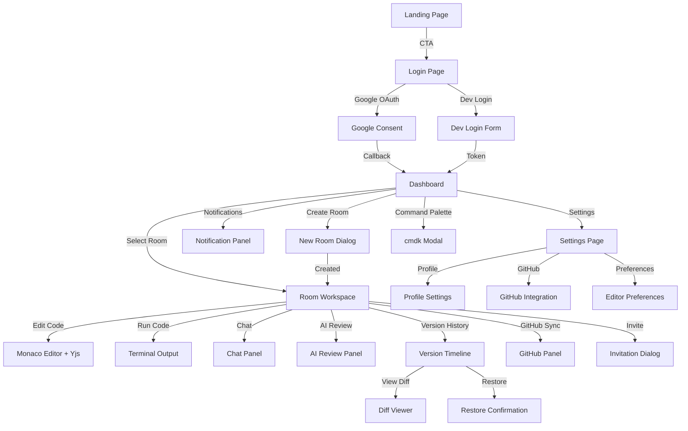

# Frontend Architecture & Design Plan — CodeSync

> A world-class collaborative code editor SaaS frontend designed to match the design language of **Linear + Vercel + Cursor + GitHub + Stripe Dashboard**.

---

## 1. Backend Analysis Summary

The backend is a production-grade **Express.js + Prisma + PostgreSQL + Redis + Socket.IO** system organized into 13 modules spanning 11 milestones. Below is the complete API surface the frontend must integrate with.

### REST API Endpoints (Base: `/api/v1`)

| Module | Method | Endpoint | Auth | RBAC | Purpose |
|---|---|---|---|---|---|
| **System** | `GET` | `/health` | ✗ | — | Liveness probe |
| | `GET` | `/ready` | ✗ | — | Readiness probe |
| | `GET` | `/docs/openapi.json` | ✗ | — | OpenAPI spec |
| | `GET` | `/queues` | ✗ | — | BullMQ queue status |
| **Auth** | `GET` | `/auth/google` | ✗ | — | Initiate Google OAuth |
| | `GET` | `/auth/google/callback` | ✗ | — | Google OAuth callback |
| | `POST` | `/auth/refresh` | Cookie | — | Rotate token pair |
| | `POST` | `/auth/logout` | ✓ | — | Revoke refresh token |
| | `POST` | `/auth/dev/login` | ✗ | — | Dev-mode login (non-prod) |
| **Users** | `GET` | `/users/me` | ✓ | — | Get current profile |
| | `PATCH` | `/users/me` | ✓ | — | Update profile |
| | `DELETE` | `/users/me` | ✓ | — | Soft-delete account |
| | `GET` | `/users/search?q=&limit=` | ✓ | — | Search users |
| **Rooms** | `GET` | `/rooms` | ✓ | — | List user's rooms (paginated) |
| | `POST` | `/rooms` | ✓ | — | Create room |
| | `GET` | `/rooms/:roomId` | ✓ | viewer+ | Get room details |
| | `PATCH` | `/rooms/:roomId` | ✓ | admin | Update room |
| | `DELETE` | `/rooms/:roomId` | ✓ | admin | Soft-delete room |
| | `GET` | `/rooms/:roomId/members` | ✓ | viewer+ | List members |
| | `DELETE` | `/rooms/:roomId/members/:userId` | ✓ | admin | Remove member |
| | `PATCH` | `/rooms/:roomId/members/:userId/role` | ✓ | admin | Update member role |
| | `POST` | `/rooms/:roomId/leave` | ✓ | viewer+ | Leave room |
| | `GET` | `/rooms/invites/:token` | ✗ | — | Get invitation details |
| | `POST` | `/rooms/invites/accept` | ✓ | — | Accept invitation |
| | `GET` | `/rooms/:roomId/invites` | ✓ | editor+ | List invitations |
| | `POST` | `/rooms/:roomId/invites` | ✓ | editor+ | Create invitation |
| | `DELETE` | `/rooms/:roomId/invites/:invitationId` | ✓ | admin | Revoke invitation |
| **Files** | `GET` | `/rooms/:roomId/files` | ✓ | viewer+ | List files |
| | `POST` | `/rooms/:roomId/files` | ✓ | editor+ | Create file |
| | `GET` | `/rooms/:roomId/files/:fileId` | ✓ | viewer+ | Get file |
| | `PATCH` | `/rooms/:roomId/files/:fileId` | ✓ | editor+ | Update file |
| | `DELETE` | `/rooms/:roomId/files/:fileId` | ✓ | editor+ | Delete file |
| **Chat** | `GET` | `/rooms/:roomId/messages?limit=&cursor=` | ✓ | viewer+ | Get chat history |
| **Compiler** | `POST` | `/rooms/:roomId/compiler/execute` | ✓ | editor+ | Execute code |
| | `GET` | `/rooms/:roomId/compiler/jobs?limit=&cursor=` | ✓ | viewer+ | List execution history |
| | `GET` | `/rooms/:roomId/compiler/jobs/:jobId` | ✓ | viewer+ | Get execution result |
| **Versions** | `POST` | `/rooms/:roomId/versions` | ✓ | editor+ | Create snapshot |
| | `GET` | `/rooms/:roomId/versions?page=&limit=` | ✓ | viewer+ | List versions |
| | `GET` | `/rooms/:roomId/versions/:versionId` | ✓ | viewer+ | Get version details |
| | `GET` | `/rooms/:roomId/versions/:versionId/diff?targetVersionId=` | ✓ | viewer+ | Compute diff |
| | `POST` | `/rooms/:roomId/versions/:versionId/restore` | ✓ | admin | Restore to version |
| **GitHub** | `GET` | `/github/auth` | ✓ | — | Initiate GitHub OAuth |
| | `GET` | `/github/callback` | ✗ | — | GitHub OAuth callback |
| | `POST` | `/github/connect` | ✓ | — | Connect GitHub token |
| | `DELETE` | `/github/disconnect` | ✓ | — | Disconnect GitHub |
| | `GET` | `/github/status` | ✓ | — | Get GitHub connection status |
| | `GET` | `/github/repos` | ✓ | — | List user's GitHub repos |
| | `POST` | `/rooms/:roomId/github/import` | ✓ | editor+ | Import repo into room |
| | `POST` | `/rooms/:roomId/github/commit-push` | ✓ | editor+ | Commit & push to GitHub |
| | `POST` | `/rooms/:roomId/github/pr` | ✓ | editor+ | Create pull request |
| **AI** | `POST` | `/ai/explain` | ✓ | — | Explain code snippet |
| | `POST` | `/ai/suggest` | ✓ | — | Suggest improvements |
| | `GET` | `/ai/reviews/:reviewId` | ✓ | — | Get review by ID |
| | `POST` | `/rooms/:roomId/ai/review` | ✓ | editor+ | Request AI review |
| **Notifications** | `GET` | `/notifications?page=&limit=&unreadOnly=` | ✓ | — | List notifications |
| | `GET` | `/notifications/unread-count` | ✓ | — | Get unread count |
| | `PATCH` | `/notifications/read-all` | ✓ | — | Mark all read |
| | `PATCH` | `/notifications/:notificationId/read` | ✓ | — | Mark one read |

### WebSocket Namespaces

| Namespace | Events (Client → Server) | Events (Server → Client) |
|---|---|---|
| `/collaboration` | `join_room`, `leave_room`, `heartbeat` | `user_joined`, `user_left` |
| `/editor` | `editor:join`, `editor:change`, `cursor:move`, `selection:change`, `typing:start`, `typing:stop` | `editor:update`, `cursor:update`, `selection:update`, `typing:start`, `typing:stop` |
| `/chat` | `chat:join`, `chat:send`, `chat:typing:start`, `chat:typing:stop` | `chat:receive`, `chat:typing:start`, `chat:typing:stop` |
| `/compiler` | `compiler:join` | `compiler:stdout`, `compiler:stderr`, `compiler:done` |
| **Default** | — | `user:{userId}:notification` → `{ type, notification, unreadCount }` |

### Authentication Architecture

- **Access Token**: JWT (15 min TTL), sent via `Authorization: Bearer <token>` header
- **Refresh Token**: Cryptographic, stored as HTTP-only cookie on path `/api/v1/auth`, 7-day TTL
- **Token Rotation**: Every refresh issues a new pair + revokes old
- **Socket Auth**: Token via `handshake.auth.token`, `Authorization` header, or `?token=` query
- **OAuth**: Google OAuth 2.0 (production), Dev login (dev/staging)

### Data Models (Key Entities)

- **User** — profile, preferences (JSON), Google ID, avatar
- **Room** — collaborative workspace with name, language, description, public/private, settings (JSON)
- **RoomMember** — junction with role (viewer/editor/admin)
- **Invitation** — token-based, role, status, TTL
- **File** — code files within a room (name, language, content)
- **Message** — chat (USER/SYSTEM types), cursor-paginated
- **CompilerJob** — execution audit (queued → running → completed/failed/timeout)
- **Version** — snapshot label + description, with immutable VersionFiles
- **GitHubToken** — encrypted user connection
- **AiReview** — async review with issues/suggestions (JSON), cost tracking
- **Notification** — typed, titled, linked, read state

---

## 2. Overall Frontend Architecture

```
┌─────────────────────────────────────────────────────────┐
│                     Next.js App Router                   │
│  ┌──────────────────────────────────────────────────┐   │
│  │                 Route Groups                      │   │
│  │  (marketing)  │  (auth)  │  (dashboard)  │ (room) │   │
│  └──────────────────────────────────────────────────┘   │
│  ┌──────────────────────────────────────────────────┐   │
│  │               Provider Stack                      │   │
│  │  ThemeProvider → QueryProvider → AuthProvider →    │   │
│  │  SocketProvider → ToastProvider                    │   │
│  └──────────────────────────────────────────────────┘   │
│  ┌──────────────────────────────────────────────────┐   │
│  │              State Architecture                   │   │
│  │  React Query (server)  │  Context (auth/socket)   │   │
│  │  useState (local UI)   │  URL params (filters)    │   │
│  └──────────────────────────────────────────────────┘   │
│  ┌──────────────────────────────────────────────────┐   │
│  │             API / Transport Layer                 │   │
│  │  Axios Instance → Interceptors → Auto-Refresh    │   │
│  │  Socket.IO Client → Namespace Managers            │   │
│  └──────────────────────────────────────────────────┘   │
└─────────────────────────────────────────────────────────┘
```

### Core Architectural Principles

1. **Server Components by default** — pages, layouts, and data-display components render on the server
2. **Client Components only when needed** — interactivity, hooks, browser APIs, WebSocket listeners
3. **React Query for all server state** — automatic caching, background refetching, optimistic updates
4. **Context for cross-cutting state** — auth session, socket connections, theme
5. **URL as state** — pagination, filters, and search encoded in URL search params
6. **Colocation** — types, hooks, and utils live near the components that use them

---

## 3. User Flow



---

## 4. Navigation Flow

### Primary Navigation (Sidebar — collapsed by default on mobile)

```
╔═══════════════════════╗
║  ◆ CodeSync Logo      ║
╠═══════════════════════╣
║  🏠 Dashboard         ║
║  📁 Rooms             ║
║  🤖 AI Assistant      ║
║  🔔 Notifications     ║
╠═══════════════════════╣
║  ⚙️ Settings          ║
║  👤 Profile           ║
╚═══════════════════════╝
```

### Room Workspace Navigation (Top bar + secondary panels)

```
╔═══════════════════════════════════════════════════════════════╗
║  ← Back │ Room Name │ Members (Avatars) │ 🔔 │ ⌘K │ ⚙️     ║
╠═══════════════════════════════════════════════════════════════╣
║  Files │ Chat │ Terminal │ AI Review │ Versions │ GitHub      ║
╚═══════════════════════════════════════════════════════════════╝
```

---

## 5. Complete Page Hierarchy

### 5.1 Landing Page — `/`

| Attribute | Detail |
|---|---|
| **Purpose** | Marketing page to convert visitors into users |
| **Layout** | Full-width, no sidebar. Hero → Features → How it works → CTA → Footer |
| **Components** | `HeroSection`, `FeatureGrid`, `HowItWorks`, `CTASection`, `Footer`, `Navbar` |
| **Animations** | Lenis smooth scroll, hero text reveal with staggered Motion.dev, floating gradient orb background, scroll-triggered feature cards, parallax code snippets |
| **3D (Spline)** | Interactive 3D code editor model in hero section |
| **Loading State** | Not applicable (static page, SSG) |
| **Error State** | Not applicable |
| **Responsive** | Hero stacks vertically on mobile, feature grid → single column, CTA full-width |
| **Libraries** | Lenis, Motion.dev, Spline (hero only) |

### 5.2 Login Page — `/login`

| Attribute | Detail |
|---|---|
| **Purpose** | Authentication entry point |
| **Layout** | Split-screen: left = animated illustration/3D, right = login card |
| **Components** | `GoogleLoginButton`, `DevLoginForm` (dev only), `AuthCard`, `AnimatedBackground` |
| **User Journey** | User clicks "Continue with Google" → redirected to `/api/v1/auth/google` → callback returns `accessToken` + `refreshToken` cookie → redirect to dashboard |
| **Animations** | Card entrance (scale + fade), button hover (elevation + glow), background gradient animation |
| **3D (Spline/Rive)** | Animated code illustration on left panel |
| **Loading State** | Button spinner + disabled state during OAuth redirect |
| **Error State** | Toast error with `?error=auth_failed` query param handling |
| **Responsive** | Mobile: full-screen card, illustration hidden. Tablet: illustration reduced |
| **Libraries** | Motion.dev, Sonner (error toast) |

### 5.3 OAuth Callback — `/callback`

| Attribute | Detail |
|---|---|
| **Purpose** | Handle Google OAuth redirect, store access token, redirect to dashboard |
| **Layout** | Full-screen loading animation |
| **Components** | `LoadingSpinner`, `AnimatedLogo` |
| **User Journey** | Backend redirects here with `accessToken` in query/response → store in memory → redirect to `/dashboard` |
| **Animations** | Pulsing logo animation |
| **Loading State** | Full-page loader with "Signing you in..." text |
| **Error State** | Redirect to `/login?error=callback_failed` |

### 5.4 Dashboard — `/(dashboard)/dashboard`

| Attribute | Detail |
|---|---|
| **Purpose** | Primary hub showing rooms overview, recent activity, quick actions |
| **API Endpoints** | `GET /rooms`, `GET /notifications/unread-count` |
| **Layout** | Sidebar + main content area. Header with search + notifications + command palette trigger |
| **Components** | `DashboardHeader`, `RoomGrid`/`RoomList`, `QuickActions`, `RecentActivity`, `MetricCard`, `CreateRoomDialog`, `EmptyState` |
| **User Journey** | View all rooms → filter/search → click to open → or create new room |
| **Animations** | Staggered card entrance, hover card elevation, create room dialog slide-up, metric counter animation |
| **Loading State** | Skeleton grid (6 cards), skeleton metric bars |
| **Error State** | Retry banner with "Failed to load rooms" |
| **Responsive** | Desktop: 3-column grid. Tablet: 2 columns. Mobile: single column, sidebar collapses to bottom nav |
| **Libraries** | Motion.dev (stagger), cmdk, Sonner |

### 5.5 Room Workspace — `/(dashboard)/rooms/[roomId]`

| Attribute | Detail |
|---|---|
| **Purpose** | The core collaborative editing experience |
| **API Endpoints** | `GET /rooms/:roomId`, `GET /rooms/:roomId/files`, `GET /rooms/:roomId/members` |
| **WebSocket Namespaces** | `/collaboration`, `/editor`, `/chat`, `/compiler` |
| **Layout** | Resizable multi-panel: File explorer (left) ← → Monaco Editor (center) ← → Side panel (right: Chat/AI/Versions) ← → Terminal (bottom) |
| **Components** | `FileExplorer`, `MonacoEditor`, `ChatPanel`, `TerminalPanel`, `PresenceBar`, `CursorOverlay`, `AIReviewPanel`, `VersionPanel`, `GitHubPanel`, `RoomSettingsSheet`, `InviteDialog`, `MemberList` |
| **User Journey** | Join room → see presence → select file → collaborative edit → run code → chat → request AI review |
| **Animations** | Panel resize with spring physics, file selection slide, presence avatars pop-in, cursor follow with smooth interpolation, terminal slide-up, typing indicators pulse |
| **Loading State** | Full-page skeleton with editor placeholder, file tree shimmer |
| **Error State** | Room not found (404 illustration), access denied (403 illustration), connection lost (reconnection banner with progress) |
| **Responsive** | Desktop: full multi-panel. Tablet: collapsible side panel. Mobile: tab-based navigation between editor/chat/terminal |
| **Libraries** | Monaco Editor, react-resizable-panels, Motion.dev, Socket.IO client, Yjs |

### 5.6 Room Settings — `/(dashboard)/rooms/[roomId]/settings`

| Attribute | Detail |
|---|---|
| **Purpose** | Room configuration, member management, danger zone |
| **API Endpoints** | `PATCH /rooms/:roomId`, `GET/DELETE /rooms/:roomId/members`, `PATCH .../role`, invitations CRUD |
| **Layout** | Settings page within room context — vertical sections |
| **Components** | `SettingsForm`, `MemberTable`, `RoleSelector`, `InviteSection`, `DangerZone`, `ConfirmDialog` |
| **User Journey** | Admin updates room name/language/visibility → manages members → creates/revokes invites → deletes room |
| **Animations** | Section expand/collapse, role change badge morph, delete confirmation shake |
| **Loading State** | Form skeleton, table skeleton |
| **Error State** | Inline field errors, toast for server errors |
| **Responsive** | Single column on all breakpoints, sections stack |
| **Libraries** | React Hook Form, Zod, Sonner |

### 5.7 Invitation Accept — `/rooms/invites/[token]`

| Attribute | Detail |
|---|---|
| **Purpose** | Public invitation landing → accept and join room |
| **API Endpoints** | `GET /rooms/invites/:token`, `POST /rooms/invites/accept` |
| **Layout** | Centered card with room info and accept button |
| **Components** | `InvitationCard`, `AcceptButton`, `ExpiredState` |
| **Animations** | Card entrance, success confetti on accept |
| **Loading State** | Card skeleton |
| **Error State** | Expired invitation illustration, invalid token error |
| **Responsive** | Centered card scales down on mobile |

### 5.8 AI Assistant — `/(dashboard)/ai`

| Attribute | Detail |
|---|---|
| **Purpose** | Standalone AI tools: explain code, suggest improvements |
| **API Endpoints** | `POST /ai/explain`, `POST /ai/suggest`, `GET /ai/reviews/:reviewId` |
| **Layout** | Split: code input (left) ← → AI response (right) |
| **Components** | `CodeInputArea` (Monaco), `AIResponseCard`, `StreamingText`, `ExplainTab`, `SuggestTab` |
| **Animations** | Streaming text typewriter effect, response card slide-in, loading shimmer with AI pulse |
| **Loading State** | "Thinking..." skeleton with animated gradient |
| **Error State** | Rate limit warning, API error with retry |
| **Responsive** | Stacks vertically on mobile |
| **Libraries** | Monaco Editor, Motion.dev |

### 5.9 Notifications — `/(dashboard)/notifications`

| Attribute | Detail |
|---|---|
| **Purpose** | Full notification center (also accessible via header bell icon popover) |
| **API Endpoints** | `GET /notifications`, `PATCH /notifications/:id/read`, `PATCH /notifications/read-all`, `GET /notifications/unread-count` |
| **WebSocket** | `user:{userId}:notification` on default namespace |
| **Layout** | List view with filters (all / unread) |
| **Components** | `NotificationList`, `NotificationItem`, `NotificationFilter`, `MarkAllReadButton`, `EmptyNotifications` |
| **Animations** | New notification slide-in from top, read → opacity fade, mark-all sweep animation |
| **Loading State** | List skeleton (5 items) |
| **Error State** | Retry on fail |
| **Responsive** | Full-width list on all breakpoints |
| **Libraries** | Motion.dev, Sonner |

### 5.10 Settings — `/(dashboard)/settings`

| Attribute | Detail |
|---|---|
| **Purpose** | User profile, preferences, integrations, account management |
| **API Endpoints** | `GET/PATCH /users/me`, `DELETE /users/me`, `GET/POST/DELETE /github/*` |
| **Layout** | Left nav tabs (Profile / Preferences / Integrations / Account) + right content area |
| **Components** | `ProfileForm`, `AvatarUpload`, `PreferencesEditor`, `GitHubConnectionCard`, `ThemeToggle`, `DeleteAccountDialog` |
| **User Journey** | Update name/avatar → configure editor preferences → connect/disconnect GitHub → delete account |
| **Animations** | Tab transition crossfade, avatar upload preview morph, GitHub connect success check |
| **Loading State** | Form skeleton |
| **Error State** | Inline validation, toast for server errors |
| **Responsive** | Mobile: tabs become horizontal scroll, single column form |
| **Libraries** | React Hook Form, Zod, next-themes, Sonner |

### 5.11 Error Pages

#### 404 — Not Found
- Custom illustration (floating astronaut / lost in space theme)
- "Page not found" with return home button
- Subtle floating particle animation

#### 500 — Server Error
- Custom illustration (broken circuit / glitch theme)
- "Something went wrong" with retry button
- Glitch text animation

---

## 6. Design System

### 6.1 Typography

```css
/* Font Stack: Inter for UI, JetBrains Mono for code */
--font-sans: 'Inter', -apple-system, BlinkMacSystemFont, 'Segoe UI', sans-serif;
--font-mono: 'JetBrains Mono', 'Fira Code', 'Cascadia Code', monospace;

/* Scale */
--text-xs:    0.75rem / 1rem;      /* 12px — captions, badges */
--text-sm:    0.875rem / 1.25rem;   /* 14px — secondary text, table cells */
--text-base:  1rem / 1.5rem;        /* 16px — body text */
--text-lg:    1.125rem / 1.75rem;   /* 18px — section titles */
--text-xl:    1.25rem / 1.75rem;    /* 20px — page subtitles */
--text-2xl:   1.5rem / 2rem;        /* 24px — page titles */
--text-3xl:   1.875rem / 2.25rem;   /* 30px — hero subtitles */
--text-4xl:   2.25rem / 2.5rem;     /* 36px — hero titles */
--text-5xl:   3rem / 1;             /* 48px — landing hero */
--text-6xl:   3.75rem / 1;          /* 60px — landing hero (desktop) */

/* Weights */
--font-regular:  400;
--font-medium:   500;
--font-semibold: 600;
--font-bold:     700;

/* Tracking */
--tracking-tight:   -0.025em;  /* Headings */
--tracking-normal:  0;         /* Body */
--tracking-wide:    0.025em;   /* Badges, labels */
```

### 6.2 Color Palette

```css
/* === DARK THEME (Default) === */

/* Neutral / Gray scale — inspired by Linear/Vercel */
--gray-1:   hsl(0 0% 4.3%);    /* App background */
--gray-2:   hsl(0 0% 6.5%);    /* Subtle background */
--gray-3:   hsl(0 0% 9.1%);    /* Element background */
--gray-4:   hsl(0 0% 11.4%);   /* Hover background */
--gray-5:   hsl(0 0% 13.7%);   /* Active / pressed */
--gray-6:   hsl(0 0% 16.1%);   /* Subtle border */
--gray-7:   hsl(0 0% 20.0%);   /* Border */
--gray-8:   hsl(0 0% 28.0%);   /* Strong border */
--gray-9:   hsl(0 0% 43.5%);   /* Muted text */
--gray-10:  hsl(0 0% 49.4%);   /* Placeholder */
--gray-11:  hsl(0 0% 62.8%);   /* Secondary text */
--gray-12:  hsl(0 0% 93.0%);   /* Primary text */

/* Brand / Accent — Electric blue-violet */
--accent-1:  hsl(240 65% 5%);
--accent-2:  hsl(240 70% 8%);
--accent-3:  hsl(240 72% 12%);
--accent-4:  hsl(240 68% 17%);
--accent-5:  hsl(240 65% 22%);
--accent-6:  hsl(240 62% 28%);
--accent-7:  hsl(240 58% 36%);
--accent-8:  hsl(240 55% 48%);
--accent-9:  hsl(240 80% 62%);    /* Primary accent */
--accent-10: hsl(240 85% 68%);
--accent-11: hsl(240 90% 78%);    /* Accent text */
--accent-12: hsl(240 95% 93%);

/* Semantic Colors */
--success:    hsl(142 71% 45%);    /* Green */
--success-bg: hsl(142 71% 45% / 0.12);
--warning:    hsl(38 92% 50%);     /* Amber */
--warning-bg: hsl(38 92% 50% / 0.12);
--error:      hsl(0 72% 51%);      /* Red */
--error-bg:   hsl(0 72% 51% / 0.12);
--info:       hsl(206 100% 50%);   /* Blue */
--info-bg:    hsl(206 100% 50% / 0.12);

/* === LIGHT THEME === */
/* (Inverted scale of above, following Radix UI patterns) */
```

### 6.3 Spacing

```css
/* 4px base unit */
--space-0:  0;
--space-1:  0.25rem;   /*  4px */
--space-2:  0.5rem;    /*  8px */
--space-3:  0.75rem;   /* 12px */
--space-4:  1rem;      /* 16px */
--space-5:  1.25rem;   /* 20px */
--space-6:  1.5rem;    /* 24px */
--space-8:  2rem;      /* 32px */
--space-10: 2.5rem;    /* 40px */
--space-12: 3rem;      /* 48px */
--space-16: 4rem;      /* 64px */
--space-20: 5rem;      /* 80px */
--space-24: 6rem;      /* 96px */
```

### 6.4 Border Radius

```css
--radius-sm:   0.375rem;  /*  6px — small badges */
--radius-md:   0.5rem;    /*  8px — buttons, inputs */
--radius-lg:   0.75rem;   /* 12px — cards */
--radius-xl:   1rem;      /* 16px — dialogs, modals */
--radius-2xl:  1.5rem;    /* 24px — large panels */
--radius-full: 9999px;    /* Pills, avatars */
```

### 6.5 Shadows

```css
/* Elevation system — soft, layered shadows */
--shadow-xs:   0 1px 2px 0 rgb(0 0 0 / 0.05);
--shadow-sm:   0 1px 3px 0 rgb(0 0 0 / 0.1), 0 1px 2px -1px rgb(0 0 0 / 0.1);
--shadow-md:   0 4px 6px -1px rgb(0 0 0 / 0.1), 0 2px 4px -2px rgb(0 0 0 / 0.1);
--shadow-lg:   0 10px 15px -3px rgb(0 0 0 / 0.1), 0 4px 6px -4px rgb(0 0 0 / 0.1);
--shadow-xl:   0 20px 25px -5px rgb(0 0 0 / 0.1), 0 8px 10px -6px rgb(0 0 0 / 0.1);
--shadow-glow: 0 0 20px hsl(240 80% 62% / 0.15);  /* Accent glow for focus */

/* Dark theme: shadows are near-invisible, rely on borders + background contrast */
```

### 6.6 Component Tokens

#### Buttons
| Variant | Background | Text | Border | Hover |
|---|---|---|---|---|
| **Primary** | `accent-9` | white | none | `accent-10` + glow shadow |
| **Secondary** | `gray-3` | `gray-12` | `gray-7` | `gray-4` |
| **Ghost** | transparent | `gray-11` | none | `gray-3` |
| **Destructive** | `error` | white | none | darken 10% |
| **Outline** | transparent | `gray-12` | `gray-7` | `gray-3` |

Sizes: `sm` (h-8), `md` (h-9), `lg` (h-10), `icon` (h-9 w-9)

#### Inputs
- Background: `gray-2` with `gray-6` border
- Focus: `accent-9` ring (2px) + `shadow-glow`
- Error: `error` ring + error text below
- Disabled: opacity 50%

#### Cards
- Background: `gray-2`
- Border: `gray-6` (1px)
- Radius: `radius-lg`
- Hover: border → `gray-7`, subtle translateY(-1px)

#### Tables
- Header: `gray-3` background, `gray-11` text, uppercase `text-xs`
- Rows: alternating `gray-1` / `gray-2`
- Hover: `gray-3`
- Borders: `gray-6` horizontal

#### Badges / Status
| Type | Background | Text |
|---|---|---|
| Default | `gray-4` | `gray-11` |
| Success | `success-bg` | `success` |
| Warning | `warning-bg` | `warning` |
| Error | `error-bg` | `error` |
| Info | `info-bg` | `info` |
| Accent | `accent-3` | `accent-11` |

#### Dialogs / Modals
- Overlay: black 50% opacity with backdrop blur (8px)
- Content: `gray-2` background, `gray-7` border, `radius-xl`
- Enter: scale(0.95) + opacity(0) → scale(1) + opacity(1) (200ms spring)

#### Dropdowns
- Background: `gray-2`, border `gray-7`, `radius-lg`, `shadow-lg`
- Items: `text-sm`, hover `gray-4`, active `accent-3`

#### Tooltips
- Background: `gray-12`, text: `gray-1`, `radius-md`, `text-xs`
- Arrow pointing to trigger

#### Code Blocks
- Background: `gray-3`
- Font: `font-mono`, `text-sm`
- Border: `gray-6`
- Syntax highlighting: VS Code Dark+ theme

#### Navigation (Sidebar)
- Width: 240px expanded, 48px collapsed
- Background: `gray-2`
- Active item: `accent-3` bg, `accent-11` text
- Hover: `gray-4`
- Icons: Lucide, 18px

#### Topbar
- Height: 48px
- Background: `gray-1` with `gray-6` bottom border
- Backdrop blur on scroll

#### Command Palette (cmdk)
- Full-width dialog, max-width 640px
- Search input at top
- Grouped items with section headers
- Keyboard hints (right-aligned badges)
- Shortcut: `⌘K` / `Ctrl+K`

#### Toast (Sonner)
- Position: bottom-right
- Variants: success (green left border), error (red), info (blue), warning (amber)
- Auto-dismiss: 5s with progress bar

#### Loaders
- **Full page**: Animated logo pulse + "Loading..." text
- **Inline**: 3-dot bounce animation
- **Button**: spinner replacing icon/text
- **Page transition**: top progress bar (NProgress style)

#### Skeleton
- Background: linear gradient shimmer `gray-3` → `gray-5` → `gray-3`
- Animation: 1.5s ease-in-out infinite
- Match exact component dimensions

#### Empty States
- Centered illustration (custom SVG)
- Title + description + CTA button
- Examples: "No rooms yet", "No notifications", "No versions"

---

## 7. Component Hierarchy

### Atomic / Primitive Components (from shadcn/ui)

```
ui/
├── Button
├── Input
├── Textarea
├── Select
├── Checkbox
├── RadioGroup
├── Switch
├── Label
├── Badge
├── Avatar
├── Separator
├── ScrollArea
├── Skeleton
├── Tooltip
├── Popover
├── Dialog
├── Sheet (slide-over panel)
├── DropdownMenu
├── ContextMenu
├── Command (cmdk)
├── Tabs
├── Table
├── Card
├── Form (react-hook-form integration)
├── Toaster (Sonner)
└── Toggle
```

### Composite / Domain Components

```
components/
├── layout/
│   ├── AppSidebar           — Main navigation sidebar with expand/collapse
│   ├── AppTopbar            — Search, notifications, user menu, ⌘K trigger
│   ├── MobileNav            — Bottom tab bar for mobile
│   ├── PageHeader           — Title + description + action buttons
│   └── DashboardShell       — Sidebar + topbar + main content wrapper
│
├── auth/
│   ├── GoogleLoginButton    — Branded Google OAuth button
│   ├── DevLoginForm         — Dev-mode email/name form
│   └── AuthGuard            — Route protection wrapper
│
├── rooms/
│   ├── RoomCard             — Room preview card with metadata
│   ├── RoomGrid             — Grid/list layout of room cards
│   ├── CreateRoomDialog     — Modal form for new room
│   ├── RoomSettingsForm     — Room settings editor
│   ├── MemberList           — List of room members with role badges
│   ├── MemberRow            — Single member with role dropdown + remove
│   ├── InviteDialog         — Create and share invitation link
│   ├── InvitationCard       — Public invitation display
│   └── RoleSelector         — Role dropdown (viewer/editor/admin)
│
├── editor/
│   ├── CodeEditor           — Monaco Editor wrapper with Yjs binding
│   ├── FileExplorer         — File tree sidebar within room
│   ├── FileItem             — Single file in tree with context menu
│   ├── EditorTabs           — Open file tabs above editor
│   ├── CursorOverlay        — Remote cursor labels and selections
│   ├── LanguageSelector     — Language picker for files
│   └── EditorToolbar        — Run, format, AI review buttons
│
├── terminal/
│   ├── TerminalPanel        — Execution output panel
│   ├── TerminalOutput       — Scrollable stdout/stderr display
│   ├── ExecutionStatus      — Job status badge (queued/running/done/failed)
│   └── ExecutionHistory     — Past execution results
│
├── chat/
│   ├── ChatPanel            — Full chat interface
│   ├── ChatMessage          — Single message bubble
│   ├── ChatInput            — Message composition with send
│   ├── TypingIndicator      — "User is typing..." animation
│   └── SystemMessage        — System event message
│
├── ai/
│   ├── AIReviewPanel        — AI code review display
│   ├── AIReviewCard         — Single review with issues/suggestions
│   ├── AIIssueItem          — Individual issue with severity badge
│   ├── AISuggestionItem     — Individual suggestion
│   ├── AIExplainView        — Code explanation display
│   ├── AISuggestView        — Improvement suggestions display
│   ├── AIStreamingText      — Typewriter streaming animation
│   └── AILoadingState       — "AI is reviewing..." pulse animation
│
├── versions/
│   ├── VersionPanel         — Version history timeline
│   ├── VersionItem          — Single version with label + timestamp
│   ├── VersionDiffViewer    — Side-by-side diff display
│   ├── RestoreDialog        — Confirmation before restore
│   └── CreateSnapshotDialog — Label + description for new snapshot
│
├── github/
│   ├── GitHubConnectionCard — Connection status + connect/disconnect
│   ├── RepoSelector         — Dropdown of user's GitHub repos
│   ├── ImportRepoDialog     — Import repo form
│   ├── CommitPushDialog     — Commit message + push form
│   ├── CreatePRDialog       — Pull request creation form
│   └── GitHubStatusBadge    — Connected/disconnected indicator
│
├── notifications/
│   ├── NotificationBell     — Bell icon with unread count badge
│   ├── NotificationPopover  — Quick notification dropdown in topbar
│   ├── NotificationList     — Full notification list view
│   ├── NotificationItem     — Single notification with actions
│   └── EmptyNotifications   — Empty state illustration
│
├── common/
│   ├── AnimatedCard         — Card with hover elevation + entrance animation
│   ├── GradientBackground   — Animated gradient mesh background
│   ├── MetricCard           — Stat display with animated counter
│   ├── StatusBadge          — Generic status badge component
│   ├── ConfirmDialog        — Reusable confirmation dialog
│   ├── SearchInput          — Debounced search input
│   ├── EmptyState           — Reusable empty state with illustration + CTA
│   ├── LoadingSkeleton       — Generic skeleton loader
│   ├── PageLoader           — Full-page loading animation
│   ├── ErrorBoundary        — React error boundary with fallback UI
│   ├── PresenceAvatars      — Stacked avatar group with online indicators
│   ├── TimeAgo              — Relative time display
│   ├── CopyButton           — Click-to-copy with confirmation
│   ├── MarkdownViewer       — Markdown renderer for AI responses
│   └── CommandPalette       — Global command palette (cmdk)
│
└── landing/
    ├── HeroSection          — Hero with 3D + CTA
    ├── FeatureGrid          — Feature cards
    ├── HowItWorks           — Step-by-step
    ├── CTASection            — Final call to action
    ├── LandingNavbar        — Marketing nav
    └── Footer               — Links + socials
```

---

## 8. Animation Strategy

### Global Animations

| Location | Type | Library | Implementation |
|---|---|---|---|
| **Page transitions** | Crossfade + slide | Motion.dev | `AnimatePresence` wrapping route children |
| **Top progress bar** | Linear progress | CSS | NProgress-style bar on route change |
| **Scroll** | Smooth scroll | Lenis | `LenisProvider` on marketing pages only |
| **Theme toggle** | Dark ↔ Light morph | CSS + Motion.dev | Color transition on `documentElement` |

### Landing Page

| Element | Animation | Duration | Trigger |
|---|---|---|---|
| Hero title | Staggered word reveal (translateY + opacity) | 800ms total, 80ms stagger | On mount |
| Hero subtitle | Fade in + translateY | 600ms, 200ms delay | On mount |
| Hero CTA | Scale pop + glow pulse | 400ms + infinite pulse | On mount |
| Hero 3D model | Spline scene with auto-rotate | Continuous | On mount |
| Floating gradient | CSS `@keyframes` gradient shift | 8s infinite | Always |
| Feature cards | Scroll-triggered stagger fade-in | 400ms, 100ms stagger | Intersection Observer |
| Code snippets | Typewriter + syntax highlight | 2s | Intersection Observer |

### Dashboard

| Element | Animation | Duration | Trigger |
|---|---|---|---|
| Room cards | Staggered entrance (scale + opacity) | 300ms, 50ms stagger | On data load |
| Metric counters | Count-up animation | 1s ease-out | On mount |
| Create room dialog | Scale in from center | 200ms spring | On open |
| Room card hover | translateY(-2px) + shadow-lg | 150ms | Hover |

### Room Workspace

| Element | Animation | Duration | Trigger |
|---|---|---|---|
| Panel resize | Spring physics | 200ms spring | Drag |
| File selection | Left border slide + bg fade | 150ms | Click |
| Remote cursors | Smooth position interpolation | 100ms | Socket event |
| Typing indicators | 3-dot bounce loop | 1.2s infinite | Socket event |
| Terminal slide | translateY from 100% | 300ms spring | Toggle |
| Chat messages | Slide-in from bottom | 200ms | New message |
| Presence avatars | Scale pop-in | 200ms spring | Join event |
| AI review loading | Gradient shimmer pulse | 2s infinite | Processing |
| Compiler output | Line-by-line fade-in | 50ms per line | Stream chunk |

### Micro-interactions

| Element | Animation | Duration | Trigger |
|---|---|---|---|
| Button press | scale(0.97) | 100ms | Active |
| Button hover | translateY(-1px) + shadow | 150ms | Hover |
| Primary button | Subtle glow pulse on accent | 2s infinite | Focus |
| Toggle | Width + color morph | 200ms spring | Click |
| Checkbox | Scale bounce + check draw | 200ms | Click |
| Copy button | → checkmark morph | 300ms | Click, revert after 2s |
| Badge | Scale pop | 200ms spring | Value change |
| Toast | Slide-in from right + progress bar | 300ms in, 5s dismiss | Event |
| Notification count | Scale bounce | 200ms spring | Count change |
| Dropdown | Scale(0.95) + opacity | 150ms | Open |

---

## 9. UI Library Usage Strategy

| Library | Usage | Where |
|---|---|---|
| **shadcn/ui** | All primitive components (Button, Input, Dialog, etc.) | Everywhere |
| **Motion.dev (Framer Motion)** | Page transitions, card animations, presence, stagger effects, layout animations | Dashboard, room workspace, landing page |
| **Lenis** | Smooth scrolling | Landing page only |
| **Monaco Editor** | Code editing | Room workspace, AI assistant |
| **cmdk** | Command palette | Global (⌘K) |
| **react-resizable-panels** | Multi-panel layout | Room workspace |
| **Sonner** | Toast notifications | Global |
| **Recharts** | Charts and metrics visualization | Dashboard metrics, AI review stats |
| **next-themes** | Dark/light theme | Global |
| **Lucide** | Icons | Everywhere |
| **Spline** | 3D interactive model | Landing page hero only |
| **Socket.IO Client** | WebSocket connections | Room workspace, notifications |
| **Yjs** | CRDT collaborative editing | Room workspace editor |
| **React Hook Form + Zod** | Form management and validation | All forms |
| **Aceternity UI / Magic UI** | Spotlight effects, gradient borders, animated backgrounds | Landing page, select premium components |

> [!IMPORTANT]
> Spline and Rive are optional enhancements. The landing page should work beautifully without them. Only integrate 3D if performance budget allows (lazy-load behind `Suspense` with skeleton fallback).

---

## 10. Folder Structure

```
frontend/src/
├── app/
│   ├── (marketing)/
│   │   ├── layout.tsx                  — Marketing layout (no sidebar)
│   │   └── page.tsx                    — Landing page
│   │
│   ├── (auth)/
│   │   ├── layout.tsx                  — Auth layout (centered card)
│   │   ├── login/page.tsx              — Login page
│   │   ├── callback/page.tsx           — OAuth callback handler
│   │   └── dev-login/page.tsx          — Dev login (non-prod)
│   │
│   ├── (dashboard)/
│   │   ├── layout.tsx                  — Dashboard shell (sidebar + topbar)
│   │   ├── dashboard/page.tsx          — Dashboard home
│   │   ├── rooms/
│   │   │   ├── page.tsx                — Rooms list (redirect to dashboard)
│   │   │   └── [roomId]/
│   │   │       ├── page.tsx            — Room workspace
│   │   │       └── settings/page.tsx   — Room settings
│   │   ├── ai/page.tsx                 — AI assistant
│   │   ├── notifications/page.tsx      — Notifications center
│   │   └── settings/
│   │       ├── page.tsx                — General settings (redirect)
│   │       ├── profile/page.tsx        — Profile settings
│   │       ├── preferences/page.tsx    — Editor preferences
│   │       ├── integrations/page.tsx   — GitHub integration
│   │       └── account/page.tsx        — Account management
│   │
│   ├── invite/[token]/page.tsx         — Public invitation accept
│   │
│   ├── not-found.tsx                   — Custom 404
│   ├── error.tsx                       — Custom 500
│   ├── loading.tsx                     — Global loading
│   ├── layout.tsx                      — Root layout (providers)
│   ├── globals.css                     — CSS variables + design tokens
│   └── providers.tsx                   — Provider composition
│
├── components/
│   ├── ui/                             — shadcn/ui primitives
│   │   ├── button.tsx
│   │   ├── input.tsx
│   │   ├── dialog.tsx
│   │   ├── ... (all shadcn components)
│   │   └── index.ts
│   ├── layout/                         — App shell components
│   ├── auth/                           — Authentication components
│   ├── rooms/                          — Room-related components
│   ├── editor/                         — Code editor components
│   ├── terminal/                       — Terminal/compiler components
│   ├── chat/                           — Chat components
│   ├── ai/                             — AI components
│   ├── versions/                       — Version history components
│   ├── github/                         — GitHub integration components
│   ├── notifications/                  — Notification components
│   ├── common/                         — Shared/reusable components
│   └── landing/                        — Landing page components
│
├── hooks/
│   ├── use-auth.ts                     — Auth state + token management
│   ├── use-socket.ts                   — Socket.IO connection manager
│   ├── use-rooms.ts                    — Room queries + mutations
│   ├── use-files.ts                    — File queries + mutations
│   ├── use-chat.ts                     — Chat messages + socket events
│   ├── use-compiler.ts                 — Compiler execution + streaming
│   ├── use-versions.ts                 — Version history queries
│   ├── use-github.ts                   — GitHub integration queries
│   ├── use-ai.ts                       — AI review/explain/suggest
│   ├── use-notifications.ts            — Notification queries + real-time
│   ├── use-presence.ts                 — Room presence tracking
│   ├── use-debounce.ts                 — Debounced value hook
│   ├── use-media-query.ts              — Responsive breakpoint hook
│   ├── use-command-palette.ts          — ⌘K keyboard shortcut
│   └── use-clipboard.ts               — Copy to clipboard
│
├── services/
│   ├── api/
│   │   ├── client.ts                   — Axios instance + interceptors
│   │   ├── auth.ts                     — Auth API functions
│   │   ├── users.ts                    — Users API functions
│   │   ├── rooms.ts                    — Rooms API functions
│   │   ├── files.ts                    — Files API functions
│   │   ├── chat.ts                     — Chat API functions
│   │   ├── compiler.ts                 — Compiler API functions
│   │   ├── versions.ts                 — Versions API functions
│   │   ├── github.ts                   — GitHub API functions
│   │   ├── ai.ts                       — AI API functions
│   │   └── notifications.ts           — Notifications API functions
│   │
│   └── socket/
│       ├── manager.ts                  — Socket.IO connection manager
│       ├── collaboration.ts            — /collaboration namespace handler
│       ├── editor.ts                   — /editor namespace handler
│       ├── chat.ts                     — /chat namespace handler
│       └── compiler.ts                 — /compiler namespace handler
│
├── providers/
│   ├── auth-provider.tsx               — Auth context + token refresh
│   ├── query-provider.tsx              — React Query client
│   ├── theme-provider.tsx              — next-themes wrapper
│   ├── socket-provider.tsx             — Socket.IO context
│   └── toast-provider.tsx              — Sonner provider
│
├── types/
│   ├── auth.ts                         — Auth types
│   ├── user.ts                         — User types
│   ├── room.ts                         — Room, RoomMember types
│   ├── file.ts                         — File types
│   ├── message.ts                      — Chat message types
│   ├── compiler.ts                     — CompilerJob types
│   ├── version.ts                      — Version, VersionFile, Diff types
│   ├── github.ts                       — GitHub types
│   ├── ai.ts                           — AiReview types
│   ├── notification.ts                 — Notification types
│   ├── invitation.ts                   — Invitation types
│   └── api.ts                          — Generic API response wrapper
│
├── lib/
│   ├── utils.ts                        — cn(), formatDate, etc.
│   ├── constants.ts                    — Route paths, query keys, socket events
│   └── validators.ts                   — Shared Zod schemas
│
├── store/                              — (Reserved for future Zustand if needed)
│
└── styles/
    └── themes/
        ├── dark.css                    — Dark theme variables
        └── light.css                   — Light theme variables
```

---

## 11. State Management Architecture

### Decision Matrix

| State Category | Solution | Rationale |
|---|---|---|
| **Server data** (rooms, files, users, notifications, versions, AI reviews) | **React Query** | Automatic caching, background refetching, stale-while-revalidate, optimistic updates, infinite scroll, pagination |
| **Authentication** (access token, user session) | **React Context** (`AuthProvider`) | Cross-cutting concern, infrequently changes, no caching needed — just in-memory token management |
| **WebSocket connections** | **React Context** (`SocketProvider`) | Singleton socket instances shared across components, no serialization needed |
| **Theme** | **next-themes** | SSR-compatible, localStorage persistence, system preference detection |
| **Form state** | **React Hook Form** | Per-form local state, no global sharing needed |
| **UI state** (modals, sidebars, tabs) | **useState / URL params** | Local component state or URL for shareable state (active tab, pagination page) |
| **Command palette** | **cmdk** (internal state) | Self-managed, no external state needed |

### React Query Strategy

```typescript
// Query Key Factory — colocate with hooks
const queryKeys = {
  rooms: {
    all: ['rooms'] as const,
    lists: () => [...queryKeys.rooms.all, 'list'] as const,
    list: (filters: RoomFilters) => [...queryKeys.rooms.lists(), filters] as const,
    details: () => [...queryKeys.rooms.all, 'detail'] as const,
    detail: (id: string) => [...queryKeys.rooms.details(), id] as const,
    members: (id: string) => [...queryKeys.rooms.detail(id), 'members'] as const,
    invitations: (id: string) => [...queryKeys.rooms.detail(id), 'invitations'] as const,
  },
  files: {
    all: (roomId: string) => ['rooms', roomId, 'files'] as const,
    detail: (roomId: string, fileId: string) => [...queryKeys.files.all(roomId), fileId] as const,
  },
  // ... same pattern for all entities
};

// Stale times by data volatility
const STALE_TIMES = {
  user: 5 * 60 * 1000,          // 5 min — profile rarely changes
  rooms: 30 * 1000,             // 30s — rooms change infrequently
  files: 10 * 1000,             // 10s — files change during editing
  messages: 0,                  // Always stale — rely on socket updates
  notifications: 30 * 1000,    // 30s — supplemented by socket push
  versions: 60 * 1000,         // 1 min
};
```

### Auth Flow

```
1. User clicks "Login with Google"
2. Browser redirects to /api/v1/auth/google
3. Google consent → callback to /api/v1/auth/google/callback
4. Backend sets refreshToken cookie (HTTP-only) + returns accessToken + user in JSON
5. Frontend stores accessToken in memory (AuthContext)
6. Axios interceptor attaches Bearer token to every request
7. On 401 TOKEN_EXPIRED → interceptor calls /api/v1/auth/refresh
8. New accessToken stored in memory, retry failed request
9. On refresh failure → redirect to /login
```

---

## 12. API Integration Strategy

### Axios Client Configuration

```typescript
// services/api/client.ts
const apiClient = axios.create({
  baseURL: process.env.NEXT_PUBLIC_API_URL + '/api/v1',
  withCredentials: true,  // Send cookies (refresh token)
  timeout: 15000,
});

// Request interceptor: attach access token
apiClient.interceptors.request.use((config) => {
  const token = getAccessToken();  // From AuthContext
  if (token) {
    config.headers.Authorization = `Bearer ${token}`;
  }
  return config;
});

// Response interceptor: auto-refresh on 401
apiClient.interceptors.response.use(
  (response) => response,
  async (error) => {
    if (error.response?.status === 401 && error.response?.data?.code === 'TOKEN_EXPIRED') {
      const newToken = await refreshToken();
      error.config.headers.Authorization = `Bearer ${newToken}`;
      return apiClient(error.config);  // Retry
    }
    throw error;
  }
);
```

### API Service Layer Pattern

Each module has a service file that maps 1:1 to backend endpoints:

```typescript
// services/api/rooms.ts
export const roomsApi = {
  list: (params: { page: number; limit: number }) =>
    apiClient.get<ApiResponse<Room[]>>('/rooms', { params }),

  get: (roomId: string) =>
    apiClient.get<ApiResponse<Room>>(`/rooms/${roomId}`),

  create: (data: CreateRoomData) =>
    apiClient.post<ApiResponse<Room>>('/rooms', data),

  // ... all endpoints
};
```

### Socket.IO Integration

```typescript
// services/socket/manager.ts
class SocketManager {
  private sockets: Map<string, Socket> = new Map();

  connect(namespace: string, token: string): Socket {
    if (this.sockets.has(namespace)) return this.sockets.get(namespace)!;

    const socket = io(`${API_URL}${namespace}`, {
      auth: { token },
      reconnection: true,
      reconnectionAttempts: 5,
      reconnectionDelay: 1000,
    });

    this.sockets.set(namespace, socket);
    return socket;
  }

  disconnect(namespace: string): void {
    this.sockets.get(namespace)?.disconnect();
    this.sockets.delete(namespace);
  }

  disconnectAll(): void {
    this.sockets.forEach((socket) => socket.disconnect());
    this.sockets.clear();
  }
}
```

---

## 13. Responsive Strategy

### Breakpoints

| Breakpoint | Width | Target |
|---|---|---|
| `sm` | ≥ 640px | Large phones (landscape) |
| `md` | ≥ 768px | Tablets |
| `lg` | ≥ 1024px | Small laptops |
| `xl` | ≥ 1280px | Desktop |
| `2xl` | ≥ 1536px | Large desktop / ultrawide |

### Layout Adaptations

| Component | Desktop (≥1024) | Tablet (768-1023) | Mobile (<768) |
|---|---|---|---|
| **Sidebar** | Fixed, 240px, expanded | Overlay on toggle, collapsed by default | Bottom tab bar (5 tabs) |
| **Dashboard grid** | 3 columns | 2 columns | 1 column |
| **Room workspace** | Full multi-panel (resizable) | 2 panels + bottom sheet | Tab-based (Editor / Chat / Terminal) |
| **Monaco Editor** | Full height | Full height | Full height (primary view) |
| **Chat panel** | Side panel | Slide-over sheet | Full-screen tab |
| **Terminal** | Bottom panel | Bottom sheet | Full-screen tab |
| **Settings** | Sidebar tabs + content | Sidebar tabs + content | Horizontal tab scroll + content |
| **Command palette** | 640px centered modal | 90vw centered modal | Full-width bottom sheet |
| **Dialogs** | Centered modal | Centered modal | Bottom sheet |

### Touch Optimizations (Mobile)

- Minimum touch target: 44×44px
- Swipe gestures: swipe between editor tabs on mobile
- Long-press context menus on file items
- Pull-to-refresh on room list
- Bottom sheet pattern for all modals

---

## 14. Performance Strategy

### Code Splitting & Lazy Loading

```typescript
// Heavy components loaded dynamically
const MonacoEditor = dynamic(() => import('@/components/editor/CodeEditor'), {
  loading: () => <EditorSkeleton />,
  ssr: false,  // Monaco cannot SSR
});

const SplineScene = dynamic(() => import('@/components/landing/SplineHero'), {
  loading: () => <HeroSkeleton />,
  ssr: false,
});

const DiffViewer = dynamic(() => import('@/components/versions/VersionDiffViewer'), {
  loading: () => <DiffSkeleton />,
});
```

### Caching Strategy

| Layer | Strategy |
|---|---|
| **React Query** | `staleTime` + `gcTime` per entity type (see §11) |
| **Next.js** | ISR for landing page (revalidate: 3600s). Dynamic routes for dashboard |
| **Browser** | Static assets cached with content hashing (Next.js default) |
| **Prefetching** | Prefetch room data on hover over room card |

### Bundle Optimization

- Tree-shake Lucide icons (import individual icons, not the whole package)
- Externalize Monaco Editor workers
- Use `next/image` for all images (automatic WebP, lazy loading, sizing)
- Compress Spline scene to GLTF/GLB binary
- Lazy load Recharts only on pages with charts

### Streaming & Suspense

```tsx
// app/(dashboard)/dashboard/page.tsx
export default function DashboardPage() {
  return (
    <div>
      <PageHeader title="Dashboard" />
      <Suspense fallback={<MetricsSkeleton />}>
        <DashboardMetrics />
      </Suspense>
      <Suspense fallback={<RoomGridSkeleton />}>
        <RoomGrid />
      </Suspense>
    </div>
  );
}
```

### WebSocket Performance

- Connect to namespaces only when entering relevant pages
- Disconnect on unmount / route change
- Debounce cursor position updates (50ms)
- Batch editor changes before broadcasting
- Heartbeat interval: 30s

---

## 15. Accessibility Strategy

### WCAG 2.1 AA Compliance

| Category | Implementation |
|---|---|
| **Color contrast** | All text meets 4.5:1 ratio (regular) / 3:1 (large). Verified with design tokens |
| **Keyboard navigation** | Full tab order for all interactive elements. Focus visible ring (`accent-9` 2px) |
| **Focus management** | Auto-focus first input in dialogs. Return focus to trigger on close |
| **ARIA** | `role`, `aria-label`, `aria-describedby`, `aria-live` on dynamic content |
| **Screen readers** | Announce: toast notifications (`aria-live="polite"`), form errors (`aria-invalid`), presence changes |
| **Skip links** | "Skip to main content" link at top of page |
| **Headings** | Single `<h1>` per page, proper hierarchy (h1 > h2 > h3) |
| **Semantic HTML** | `<nav>`, `<main>`, `<aside>`, `<header>`, `<footer>`, `<section>`, `<article>` |
| **Motion** | Respect `prefers-reduced-motion` — disable all non-essential animations |
| **Forms** | Associated `<label>` for every input. Error messages linked via `aria-describedby` |
| **Images** | All decorative images: `alt=""`. All informational images: descriptive alt text |
| **Interactive** | All custom interactive elements have `role="button"` + `onKeyDown` Enter/Space |

### Monaco Editor Accessibility

- Enable built-in screen reader support (`accessibilitySupport: 'on'`)
- Announce cursor position changes
- Keyboard shortcuts documented in command palette

---

## 16. Future Scalability Plan

| Phase | Enhancement | Effort |
|---|---|---|
| **v1.1** | PWA support (offline room list, service worker) | Medium |
| **v1.2** | i18n with `next-intl` (English + Hindi initially) | Medium |
| **v1.3** | AI chat interface (conversational code assistant) | Large |
| **v2.0** | Multi-file editor tabs (VS Code-style) with file tree drag-drop | Large |
| **v2.1** | Custom themes / theme marketplace | Medium |
| **v2.2** | Plugin system for editor extensions | Very Large |
| **v3.0** | Desktop app via Electron/Tauri | Very Large |
| **Future** | GitLab/Bitbucket integration | Medium |
| **Future** | Audio/video collaboration (WebRTC) | Very Large |
| **Future** | Organization/team accounts with billing | Very Large |

---

## 17. Implementation Milestones

### Phase 1: Foundation (Week 1-2)

> [!IMPORTANT]
> This phase establishes the entire design system and project scaffold. Everything else builds on this.

- [ ] Initialize Next.js project with TypeScript + Tailwind CSS
- [ ] Install and configure all dependencies
- [ ] Set up shadcn/ui components (all primitives)
- [ ] Implement design system (globals.css — all CSS variables, tokens)
- [ ] Create layout components: `AppSidebar`, `AppTopbar`, `DashboardShell`, `MobileNav`
- [ ] Configure next-themes (dark/light)
- [ ] Set up Axios client with interceptors and auto-refresh
- [ ] Implement `AuthProvider` + `AuthGuard`
- [ ] Set up React Query provider with devtools
- [ ] Create all TypeScript types (`/types/*`)
- [ ] Create API service layer (`/services/api/*`)
- [ ] Set up Sonner toast provider
- [ ] Build common components: `EmptyState`, `LoadingSkeleton`, `ErrorBoundary`, `PageHeader`, `StatusBadge`, `ConfirmDialog`

### Phase 2: Authentication (Week 2-3)

- [ ] Build Login page with Google OAuth button
- [ ] Implement OAuth callback handler (`/callback`)
- [ ] Build Dev Login page (dev environment only)
- [ ] Implement token refresh flow
- [ ] Test full auth cycle (login → dashboard → refresh → logout)
- [ ] Build 404 and 500 error pages

### Phase 3: Dashboard & Rooms (Week 3-4)

- [ ] Build Dashboard page with room grid
- [ ] Implement `RoomCard` with animations
- [ ] Build `CreateRoomDialog` form
- [ ] Implement room list with pagination
- [ ] Build room detail fetching
- [ ] Build `CommandPalette` (cmdk) with room search
- [ ] Build Settings pages (Profile, Preferences, Account)

### Phase 4: Room Workspace — Core (Week 4-6)

- [ ] Build room workspace layout with `react-resizable-panels`
- [ ] Integrate Monaco Editor with language support
- [ ] Build `FileExplorer` component
- [ ] Implement file CRUD operations
- [ ] Build `EditorTabs` for open files
- [ ] Set up Socket.IO manager and provider
- [ ] Implement `/collaboration` namespace (presence)
- [ ] Implement `/editor` namespace (Yjs integration)
- [ ] Build `CursorOverlay` for remote cursors
- [ ] Build `PresenceAvatars` component

### Phase 5: Room Features (Week 6-8)

- [ ] Build `ChatPanel` with Socket.IO integration
- [ ] Implement chat history (cursor pagination)
- [ ] Build `TerminalPanel` with compiler streaming
- [ ] Implement code execution flow
- [ ] Build `VersionPanel` with timeline
- [ ] Implement version diff viewer
- [ ] Implement version restore
- [ ] Build `InviteDialog` and invitation flow
- [ ] Build `MemberList` with role management

### Phase 6: AI & GitHub (Week 8-9)

- [ ] Build `AIReviewPanel` with streaming animation
- [ ] Implement AI explain and suggest views
- [ ] Build standalone AI Assistant page
- [ ] Build `GitHubConnectionCard` in settings
- [ ] Implement GitHub OAuth flow
- [ ] Build `ImportRepoDialog`
- [ ] Build `CommitPushDialog`
- [ ] Build `CreatePRDialog`

### Phase 7: Notifications & Polish (Week 9-10)

- [ ] Build `NotificationBell` with real-time count
- [ ] Build `NotificationPopover` + full Notifications page
- [ ] Implement real-time notification via Socket.IO
- [ ] Build Room Settings page (admin features)

### Phase 8: Landing Page & Marketing (Week 10-11)

- [ ] Build `LandingNavbar` + `Footer`
- [ ] Build `HeroSection` with animated text + CTA
- [ ] Integrate Spline 3D scene (optional)
- [ ] Build `FeatureGrid` with scroll animations
- [ ] Build `HowItWorks` section
- [ ] Implement Lenis smooth scrolling
- [ ] SEO: meta tags, structured data, sitemap

### Phase 9: Testing & Production (Week 11-12)

- [ ] End-to-end testing of all user flows
- [ ] Accessibility audit (axe, Lighthouse)
- [ ] Performance audit (Lighthouse, Web Vitals)
- [ ] Bundle size analysis and optimization
- [ ] Responsive testing across breakpoints
- [ ] Cross-browser testing (Chrome, Firefox, Safari, Edge)
- [ ] Error monitoring setup (Sentry)
- [ ] Production build + deployment configuration
- [ ] Final review and polish pass

---

## Open Questions

> [!IMPORTANT]
> **Q1**: The backend's Google OAuth callback currently returns JSON with `accessToken` in the response body. Does the frontend receive this via a redirect to a frontend route with the token in a query param, or does the backend redirect to a frontend page and the frontend then calls `/auth/refresh` to get the initial token? The current controller returns JSON, which suggests the frontend callback page needs to extract the response.

> [!IMPORTANT]
> **Q2**: The backend CORS origin is set via `CORS_ORIGIN` env var. What is the planned frontend URL? (e.g., `http://localhost:3000` for dev). This affects the Axios base URL configuration.

> [!WARNING]
> **Q3**: The GitHub OAuth callback redirects to `${CORS_ORIGIN}?github=success&username=...`. Should this go to a dedicated `/settings/integrations` page, or is the current dashboard redirect with query params acceptable?

> [!NOTE]
> **Q4**: Should the landing page be a separate marketing site, or integrated into the same Next.js app as the `(marketing)` route group? (Plan currently assumes integrated.)
